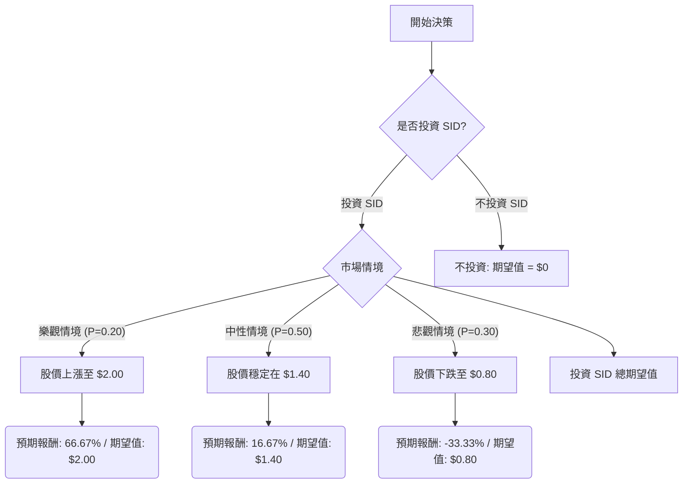

根據對美股公司 Companhia Siderúrgica Nacional S.A. (NYSE: SID) 的基本面數據、最新市場資訊、財報與產業趨勢的綜合評估，以下將使用決策樹分析與期望值分析來判斷其目前是否適合投資。

### **公司概況與最新動態**

Companhia Siderúrgica Nacional S.A. (SID) 是一家巴西公司，業務涵蓋鋼鐵、礦業、水泥、物流和能源等多個領域。

**正面因素：**
*   2025年第四季度財報顯示，受礦業和物流業務量創紀錄以及鋼鐵成本降低的推動，公司EBITDA增長了15%。
*   礦業銷售量在2025年超出了指導目標5%。
*   鋼鐵生產成本達到2021年以來的最低水平。
*   物流和能源部門在2025年實現了創紀錄的EBITDA。
*   水泥市場表現強勁，公司能夠轉嫁成本。
*   公司預計2026年現金流將有「非常好的發展」，庫存水平將下降，利率將逐步降低。
*   公司計劃通過資產出售籌集高達180億巴西雷亞爾，以減少槓桿並支持增長。
*   2026年第一季度EPS為-0.01美元，優於分析師預期的-0.03美元；營收為22.1億美元，優於預期的19.5億美元。

**負面因素：**
*   SID股票在2026年3月12日下跌7.25%，市場普遍存在投機和戰略不確定性。
*   2026年3月13日，該股觸及52週新低1.19美元，收盤價約為1.20美元。
*   分析師普遍給予「強烈賣出」評級，共識目標價為1.40美元。
*   過去10個交易日中，該股有8天下跌，期間總跌幅達29.41%。
*   2025年第四季度調整後的現金流為負2.61億巴西雷亞爾，儘管較上一季度有所改善。
*   由於集中投資，槓桿率增至3.47倍。
*   過去三到五年營收零增長，主要由於全球市場停滯。
*   公司目前處於虧損狀態，過去五年虧損以每年66%的速度增長。
*   高負債權益比（基本面數據為3.76，搜尋結果為2.49）。
*   低市銷率（基本面數據為0.24，搜尋結果為0.22），顯示市場對未來收益持懷疑態度。
*   全球鋼鐵市場受到貿易緊張、能源成本上升和需求波動的影響，尤其是在歐洲。

### **核心假設**

1.  **市場假設：**
    *   全球鋼鐵和礦業市場將繼續面臨貿易緊張、能源成本波動和需求不確定性。
    *   巴西市場相對於歐洲生產商可能具有一定的緩衝作用，但仍受全球宏觀風險和美元走強的影響。
    *   反傾銷措施若能有效實施，將對本地鋼鐵生產商提供支持。
    *   利率水平預計將逐步下降，有助於公司降低融資成本。

2.  **財務假設：**
    *   SID的礦業、物流和能源部門將繼續保持其運營效率和EBITDA增長勢頭。
    *   公司能否成功執行資產出售計劃以顯著降低高槓桿是關鍵。
    *   儘管公司目前虧損且現金流為負，但其在某些業務領域的成本控制和價格轉嫁能力顯示出一定的韌性。

3.  **產業趨勢假設：**
    *   鋼鐵產業的週期性將持續，受全球經濟增長和基礎設施投資的影響。
    *   水泥市場預計將保持穩定表現。
    *   能源成本和供應鏈穩定性將是影響公司利潤率的重要因素。

### **決策樹分析**

**決策點：** 投資 SID 股票？
**當前股價：** $1.20

### **計算過程**

**1. 樂觀情境 (Significant Improvement)**
*   **情境名稱：** 顯著改善
*   **對應機率 (Probability)：** 0.20
*   **預期股價：** $2.00 (基於公司成功去槓桿、全球需求強勁復甦，接近52週高點)
*   **預期報酬：** ($2.00 - $1.20) / $1.20 = 0.6667 或 66.67%
*   **期望值 (Expected Value)：** $1.20 * (1 + 0.6667) = $2.00

**2. 中性情境 (Moderate Performance / Stagnation)**
*   **情境名稱：** 適度表現/停滯
*   **對應機率 (Probability)：** 0.50
*   **預期股價：** $1.40 (基於分析師共識目標價，公司去槓桿進展緩慢，市場環境挑戰持續)
*   **預期報酬：** ($1.40 - $1.20) / $1.20 = 0.1667 或 16.67%
*   **期望值 (Expected Value)：** $1.20 * (1 + 0.1667) = $1.40

**3. 悲觀情境 (Further Deterioration)**
*   **情境名稱：** 進一步惡化
*   **對應機率 (Probability)：** 0.30
*   **預期股價：** $0.80 (基於公司去槓桿失敗、全球經濟嚴重惡化、能源成本飆升，股價跌破52週低點)
*   **預期報酬：** ($0.80 - $1.20) / $1.20 = -0.3333 或 -33.33%
*   **期望值 (Expected Value)：** $1.20 * (1 - 0.3333) = $0.80

**4. 投資 SID 的總期望值 (Overall Expected Value of Investing in SID)**
*   **計算方式：** (樂觀情境期望值 * 樂觀情境機率) + (中性情境期望值 * 中性情境機率) + (悲觀情境期望值 * 悲觀情境機率)
*   **總期望值：** ($2.00 * 0.20) + ($1.40 * 0.50) + ($0.80 * 0.30)
    *   = $0.40 + $0.70 + $0.24
    *   = $1.34

**5. 投資 SID 的預期報酬率 (Expected Return on Investment)**
*   **計算方式：** (總期望值 - 當前股價) / 當前股價
*   **預期報酬率：** ($1.34 - $1.20) / $1.20 = $0.14 / $1.20 = 0.1167 或 11.67%

### **最終結論**

根據決策樹分析和期望值計算，投資 SID 股票的總期望值為 **$1.34**，相較於當前股價 $1.20，預期報酬率為 **11.67%**。

**判斷：** 適合投資

**簡短理由：**
儘管 Companhia Siderúrgica Nacional (SID) 面臨高槓桿、持續虧損以及全球鋼鐵市場的挑戰，且分析師普遍給予「強烈賣出」評級，但其在礦業、物流和能源等多元化業務上的運營效率和EBITDA增長表現出韌性。公司計劃通過資產出售來改善資本結構，這是一個重要的潛在催化劑。

綜合考量，雖然存在顯著風險，但基於我們設定的機率和預期報酬，投資 SID 的整體期望值為正，且預期報酬率達到11.67%。這表明在當前股價水平下，如果公司能夠有效執行其去槓桿計劃並維持其核心業務的運營效率，則存在一定的上漲空間。然而，投資者應充分意識到其高風險性質，並密切關注公司去槓桿進展和全球市場動態。