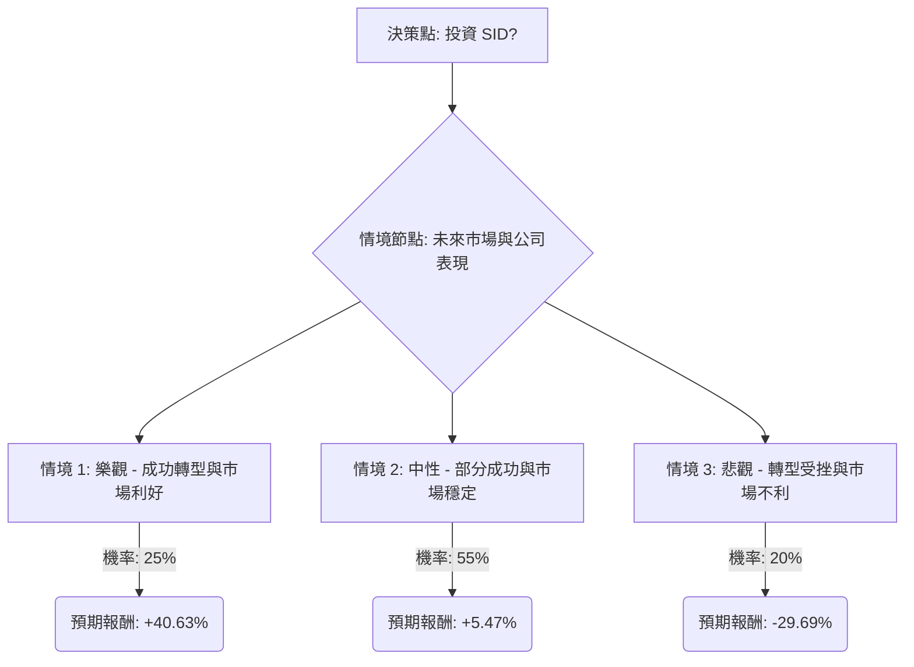

根據您提供的美股公司 SID（Companhia Siderúrgica Nacional）基本面數據，並結合最新的網路搜尋資訊，以下將透過決策樹分析與期望值分析，評估該股票目前的投資適合性。

### **核心假設**

在進行決策樹分析前，我們將基於收集到的資訊，建立以下核心假設：

1.  **市場趨勢 (巴西鋼鐵與鐵礦石)**：
    *   **巴西鋼鐵市場**：預計在2025年至2035年間，將以3%至4%的複合年增長率（CAGR）增長，主要受建築和基礎設施需求驅動。然而，來自中國的鋼鐵進口壓力巨大，巴西政府的反傾銷措施實施情況將是關鍵。
    *   **鐵礦石價格**：預計在未來18個月內，全球鐵礦石價格將維持在每噸80至100美元之間，受中國房地產市場需求疲軟和供應增長挑戰的影響。
2.  **公司財務狀況 (SID)**：
    *   **高負債**：SID 面臨高額淨負債（截至2026年第一季度約405億巴西雷亞爾，約78億美元），淨負債/LTM EBITDA 比率為3.36倍，遠高於管理層目標的1倍。
    *   **積極去槓桿**：公司正積極透過資產出售（包括水泥業務控制權和基礎設施部門股權）來降低負債，目標是減少150億至180億巴西雷亞爾的負債。此外，已獲得12億美元（可擴展至14億美元）的過渡性貸款以再融資現有債務。
    *   **盈利能力**：儘管2025年第四季度EBITDA表現良好（33億巴西雷亞爾，利潤率28%），但近期仍報告負的每股盈餘（EPS）和淨利潤，顯示公司在償債和營運成本後面臨挑戰。流動性比率（速動比率0.71，流動比率1.08）也較為緊張。
    *   **分析師評級**：分析師普遍給予「賣出」或「持有」評級，目標價約在1.00美元至1.40美元之間。

### **決策樹分析**

我們將從「投資 SID」的決策點出發，考慮未來12-18個月內可能發生的三種主要情境，並為每個情境分配機率和預期報酬。

**起始點：投資 SID (目前股價 $1.28)**

#### **節點詳情與計算過程**

**1. 決策點：投資 SID (目前股價 $1.28)**

*   這是我們做出投資決策的起點。

**2. 情境節點：未來市場與公司表現**

*   此節點代表了未來可能發生的不同結果，每個結果都有其對應的機率和預期報酬。

**情境 1: 樂觀 - 成功轉型與市場利好**
*   **預測情境名稱**：成功轉型與市場利好
*   **核心假設**：
    *   CSN 成功執行資產出售計畫，顯著降低淨負債/EBITDA比率，並實現持續的淨利潤。
    *   巴西鋼鐵需求強勁，政府反傾銷措施有效保護國內市場。
    *   全球鐵礦石價格穩定或小幅上漲。
*   **機率 (Probability)**：25%
*   **預期報酬計算**：
    *   假設股價上漲至 $1.80 (高於分析師目標價，反映強勁成功)。
    *   報酬率 = ($1.80 - $1.28) / $1.28 = 0.4063 = 40.63%
*   **期望值 (Expected Value)**：$1.28 * (1 + 0.4063) = $1.80

**情境 2: 中性 - 部分成功與市場穩定**
*   **預測情境名稱**：部分成功與市場穩定
*   **核心假設**：
    *   CSN 在去槓桿方面取得進展，但資產出售可能面臨延遲或估值不理想。
    *   營運改善緩慢，盈利能力仍受挑戰。
    *   巴西鋼鐵市場溫和增長，但進口壓力持續存在。
    *   鐵礦石價格在當前區間內波動。
*   **機率 (Probability)**：55%
*   **預期報酬計算**：
    *   假設股價小幅上漲至 $1.35 (略高於目前股價，反映部分成功)。
    *   報酬率 = ($1.35 - $1.28) / $1.28 = 0.0547 = 5.47%
*   **期望值 (Expected Value)**：$1.28 * (1 + 0.0547) = $1.35

**情境 3: 悲觀 - 轉型受挫與市場不利**
*   **預測情境名稱**：轉型受挫與市場不利
*   **核心假設**：
    *   CSN 資產出售計畫遭遇重大阻礙，負債水平居高不下，導致財務成本增加和流動性擔憂。
    *   營運挑戰持續，公司繼續虧損。
    *   巴西經濟放緩，或反傾銷措施無效，導致鋼鐵市場惡化。
    *   鐵礦石價格進一步下跌。
*   **機率 (Probability)**：20%
*   **預期報酬計算**：
    *   假設股價下跌至 $0.90 (低於52週低點 $1.11，反映轉型失敗)。
    *   報酬率 = ($0.90 - $1.28) / $1.28 = -0.2969 = -29.69%
*   **期望值 (Expected Value)**：$1.28 * (1 - 0.2969) = $0.90

### **整體期望值分析**

現在，我們將計算整體投資 SID 的期望值：

整體期望值 = (情境 1 期望值 * 情境 1 機率) + (情境 2 期望值 * 情境 2 機率) + (情境 3 期望值 * 情境 3 機率)

整體期望值 = ($1.80 * 0.25) + ($1.35 * 0.55) + ($0.90 * 0.20)
整體期望值 = $0.45 + $0.7425 + $0.18
**整體期望值 = $1.3725**

### **最終結論**

根據上述決策樹分析和期望值計算，投資美股公司 SID 的**整體期望值為 $1.3725**。

*   **適合投資 / 不適合投資**：根據目前的分析，**不適合投資**。
*   **簡短理由**：
    儘管整體期望值 ($1.3725) 略高於當前股價 ($1.28)，但這僅代表了在考慮所有情境下的平均預期。SID 面臨著極高的負債水平和持續的淨虧損，儘管公司正積極進行資產出售和債務再融資，但這些計畫的執行存在顯著風險。巴西鋼鐵市場雖然有增長潛力，但同時也面臨來自中國進口的激烈競爭和鐵礦石價格波動的風險。分析師普遍持「賣出」或「持有」的謹慎態度。

    在「中性」情境下，預期報酬率僅為5.47%，而「悲觀」情境下則可能面臨近30%的損失。考慮到公司基本面中的高槓桿、負盈利能力以及執行去槓桿計畫的不確定性，潛在的下行風險大於上行潛力，尤其對於尋求穩定回報的投資者而言。因此，目前投資 SID 的風險較高，不建議投資。