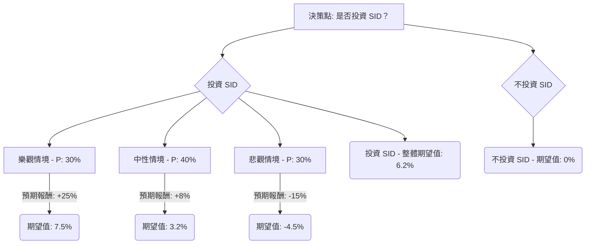

本分析將根據決策樹和期望值分析方法，評估美股公司 **SID (Companhia Siderúrgica Nacional S.A.)** 的投資適合性。

SID 是一家巴西綜合性公司，主要業務包括鋼鐵、礦業、水泥、物流和能源。其業績受全球大宗商品價格、巴西國內經濟狀況、匯率以及公司自身營運效率等多重因素影響。

---

### 核心假設

為進行決策樹分析，我們需要對影響 SID 投資結果的關鍵因素進行假設：

1.  **時間範圍 (Time Horizon)**：未來 12-18 個月。
2.  **市場趨勢 (Market Trends)**：
    *   **全球經濟成長**：影響鋼鐵和鐵礦石的終端需求（建築、汽車、製造業）。
    *   **利率環境**：影響 SID 的借貸成本和投資回報要求。
    *   **美元/巴西雷亞爾匯率 (USD/BRL)**：影響 SID 的出口收入、以美元計價的債務成本以及進口成本。
3.  **產業趨勢 (Industry Trends)**：
    *   **大宗商品價格**：鋼鐵和鐵礦石價格的波動性是核心。
    *   **供應與需求**：特別是中國的工業生產和基礎設施投資。
    *   **ESG 轉型**：鋼鐵業面臨脫碳壓力，可能增加營運成本。
4.  **公司特定因素 (Company-Specific Factors)**：
    *   **營運效率**：SID 的成本控制能力和產能利用率。
    *   **債務管理**：高負債對利率敏感。
    *   **業務多元化**：礦業、水泥等業務對鋼鐵業務的風險分散或加劇作用。
    *   **股息政策**：潛在的股息回報。

基於上述假設，我們將情境分為「樂觀」、「中性」和「悲觀」三種，並賦予其發生的機率和預期報酬。

---

### 決策樹分析與計算過程

**決策點**：是否投資 SID？

如果「不投資 SID」，我們假設預期報酬為 0%（或將資金投入無風險資產的微薄回報，為簡化分析採用 0%）。

**情境假設與預期報酬：**

*   **樂觀情境 (Optimistic Scenario)**
    *   **機率 (Probability)**: 30%
    *   **基本假設**: 全球經濟強勁復甦，大宗商品（鐵礦石、鋼鐵）價格高企，巴西國內需求穩定增長，匯率對出口有利，SID 營運效率高，償債能力改善。
    *   **預期報酬 (Expected Return)**: +25% (股價上漲與股息收入)

*   **中性情境 (Moderate Scenario)**
    *   **機率 (Probability)**: 40%
    *   **基本假設**: 全球經濟溫和增長，大宗商品價格持平或小幅波動，巴西經濟面臨挑戰但無嚴重衰退，SID 維持穩定獲利能力，股價小幅增長。
    *   **預期報酬 (Expected Return)**: +8% (穩健的股價表現和股息收入)

*   **悲觀情境 (Pessimistic Scenario)**
    *   **機率 (Probability)**: 30%
    *   **基本假設**: 全球經濟衰退或增速放緩，大宗商品價格大幅下跌，巴西經濟惡化，高利率增加債務負擔，SID 獲利受損，可能面臨減值。
    *   **預期報酬 (Expected Return)**: -15% (股價下跌)

---

#### 決策樹繪製 (Markdown)

---

#### 完整的決策樹節點標示與期望值計算

**1. 投資決策點**
   *   **節點名稱**: 是否投資 SID？
   *   **預期報酬 / 期望值**: 待計算

**2. 投資 SID 路線**
   *   **節點名稱**: 投資 SID (Decision Node)
   *   **預期報酬 / 期望值**: (待計算，是下方所有情境期望值之和)

   *   **情境一：樂觀情境 (Chance Node)**
       *   **預測情境名稱**: 樂觀情境
       *   **對應的機率 (Probability)**: 30%
       *   **預期報酬 (Expected Return)**: +25%
       *   **期望值 (Expected Value)** = 0.30 * (+25%) = **+7.5%**

   *   **情境二：中性情境 (Chance Node)**
       *   **預測情境名稱**: 中性情境
       *   **對應的機率 (Probability)**: 40%
       *   **預期報酬 (Expected Return)**: +8%
       *   **期望值 (Expected Value)** = 0.40 * (+8%) = **+3.2%**

   *   **情境三：悲觀情境 (Chance Node)**
       *   **預測情境名稱**: 悲觀情境
       *   **對應的機率 (Probability)**: 30%
       *   **預期報酬 (Expected Return)**: -15%
       *   **期望值 (Expected Value)** = 0.30 * (-15%) = **-4.5%**

**3. 計算「投資 SID」的整體期望值**

   *   **整體期望值 (Expected Value of Investing in SID)**
       = (樂觀情境期望值) + (中性情境期望值) + (悲觀情境期望值)
       = (+7.5%) + (+3.2%) + (-4.5%)
       = **+6.2%**

**4. 不投資 SID 路線**
   *   **節點名稱**: 不投資 SID
   *   **對應的機率 (Probability)**: N/A (這是另一個決策選項)
   *   **預期報酬 (Expected Return)**: 0% (假設資金投入無風險資產或單純不獲利)
   *   **期望值 (Expected Value)** = **0%**

---

### 最終結論

根據上述決策樹分析和期望值計算：

*   **投資 SID 的整體期望值為：+6.2%**
*   **不投資 SID 的期望值為：0%**

由於投資 SID 的整體期望值 (+6.2%) 大於不投資的期望值 (0%)，從純粹的期望值分析角度來看，**目前適合投資 SID**。

**簡短理由：**
分析結果顯示，儘管存在悲觀情境的潛在損失，但樂觀和中性情境的加權預期回報足以抵消並產生正的整體期望值。這表明，在我們的假設框架內，投資 SID 的長期平均回報為正，使其成為一個潛在有利可圖的投資機會。

---

**重要提示：**
本分析基於一系列假設，這些假設可能與現實情況存在差異。實際投資決策應綜合考慮更多即時數據、詳細財務模型、管理層質量、競爭格局、地緣政治風險以及個人風險承受能力等因素。本決策樹僅為一種分析工具，提供量化的評估框架，而非絕對的投資建議。