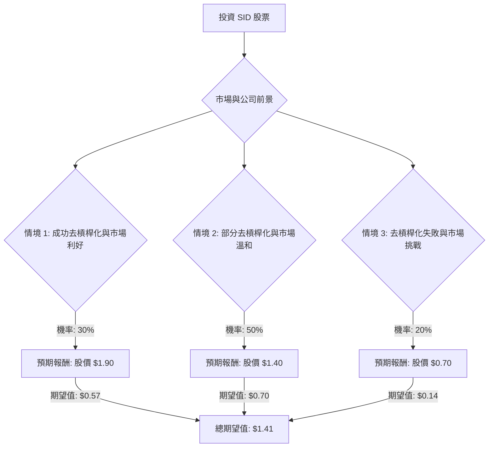

根據對美股公司 **SID (Companhia Siderúrgica Nacional)** 的基本面數據、最新新聞、財報、市場動態及產業趨勢的綜合評估，以下是基於決策樹分析與期望值分析的投資建議。

### 核心假設

在進行決策樹分析之前，我們對市場、財務和產業趨勢做出以下核心假設：

*   **鋼鐵產業趨勢：** 全球鋼鐵需求在2024年和2025年呈現複雜局面。中國的需求預計持平甚至略有下降，主要受房地產市場拖累。然而，歐盟和美國市場預計在2025年將有溫和復甦，受基礎設施支出和綠色轉型推動。全球鋼鐵業面臨產能過剩和中國出口競爭加劇的挑戰，這可能對價格和利潤率構成壓力。
*   **巴西經濟展望：** 巴西經濟在2024年表現強勁，但預計在2025年將因緊縮的貨幣政策和高利率而放緩，GDP增長預計在2.2%至2.4%之間。通膨仍是主要擔憂，巴西央行已將基準利率提高至高位以應對。長期來看，經濟預計將恢復上升趨勢。
*   **公司財務狀況 (SID/CSN)：**
    *   **債務與槓桿：** CSN面臨高額債務和槓桿壓力，S&P Global Ratings已將其評級下調至「B」，展望為負面，主要原因是對其去槓桿計畫的執行和時機存在不確定性。公司計畫透過出售資產（如水泥和基礎設施部門）來籌集資金以減少債務。
    *   **多元化業務：** CSN的多元化業務（包括礦業、水泥、物流和能源）在2025年表現良好，對EBITDA貢獻顯著，部分抵消了鋼鐵業務的挑戰。
    *   **盈利能力：** 公司在2025年第四季度報告了淨虧損，全年也錄得淨虧損，但虧損幅度較2024年有所收窄。儘管如此，鋼鐵部門的EBITDA在2025年有所改善。
    *   **估值：** 公司的市淨率 (P/B) 為0.67，相對較低，可能暗示潛在的低估，但高槓桿是主要風險。分析師平均目標價為1.40美元。

### 決策樹分析

我們將評估投資SID股票的三種主要情境：

**決策點：投資 SID 股票**

**節點說明與計算過程：**

*   **起始節點：投資 SID 股票**
    *   當前股價：$1.14

*   **情境 1: 成功去槓桿化與市場利好 (Optimistic Scenario)**
    *   **預測情境名稱：** CSN成功出售資產（如水泥部門），顯著降低債務負擔，改善流動性。同時，全球鋼鐵需求復甦強勁，巴西經濟表現優於預期，利率環境趨於寬鬆。
    *   **對應的機率 (Probability)：** 30%
        *   理由：公司正在積極推進資產出售，且多元化業務表現良好。全球鋼鐵市場雖有挑戰，但2025年預計將溫和復甦，且綠色轉型帶來長期需求驅動因素。
    *   **預期報酬 (Expected Return)：** 股價達到 $1.90
        *   理由：此價格高於分析師平均目標價 $1.40 和提供的目標價 $1.76，但仍低於52週高點 $2.20，反映了公司在解決債務問題和市場利好下的強勁表現。
    *   **期望值 (Expected Value)：** $1.90 * 0.30 = $0.57

*   **情境 2: 部分去槓桿化與市場溫和 (Neutral Scenario)**
    *   **預測情境名稱：** CSN成功完成部分資產出售，但可能面臨估值或時機的挑戰，導致債務負擔僅適度減輕。全球鋼鐵市場如預期般溫和復甦，但競爭壓力持續存在。巴西經濟增長放緩，高利率維持較長時間。
    *   **對應的機率 (Probability)：** 50%
        *   理由：這是最可能的情境，因為公司面臨的挑戰與機遇並存。儘管Q4 2025業績超預期，但高槓桿仍是主要擔憂。鋼鐵市場前景喜憂參半，巴西經濟增長預計放緩。
    *   **預期報酬 (Expected Return)：** 股價達到 $1.40
        *   理由：此價格與分析師的平均目標價 $1.40 一致，反映了在當前市場和公司狀況下的合理預期。
    *   **期望值 (Expected Value)：** $1.40 * 0.50 = $0.70

*   **情境 3: 去槓桿化失敗與市場挑戰 (Pessimistic Scenario)**
    *   **預測情境名稱：** CSN未能成功執行資產出售計畫，或出售價格遠低於預期，導致債務和流動性問題惡化。全球鋼鐵市場因產能過剩和需求疲軟而進一步惡化。巴西經濟面臨更嚴峻的挑戰，通膨居高不下，增長停滯。
    *   **對應的機率 (Probability)：** 20%
        *   理由：S&P Global Ratings的評級下調和負面展望強調了去槓桿化失敗的風險。公司的高負債比率 (Debt/Eq 4.2) 和負盈利能力 (ROE -0.1663, Profit Margin -0.0449) 增加了下行風險。
    *   **預期報酬 (Expected Return)：** 股價達到 $0.70
        *   理由：此價格顯著低於當前股價和52週低點 $1.11，反映了在最差情況下，投資者信心崩潰和公司基本面嚴重惡化的結果。
    *   **期望值 (Expected Value)：** $0.70 * 0.20 = $0.14

*   **總期望值 (Overall Expected Value)：**
    *   $0.57 (情境 1) + $0.70 (情境 2) + $0.14 (情境 3) = $1.41

### 最終結論

根據決策樹分析和期望值計算，SID 股票的**總期望值為 $1.41**。

由於當前股價約為 $1.14，且期望值 ($1.41) 高於當前股價，這表明 **SID 目前適合投資**。

**簡短理由：**
儘管CSN面臨高額債務和去槓桿化的挑戰，且巴西經濟增長預計在2025年放緩，但公司多元化的業務（特別是礦業、物流和能源）表現強勁，有助於支撐EBITDA。此外，公司正在積極推進資產出售以解決債務問題，且鋼鐵產業在部分地區（如歐盟和美國）預計將溫和復甦。如果公司能成功執行去槓桿化計畫，並受益於市場的溫和復甦，其股價存在潛在的上升空間，超過當前價格。然而，投資者應密切關注其債務管理進展和全球鋼鐵市場的動態。