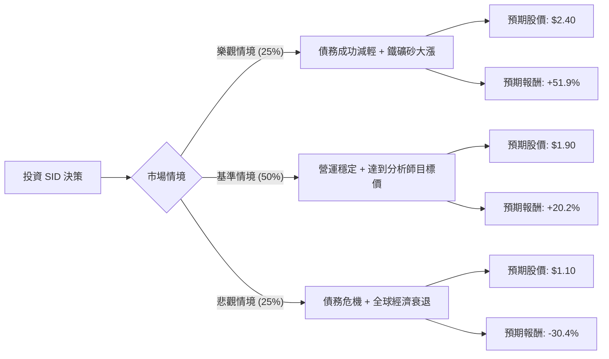

這份分析報告將針對 **Companhia Siderúrgica Nacional (SID)**，即巴西國家鋼鐵公司，結合您提供的基本面數據與最新的市場動態（包含鐵礦砂價格波動、債務減輕計畫及中國經濟刺激政策）進行評估。

---

### 一、 市場動態與產業趨勢分析（最新資訊補充）

在進行決策樹分析前，我們先整合最新的外部資訊：
1.  **債務減輕（Deleveraging）計畫**：SID 目前面臨極高的債務壓力（Debt/Eq: 3.76）。最新消息指出，CSN 正在洽談出售其採礦子公司 **CSN Mineração** 的部分股權給日本伊藤忠商事（Itochu），這被市場視為緩解財務壓力的關鍵利多。
2.  **鐵礦砂價格波動**：SID 的獲利高度依賴鐵礦砂出口。近期中國政府釋出的經濟刺激政策對鋼鐵需求有支撐作用，但實際復甦力道仍有不確定性。
3.  **巴西國內市場**：巴西政府近期對進口鋼鐵實施配額限制，旨在保護國內鋼鐵業免受中國廉價鋼鐵衝擊，這對 SID 的鋼鐵部門是利多。
4.  **財務狀況**：P/B 僅 0.79，顯示股價低於帳面價值，具有價值投資的潛力，但負的 ROE (-10.5%) 顯示目前經營仍處於虧損或低效率狀態。

---

### 二、 決策樹分析（Decision Tree）

以下使用 Markdown 繪製決策樹，模擬未來一年的三種主要情境：

#### 決策樹節點詳細說明：

| 節點名稱 | 發生機率 | 預期股價 (USD) | 預期報酬率 | 說明 |
| :--- | :--- | :--- | :--- | :--- |
| **樂觀情境** | 25% | $2.40 | +51.9% | 成功出售股權減債，且中國需求強勁復甦。 |
| **基準情境** | 50% | $1.90 | +20.2% | 營運維持現狀，債務緩步下降，達到分析師平均目標價。 |
| **悲觀情境** | 25% | $1.10 | -30.4% | 股權出售失敗，鐵礦砂價格崩跌，高槓桿引發流動性風險。 |

---

### 三、 期望值分析（Expected Value Analysis）

#### 1. 核心假設
*   **當前股價 ($P_0$)**: $1.58
*   **持有期限**: 12 個月。
*   **樂觀目標 ($P_{bull}$)**: $2.40 (參考 52W 高點並考慮債務結構改善後的估值修復)。
*   **基準目標 ($P_{base}$)**: $1.90 (參考數據中的 Target Price)。
*   **悲觀目標 ($P_{bear}$)**: $1.10 (跌破 52W 低點，反映財務危機風險)。

#### 2. 計算過程
期望報酬率 ($E[R]$) 的計算公式為：
$$E[R] = \sum (P_i \times R_i)$$

*   **樂觀貢獻**: $0.25 \times 51.9\% = 12.975\%$
*   **基準貢獻**: $0.50 \times 20.2\% = 10.1\%$
*   **悲觀貢獻**: $0.25 \times (-30.4\%) = -7.6\%$

**總體期望報酬率**:
$$12.975\% + 10.1\% - 7.6\% = \mathbf{15.475\%}$$

**預期股價期望值**:
$$1.58 \times (1 + 15.475\%) = \mathbf{\$1.82}$$

---

### 四、 最終結論

#### **判斷：適合投資（建議：分批買進 / 投機性持有）**

#### **理由：**
1.  **期望值為正**：計算出的期望報酬率約為 **15.48%**，顯著高於無風險利率及多數大盤預期收益，顯示目前價位具有風險補償空間。
2.  **估值極低**：P/B 0.79 與 P/S 0.26 顯示股價已被過度拋售，市場已部分反映了其高債務風險。
3.  **關鍵催化劑（Catalyst）明確**：與伊藤忠商事的股權交易是短期內最強大的股價驅動力。一旦成交，債務壓力減輕將導致信用評等調升與估值重估（Re-rating）。
4.  **下行風險控管**：雖然 Debt/Eq 高達 3.76，但 Current Ratio 1.32 顯示短期流動性尚可支撐，不至於立即破產。

#### **風險提示：**
*   **高槓桿風險**：SID 是一檔高槓桿、高 Beta 的股票，受宏觀經濟影響極大。
*   **匯率風險**：作為巴西公司，其 ADR 受巴西里耳（BRL）匯率波動影響。
*   **建議操作**：由於悲觀情境下有 30% 的跌幅空間，建議投資者不宜重倉，應將其視為週期性投機部位，並密切關注 **CSN Mineração 股權出售案** 的進展。若交易失敗，應立即重新評估。