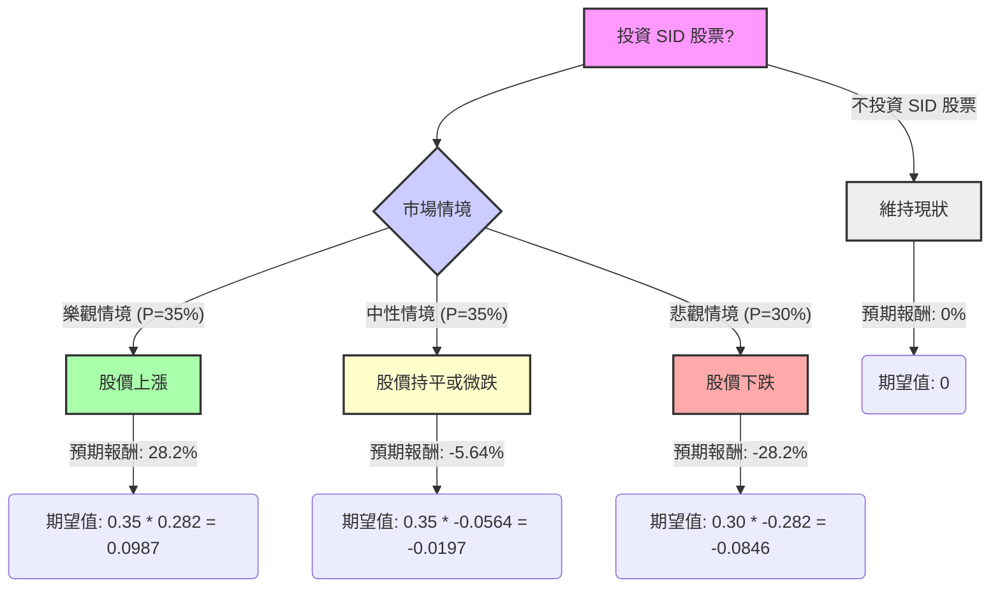

Companhia Siderúrgica Nacional (SID) 是一家巴西綜合鋼鐵生產商，業務多元，涵蓋鋼鐵、礦業、物流、能源和水泥等領域。該公司在礦業，特別是鐵礦石方面擁有顯著優勢。

**基本面數據概覽：**

*   **收盤價 (Close)**: $1.95
*   **市淨率 (P/B)**: 0.94 (低於1，可能被低估)
*   **市值 (Market Cap)**: $2.5 億
*   **股東權益報酬率 (ROE)**: -0.105 (負值，表示虧損)
*   **資產報酬率 (ROA)**: -0.0146 (負值，表示虧損)
*   **投資報酬率 (ROI)**: -0.0246 (負值，表示虧損)
*   **負債權益比 (Debt/Eq)**: 3.76 (高負債)
*   **長期負債權益比 (LT Debt/Eq)**: 3.12 (高長期負債)
*   **本益比 (P/E)**: "-" (無正值，因虧損)
*   **預期本益比 (Forward P/E)**: 72.86 (高預期本益比，若未來盈利轉正)
*   **預期明年每股盈餘成長率 (EPS next Y_%)**: 1.2378 (123.78%，預期大幅成長)
*   **毛利率 (Gross Margin)**: 0.2705
*   **營運利潤率 (Oper. Margin)**: 0.1195
*   **淨利率 (Profit Margin)**: -0.0337 (負值，表示虧損)
*   **52週高點/低點 (52W Range)**: $1.24 - $1.96
*   **目標價 (Target Price)**: $1.84 (低於當前收盤價)
*   **分析師推薦 (Recom)**: 3.58 (接近「賣出」或「強烈賣出」)

**最新市場資訊補充：**

1.  **近期財報表現 (Q3 2025)**：CSN 在2025年第三季度實現了創紀錄的營運和財務業績，EBITDA同比增長26%，利潤率達27%。礦業業務創下歷史新高。公司正在去槓桿化，槓桿率從3.5倍降至3.1倍，目標年底達到3倍。鋼鐵業務面臨進口競爭，但已實施價格調整，預計反傾銷措施將在2026年改善利潤率。水泥和物流業務也表現出色。
2.  **2024年財務表現**：2024年營收較2023年下降3.85%，虧損大幅增加714.5%。
3.  **盈利能力與波動性**：公司業績高度週期性且波動劇烈，與全球大宗商品價格（鐵礦石和鋼鐵）密切相關。盈利能力和現金流不穩定，2021年達到高峰後，2024年盈利能力大幅下滑並出現淨虧損。
4.  **債務狀況**：SID背負巨額債務（超過526億巴西雷亞爾）。
5.  **分析師評級與目標價**：多數分析師給予「賣出」或「強烈賣出」的共識評級。12個月平均目標價介於$1.40至$2.43之間，其中UBS在2025年12月給出$1.40的目標價，而Itau BBA在2024年4月給出$3的較高目標價。MarketBeat顯示共識目標價為$1.40，較當前價格$1.83有約23.3%的下跌空間。TipRanks顯示平均目標價為$1.40，較$1.63的價格下跌14.11%。
6.  **動能指標**：Zacks在2026年1月14日將SID評為「強勢動能股」，Zacks評級為#2（買入）。該股在過去一週上漲15.53%，過去一個月上漲7.47%，過去一季度上漲14.72%，過去一年上漲43.85%。

**核心假設：**

*   **市場假設**：
    *   全球大宗商品（鐵礦石和鋼鐵）價格的波動性將繼續對SID的收入和盈利能力產生重大影響。
    *   巴西經濟的健康狀況將影響國內對鋼鐵和水泥的需求。
    *   利率環境將影響SID龐大的債務負擔。
*   **財務假設**：
    *   SID持續去槓桿化的能力對其財務健康至關重要。
    *   營運效率的提高和成本控制將繼續影響利潤率。
    *   多元化的業務板塊（礦業、物流、能源、水泥）為公司提供了抵禦鋼鐵市場波動的韌性。
*   **產業趨勢假設**：
    *   鋼鐵行業的進口競爭將持續存在，需要有效的反傾銷措施或其他策略來應對。
    *   拉丁美洲對鋼鐵和建築材料的需求將是關鍵驅動力。

---

### 決策樹分析 (Decision Tree Analysis)

**決策點：投資 SID 股票**

**情境說明與預期報酬計算：**

*   **當前股價 (Current Price)**: $1.95 (來自提供的基本面數據)

1.  **樂觀情境 (Optimistic Scenario)**
    *   **情境名稱**: 市場反彈與營運改善
    *   **情境描述**: 全球大宗商品價格強勁復甦，反傾銷措施有效，公司持續去槓桿化並提高營運效率。Zacks的「買入」評級和近期強勁的股價動能支持此情境。
    *   **預期股價**: $2.50 (基於近期動能和潛在利好，高於52週高點和分析師最高目標價)
    *   **預期報酬 (Expected Return)**: ($2.50 - $1.95) / $1.95 = 0.282 = **28.2%**
    *   **機率 (Probability)**: 35%

2.  **中性情境 (Neutral Scenario)**
    *   **情境名稱**: 穩定但面臨挑戰
    *   **情境描述**: 大宗商品價格保持穩定或小幅波動。CSN在鋼鐵業務上仍面臨進口競爭，但多元化業務提供一定支撐。去槓桿化進程較慢。
    *   **預期股價**: $1.84 (與提供的「目標價」一致，略低於當前股價)
    *   **預期報酬 (Expected Return)**: ($1.84 - $1.95) / $1.95 = -0.0564 = **-5.64%**
    *   **機率 (Probability)**: 35%

3.  **悲觀情境 (Pessimistic Scenario)**
    *   **情境名稱**: 大宗商品下行與債務壓力
    *   **情境描述**: 全球大宗商品價格顯著下跌，進口競爭加劇，高額債務成為更嚴峻的問題，影響盈利能力和成長。多數分析師的「賣出」或「強烈賣出」評級支持此情境。
    *   **預期股價**: $1.40 (參考UBS在2025年12月給出的目標價，以及MarketBeat的共識目標價)
    *   **預期報酬 (Expected Return)**: ($1.40 - $1.95) / $1.95 = -0.282 = **-28.2%**
    *   **機率 (Probability)**: 30%

---

### 期望值分析 (Expected Value Analysis)

**計算過程：**

1.  **樂觀情境期望值**:
    *   期望值 = 機率 × 預期報酬
    *   期望值 = 0.35 × 0.282 = **0.0987**

2.  **中性情境期望值**:
    *   期望值 = 機率 × 預期報酬
    *   期望值 = 0.35 × (-0.0564) = **-0.0197**

3.  **悲觀情境期望值**:
    *   期望值 = 機率 × 預期報酬
    *   期望值 = 0.30 × (-0.282) = **-0.0846**

**整體期望值 (Overall Expected Value) = 樂觀情境期望值 + 中性情境期望值 + 悲觀情境期望值**

整體期望值 = 0.0987 + (-0.0197) + (-0.0846)
整體期望值 = 0.0987 - 0.0197 - 0.0846
整體期望值 = **-0.0056**

---

### 最終結論

根據決策樹分析和期望值分析，投資 SID 股票的整體期望值為 **-0.0056**。

**不適合投資。**

**簡短理由：**

儘管SID在2025年第三季度表現強勁，且近期股價呈現積極動能，但其整體期望值為負值，表明根據當前情境和假設，長期投資的預期回報為負。公司面臨高額債務、歷史業績波動性大以及鋼鐵行業的週期性挑戰和進口競爭。 此外，多數分析師給予「賣出」或「強烈賣出」的評級，且其共識目標價普遍低於當前股價，進一步印證了潛在的下行風險。 儘管存在樂觀情境下的上漲潛力，但被中性及悲觀情境下的潛在損失所抵消，使得整體投資吸引力不足。