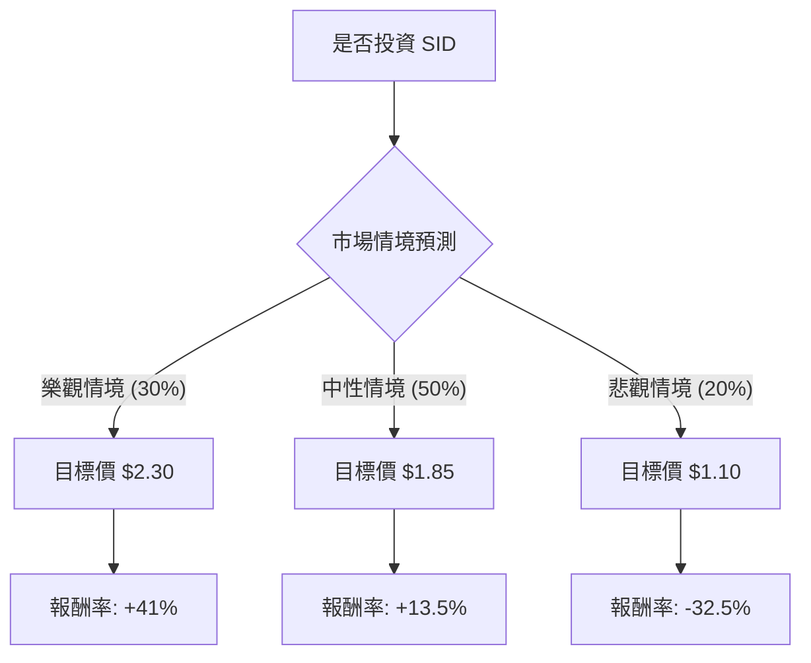

這是一份針對 **Companhia Siderúrgica Nacional (SID)**，又稱巴西國家鋼鐵公司的投資評估報告。我們將結合您提供的數據與最新的市場動態（巴西利率、鐵礦砂價格、債務收購）進行決策樹分析與期望值計算。

---

### 1. 外部市場動態與即時資訊補充

在進行建模前，我們必須考量以下影響 SID 的關鍵因素：
*   **債務壓力與去槓桿化**：SID 的債務股本比（Debt/Eq）高達 **3.76**，這在當前高利率環境下是極大風險。近期新聞指出，母公司 CSN 正積極尋求出售其採礦子公司（CSN Mineração）的股份，以緩減債務。
*   **大宗商品價格**：SID 的獲利高度依賴鐵礦砂價格。目前中國房地產市場疲軟對鋼鐵需求造成壓力，但近期中國政府的刺激政策為鐵礦砂價格提供了支撐。
*   **巴西國內經濟**：巴西央行（BCB）的貨幣政策直接影響其融資成本。
*   **估值倍數**：P/B 為 0.81，顯示股價低於帳面價值，具備典型的價值股/週期股特徵，但負的 ROE (-10.5%) 說明公司正處於虧損狀態。

---

### 2. 決策樹分析 (Decision Tree)

我們將未來一年的預期情境分為三種：**樂觀（資產剝離成功+需求復甦）**、**中性（維持現狀）**、**悲觀（債務危機+需求衰退）**。

#### **決策樹圖表 (Markdown)**

---

### 3. 期望值分析 (Expected Value Analysis)

#### **核心假設**
1.  **目前股價 ($P_0$):** $1.63
2.  **樂觀情境 (30%)**: 成功出售非核心資產減債，且鐵礦砂價格回升至 $120/噸以上。預期股價回升至 52 週高點以上水準（約 $2.30）。
3.  **中性情境 (50%)**: 營運維持平穩，債務壓力緩慢減輕。預期股價接近分析師平均目標價 $1.91，我們取較保守的 $1.85。
4.  **悲觀情境 (20%)**: 中國需求崩潰或巴西利息意外升高，導致違約風險增加。預期股價跌破 52 週低點至 $1.10 水準。

#### **計算過程**

| 情境 | 機率 (P) | 預期股價 ($) | 預期報酬率 (R) | 加權報酬 (P * R) |
| :--- | :--- | :--- | :--- | :--- |
| **樂觀** | 0.30 | $2.30 | +41.1% | +12.33% |
| **中性** | 0.50 | $1.85 | +13.5% | +6.75% |
| **悲觀** | 0.20 | $1.10 | -32.5% | -6.50% |
| **合計** | **1.00** | - | - | **+12.58%** |

**總期望報酬率 (Expected Return) = 12.33% + 6.75% - 6.50% = 12.58%**
**預期股價 (Expected Value) = $1.63 * (1 + 12.58%) ≈ $1.835**

---

### 4. 綜合數據分析 (基本面評核)

*   **優勢 (Pros)**:
    *   **低估值**: P/S 0.27 與 P/B 0.81 顯示股價已反映大部分利空。
    *   **改善趨勢**: EPS Q/Q 增長 83.38%，顯示最壞時期可能已過。
    *   **機構參與**: 機構持股變動（Inst Trans）增加 20.9%，顯示大資金開始佈局。
*   **劣勢 (Cons)**:
    *   **財務結構極差**: Debt/Eq 3.76。在利息支出高昂的情況下，淨利潤率為負 (-3.37%)。
    *   **效率低下**: ROE 為負值，說明公司目前在消耗股東權益。
    *   **流動性風險**: Quick Ratio 0.91 略低於安全線，短期償債能力有壓力。

---

### 5. 最終結論：適合投資嗎？

#### **判斷結果：【謹慎適合，建議分批佈局 (Cautious Buy)】**

#### **判斷理由：**
1.  **期望值為正**: 12.58% 的預期報酬率高於目前美股大盤平均預期，具備風險補償空間。
2.  **估值安全邊際**: 股價已在歷史低位區間（$1.24 - $1.84），且低於帳面價值。
3.  **催化劑明確**: 未來半年內 SID 若能成功出售 CSN Mineração 部分股權，將引發估值修復（Re-rating），這是一個強大的向上動能。
4.  **風險控管**: 由於 Debt/Eq 過高，這是一檔**高槓桿、高波動**的股票。適合追求高風險高回報的投資者，不適合退休金或保守型配置。

#### **投資建議建議：**
*   **進場點**: $1.60 附近分批買入。
*   **停損點**: 若收盤價跌破 $1.20 (52W Low 近郊) 且債務談判破裂，應立即出場。
*   **目標價**: 第一階段看 $1.90 (分析師目標價)，第二階段看 $2.30 (去槓桿成功後)。