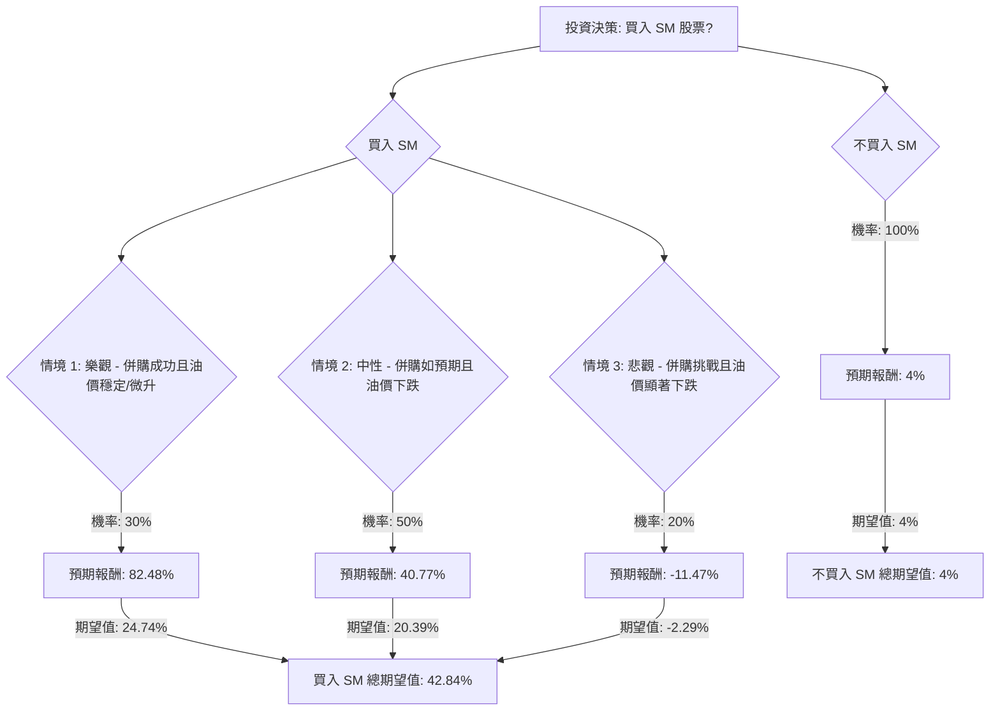

根據對SM Energy Company (SM) 的基本面數據、最新新聞、財報、市場動態及產業趨勢的綜合分析，以下將使用決策樹分析與期望值分析來評估其目前的投資適宜性。

### **核心假設**

1.  **併購成功與綜效實現**：SM Energy與Civitas Resources的合併已獲得股東批准，預計於2026年1月30日完成。假設合併將如預期般帶來規模擴大、資產基礎拓寬、營運綜效及長期股東價值提升。
2.  **油價走勢影響**：油氣價格是SM Energy獲利能力的關鍵驅動因素。儘管有短期波動，但普遍預期2026年全球油價將因供應過剩而呈現下降趨勢。
3.  **營運效率與成本控制**：合併後的公司將致力於實現營運效率和成本紀律，以應對商品價格波動和產業成本上升的壓力。
4.  **分析師預期**：分析師的目標價和評級提供了市場對SM未來表現的參考區間，但需注意其預測的變動性。

### **1. 決策樹分析 (Decision Tree Analysis)**

**決策點：投資 SM Energy (SM) 股票**

*   **當前股價 (Close):** $19.18

### **2. 計算過程**

**核心假設與情境定義：**

*   **情境 1: 樂觀 (Optimistic) - 併購成功且油價穩定/微升**
    *   **機率 (Probability):** 30%
    *   **情境描述:** 併購綜效迅速顯現，營運效率大幅提升，自由現金流改善。儘管整體油價預期下跌，但因地緣政治事件或需求超預期，油價獲得支撐或短期反彈。合併後的公司規模和多元化資產（如Permian、DJ Basin、Eagle Ford、Uinta）有助於緩解部分價格波動。參考分析師高目標價。
    *   **預期目標價:** $35.00 (參考分析師最高目標價$60 及平均目標價$33.20 區間，取較高值)
    *   **預期報酬 (Expected Return):** (($35.00 - $19.18) / $19.18) * 100% = 82.48%
    *   **期望值 (Expected Value):** 0.30 * 82.48% = 24.74%

*   **情境 2: 中性 (Moderate) - 併購如預期且油價下跌**
    *   **機率 (Probability):** 50%
    *   **情境描述:** 併購整合按計劃進行，但效益逐步顯現。油價遵循EIA/IEA預測，因供應過剩而下跌。公司透過成本控制和資本紀律維持獲利能力，但成長受商品環境限制。參考分析師共識/中位數目標價。
    *   **預期目標價:** $27.00 (參考分析師平均目標價約$27-$28.50 及CoinCodex 2026年平均預測價$23.27)
    *   **預期報酬 (Expected Return):** (($27.00 - $19.18) / $19.18) * 100% = 40.77%
    *   **期望值 (Expected Value):** 0.50 * 40.77% = 20.39%

*   **情境 3: 悲觀 (Pessimistic) - 併購挑戰且油價顯著下跌**
    *   **機率 (Probability):** 20%
    *   **情境描述:** 併購整合面臨意外挑戰，導致綜效延遲或成本增加。油價跌幅超預期，或需求顯著疲軟。營運問題（如鑽井結果不佳、服務成本上升）進一步影響獲利能力。參考分析師最低目標價。
    *   **預期目標價:** $17.00 (參考分析師最低目標價$19.00 及CoinCodex 2026年預測區間下限$18.14，考慮到負面因素，預設略低於當前股價)
    *   **預期報酬 (Expected Return):** (($17.00 - $19.18) / $19.18) * 100% = -11.47%
    *   **期望值 (Expected Value):** 0.20 * -11.47% = -2.29%

**總期望值計算：**

*   **買入 SM 股票的總期望值 (Total Expected Value for Buying SM):**
    24.74% (樂觀) + 20.39% (中性) + (-2.29%) (悲觀) = **42.84%**

*   **不買入 SM 股票的總期望值 (Total Expected Value for Not Buying SM):**
    假設將資金投入無風險資產，獲得4%的年化報酬率 (此為假設的風險自由利率，實際應參考當時市場情況)。
    **4%**

### **3. 最終結論**

根據上述決策樹分析和期望值計算，**目前適合投資 SM Energy (SM) 股票。**

**簡短理由：**

SM Energy 股票的總期望值為 **42.84%**，顯著高於不投資（或投資無風險資產）的4%期望值。儘管油價前景存在下行壓力，且分析師對其Q4 2025的EPS預期有所下調，但公司與Civitas Resources的合併預計將帶來規模經濟和營運綜效。此外，SM Energy目前的基本面數據顯示其P/E (3.11) 和P/B (0.48) 較低，股息率高達5.09%，且分析師的共識目標價普遍高於當前股價，暗示有相當大的上漲空間。雖然存在併購整合挑戰和油價波動的風險，但綜合考量下，其潛在報酬率足以彌補這些風險。