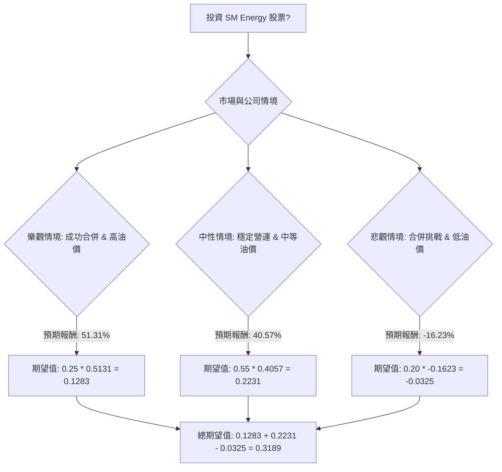

根據對美股公司 SM (SM Energy Company) 的基本面數據、最新新聞、財報、市場動態及產業趨勢的綜合評估，以下將使用決策樹分析與期望值分析來評估其目前的投資適合性。

### **核心假設**

1.  **市場趨勢：** 能源產業（特別是石油和天然氣）的商品價格波動是影響 SM Energy 盈利能力和股價的關鍵因素。目前市場對能源行業的看法存在分歧，但普遍認為在結構性投資不足的情況下，需求上升可能帶來機會。
2.  **公司財務：** SM Energy 透過資產出售和信貸額度調整積極管理債務，改善財務靈活性。儘管流動性（流動比率 0.56）較為緊張，但其盈利能力和股東權益報酬率（ROE 16.58%）表現良好。
3.  **產業競爭與營運：** 公司在米德蘭盆地（Midland Basin）的油井經濟效益具有競爭力，但奧斯汀白堊岩（Austin Chalk）等其他區域的勘探成果和營運執行情況存在不確定性。
4.  **併購影響：** 與 Civitas Resources 的全股票合併案已獲股東批准，預計於 2026 年 1 月 30 日完成。此次合併預期將帶來協同效應，但整合過程可能存在風險。本分析假設合併將按計劃進行，並對公司未來表現產生影響。
5.  **分析時程：** 本分析以未來一年作為投資評估的時間框架，與分析師的目標價預測期一致。
6.  **股息政策：** 假設公司將維持目前的季度股息政策。

### **決策樹分析**

**決策點：投資 SM Energy 股票**

*   **當前股價 (P0):** $23.66
*   **年度股息率:** 3.38%
*   **年度股息:** $23.66 * 0.0338 = $0.7998 ≈ $0.80

---

---

#### **節點計算與情境說明**

**1. 樂觀情境 (Optimistic Scenario)**
*   **情境名稱：** 成功合併與高油價
*   **情境描述：** Civitas Resources 的合併案成功整合，產生顯著的協同效應。全球石油和天然氣價格維持高位或進一步上漲。SM Energy 在各營運區域（特別是米德蘭盆地）表現出色，資產出售所得有效用於債務削減或股東回報。分析師的目標價得以實現甚至超越。
*   **機率 (Probability)：** 25%
*   **預期股價 (1年後)：** $35.00 (參考分析師平均目標價 $31.96 - $32.20 的較高區間，以及最高目標價 $49.00 - $60.00)
*   **預期報酬計算：**
    *   資本利得 = ($35.00 - $23.66) / $23.66 = 0.4793 (47.93%)
    *   總預期報酬 = 資本利得 + 股息率 = 0.4793 + 0.0338 = 0.5131 (51.31%)
*   **期望值 (Expected Value)：** 0.25 * 0.5131 = **0.1283**

**2. 中性情境 (Moderate Scenario)**
*   **情境名稱：** 穩定營運與中等油價
*   **情境描述：** 合併整合按預期進行，實現部分協同效應。石油和天然氣價格保持相對穩定，沒有大幅波動。公司營運表現穩健，米德蘭盆地持續貢獻，但其他區域可能面臨一些挑戰。公司維持良好的財務紀律。股價達到分析師的平均目標價。
*   **機率 (Probability)：** 55%
*   **預期股價 (1年後)：** $32.46 (參考公司提供的目標價，與分析師平均目標價 $31.96 - $32.20 相符)
*   **預期報酬計算：**
    *   資本利得 = ($32.46 - $23.66) / $23.66 = 0.3719 (37.19%)
    *   總預期報酬 = 資本利得 + 股息率 = 0.3719 + 0.0338 = 0.4057 (40.57%)
*   **期望值 (Expected Value)：** 0.55 * 0.4057 = **0.2231**

**3. 悲觀情境 (Pessimistic Scenario)**
*   **情境名稱：** 合併挑戰與低油價
*   **情境描述：** 合併整合遭遇重大困難，未能實現預期協同效應，甚至導致營運中斷。全球石油和天然氣價格大幅下跌。公司營運執行不佳，特別是在具有挑戰性的盆地。流動性問題加劇，債務負擔增加。股價跌至分析師最低目標價或更低。
*   **機率 (Probability)：** 20%
*   **預期股價 (1年後)：** $19.00 (參考分析師最低目標價)
*   **預期報酬計算：**
    *   資本利得 = ($19.00 - $23.66) / $23.66 = -0.1961 (-19.61%)
    *   總預期報酬 = 資本利得 + 股息率 = -0.1961 + 0.0338 = -0.1623 (-16.23%)
*   **期望值 (Expected Value)：** 0.20 * -0.1623 = **-0.0325**

### **整體期望值計算**

將各情境的期望值加總：
總期望值 = 樂觀情境期望值 + 中性情境期望值 + 悲觀情境期望值
總期望值 = 0.1283 + 0.2231 + (-0.0325) = **0.3189**

### **最終結論**

根據決策樹分析和期望值分析，投資 SM Energy (SM) 股票的**整體期望值為 0.3189 (即 31.89%)**。

**判斷：適合投資**

**簡短理由：**
儘管 SM Energy 面臨商品價格波動和合併整合的潛在挑戰，但其基本面數據顯示出較低的本益比 (P/E 3.74) 和市淨率 (P/B 0.58)，以及相對健康的股東權益報酬率 (ROE 16.58%) 和股息率 (3.38%)。最新的財報顯示公司在生產和自由現金流方面表現強勁，並積極透過資產出售和信貸調整來優化財務結構。分析師的共識目標價也顯示出顯著的潛在上漲空間。

綜合考量，雖然存在悲觀情境的風險，但中性和樂觀情境的較高機率和可觀報酬使得整體期望值為正且具吸引力。因此，目前評估 SM Energy 股票**適合投資**，尤其對於願意承擔能源行業固有風險並看好其合併後協同效應和商品價格前景的投資者。然而，投資者仍需密切關注合併進展、油氣價格走勢以及公司營運執行情況。