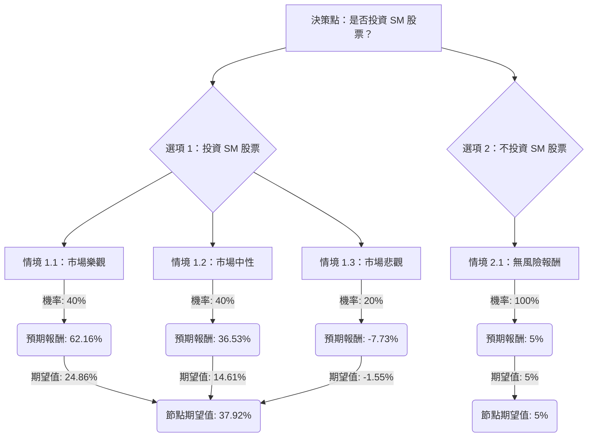

根據您提供的基本面數據以及對美股公司 SM (SM Energy Company) 的最新市場資訊進行綜合評估，以下是使用決策樹分析和期望值分析的投資評估。

SM Energy Company 是一家獨立的油氣勘探和生產公司，主要業務集中在美國德克薩斯州和猶他州的 Permian Basin、Maverick Basin 和 Uinta Basin 等地區。該公司近期於 2026 年 1 月 30 日完成了與 Civitas Resources 的全股票合併，成為美國前十大獨立油氣生產商之一，並擴大了其在 Permian Basin 的業務版圖。此次合併預計將帶來每年 2 億至 3 億美元的協同效應，並計劃在未來一年內剝離至少 10 億美元的資產以降低債務。

儘管公司在 Midland Basin 擁有具競爭力的低開採成本和 5-10 年的儲量壽命，但仍面臨維持產量所需的持續資本投入以及潛在的商品價格波動風險。分析師對 SM 的評級普遍為「中性買入」或「持有」，並給出了顯著的潛在上漲空間。

### 核心假設

1.  **投資期限：** 12 個月。
2.  **市場情境：**
    *   **樂觀情境 (Bullish)：** 假設全球經濟增長強勁，原油和天然氣價格維持高位或進一步上漲。SM Energy 成功整合 Civitas Resources，實現預期協同效應，並有效降低債務。公司營運效率提升，鑽探成果超出預期。
    *   **中性情境 (Neutral)：** 假設原油和天然氣價格保持相對穩定，全球經濟溫和增長。SM Energy 的合併整合進展順利，但協同效應可能不如預期，或面臨一些營運挑戰。公司表現符合分析師平均預期。
    *   **悲觀情境 (Bearish)：** 假設全球經濟放緩，原油和天然氣價格下跌。SM Energy 的合併整合出現問題，未能實現協同效應，甚至導致營運成本增加。公司面臨嚴重的營運挫折，如鑽探結果不佳、服務成本超預期，或債務負擔加重。
3.  **無風險報酬率：** 假設為 5% (代表投資者若不投資 SM 股票，可獲得的保守回報，例如投資於短期國債或高收益儲蓄帳戶)。

### 決策樹分析與期望值計算

**當前股價 (P0)：** $21.46
**年度股息：** $0.80 (股息率 3.7%)

#### 1. 投資 SM 股票

*   **情境 1.1：市場樂觀 (Bullish)**
    *   **機率 (Probability)：** 40% (基於分析師普遍看好潛在上漲空間及合併帶來的利好)
    *   **預期股價 (P_bullish)：** $34.00 (參考 TipRanks 和 Mizuho 的高目標價)
    *   **預期報酬 (Return_bullish)：**
        *   股價上漲：($34.00 - $21.46) / $21.46 = 58.43%
        *   總報酬：58.43% (股價上漲) + 3.73% (股息) = 62.16%
    *   **期望值 (Expected Value_bullish)：** 40% * 62.16% = 24.86%

*   **情境 1.2：市場中性 (Neutral)**
    *   **機率 (Probability)：** 40% (基於分析師「持有」評級及平均目標價)
    *   **預期股價 (P_neutral)：** $28.50 (參考 Ticker Nerd 的中位目標價)
    *   **預期報酬 (Return_neutral)：**
        *   股價上漲：($28.50 - $21.46) / $21.46 = 32.80%
        *   總報酬：32.80% (股價上漲) + 3.73% (股息) = 36.53%
    *   **期望值 (Expected Value_neutral)：** 40% * 36.53% = 14.61%

*   **情境 1.3：市場悲觀 (Bearish)**
    *   **機率 (Probability)：** 20% (考慮到商品價格波動、營運風險及部分分析師的「賣出」評級)
    *   **預期股價 (P_bearish)：** $19.00 (參考分析師最低目標價)
    *   **預期報酬 (Return_bearish)：**
        *   股價下跌：($19.00 - $21.46) / $21.46 = -11.46%
        *   總報酬：-11.46% (股價下跌) + 3.73% (股息) = -7.73%
    *   **期望值 (Expected Value_bearish)：** 20% * -7.73% = -1.55%

*   **節點期望值 (投資 SM)：** 24.86% + 14.61% + (-1.55%) = **37.92%**

#### 2. 不投資 SM 股票 (選擇無風險投資)

*   **情境 2.1：無風險報酬**
    *   **機率 (Probability)：** 100%
    *   **預期報酬 (Return_risk_free)：** 5%
    *   **期望值 (Expected Value_risk_free)：** 100% * 5% = 5%

*   **節點期望值 (不投資 SM)：** **5%**

### 決策樹圖 (Markdown)

### 最終結論

根據決策樹分析和期望值計算，**投資 SM 股票的整體期望值為 37.92%**，而選擇無風險投資的期望值為 5%。

因此，根據此分析，**SM 股票目前適合投資**。

**簡短理由：**
SM Energy 在完成與 Civitas Resources 的合併後，成為美國主要的油氣生產商之一，並預期產生顯著的協同效應和債務削減計劃。儘管油氣行業存在商品價格波動和營運風險，但分析師普遍給予「中性買入」或「持有」評級，並預期有可觀的股價上漲空間。其目前的遠期本益比 (Forward P/E) 6.47 也低於行業平均的 13.63，顯示其估值可能被低估。綜合考慮潛在的股價增長和穩定的股息收益，投資 SM 股票的預期報酬顯著高於無風險投資。