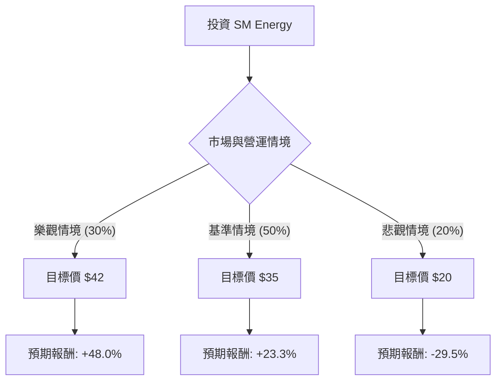

這份分析報告將針對 **SM Energy Company (SM)** 進行評估。SM 是一家獨立的能源公司，主要在德克薩斯州的二疊紀盆地（Permian Basin）和南德克薩斯州從事原油、天然氣和天然氣液（NGL）的開發與生產。

以下結合您提供的財務數據與最新的市場動態（包含近期收購案與油價趨勢）進行決策樹與期望值分析。

---

### 一、 市場動態與核心假設

在建立模型前，需考慮以下關鍵外部因素：
1.  **收購案影響**：SM 最近完成了對 **XCL Resources**（位於猶他州 Uinta 盆地）的 25.5 億美元收購。這顯著增加了其產量規模與庫存壽命，但也增加了債務壓力。
2.  **油價波動**：SM 的獲利高度依賴 WTI 原油價格。目前市場預期 2024-2025 年油價將在 $70-$85 區間震盪。
3.  **估值極低**：目前 P/E 僅 5.04，P/B 0.68，遠低於標普 500 平均水平，顯示市場對其長期成長性或油價前景存疑，但也提供了安全邊際。

---

### 二、 決策樹分析 (Decision Tree)

我們以 **未來 12 個月的投資回報** 為核心節點，劃分三種主要情境：

#### 決策樹節點詳細說明：

| 節點 (情境) | 發生機率 | 預期股價 | 預期報酬率 (相對於 $28.38) | 期望值貢獻 (EV) |
| :--- | :--- | :--- | :--- | :--- |
| **樂觀情境 (Bull)** | 30% | $42.00 | +48.0% | +14.40% |
| **基準情境 (Base)** | 50% | $35.00 | +23.3% | +11.65% |
| **悲觀情境 (Bear)** | 20% | $20.00 | -29.5% | -5.90% |
| **總計期望值** | **100%** | - | - | **+20.15%** |

---

### 三、 計算過程與核心假設

#### 1. 期望值 (Expected Value, EV) 計算：
$$EV = (0.30 \times 48.0\%) + (0.50 \times 23.3\%) + (0.20 \times -29.5\%)$$
$$EV = 14.4\% + 11.65\% - 5.9\% = 20.15\%$$

#### 2. 核心假設說明：
*   **樂觀情境 (30%)**：
    *   WTI 油價回升至 $85 以上。
    *   Uinta 盆地收購案整合順利，協同效應超出預期，自由現金流（FCF）大幅增長用於加速還債與回購股票。
    *   股價突破分析師平均目標價 ($38.21)，達到 $42。
*   **基準情境 (50%)**：
    *   油價維持在 $70-$75 區間。
    *   公司維持目前的生產效率，EPS 穩定增長（數據顯示 EPS Next Y 預期增長 14.76%）。
    *   股價向分析師共識目標價 $35-$38 靠攏。
*   **悲觀情境 (20%)**：
    *   全球經濟衰退導致油價跌破 $60。
    *   收購案帶來的債務負擔（Debt/Eq 0.59 雖不算高，但在低油價下會被放大）引起市場擔憂。
    *   股價回測 52 週低點附近（約 $20）。

---

### 四、 基本面數據補充分析

*   **超低估值**：PEG 0.56 顯示相對於其增長速度，股價被嚴重低估（通常 PEG < 1 被視為便宜）。
*   **盈利能力**：ROE 14.33% 與 Profit Margin 20.55% 顯示公司在同業中具備良好的獲利效率。
*   **技術面**：目前股價 $28.38 低於 SMA50 (0.1206 偏離) 與 SMA200 (0.2021 偏離) 的正向趨勢，但近期 Perf Week (-7.32%) 顯示有短期回檔，提供了較好的切入點。
*   **股利與回購**：3.59% 的殖利率提供了持有期間的現金流保護。

---

### 五、 最終結論

**評估結果：適合投資 (Strong Buy / Buy)**

#### 理由：
1.  **正向期望值高**：經決策樹計算，未來一年的預期報酬率期望值高達 **20.15%**，遠高於市場平均回報。
2.  **安全邊際充足**：P/B 0.68 意味著投資者能以低於公司淨資產價值的價格買入，且 P/E 僅 5 倍，下行風險在估值上已得到部分釋放。
3.  **戰略擴張**：進入 Uinta 盆地的收購案雖然短期增加了不確定性，但長期增加了資源儲備，有利於在能源價格波動中保持競爭力。
4.  **財務穩健**：Debt/Eq 0.59 處於健康水平，且 Current Ratio 0.69 雖偏低（能源股常見），但其強大的營運現金流足以覆蓋短期債務。

**建議操作**：
考慮到近期一週跌幅達 7.32%，建議可於 **$27 - $28** 區間分批建倉。主要風險點在於全球油價大幅崩跌，需密切關注 WTI 原油報價與公司收購後的首份整合財報。