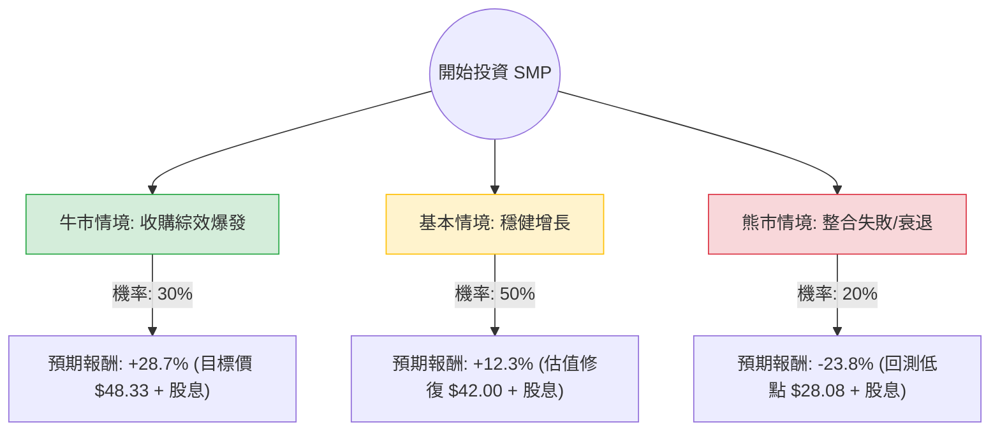

這份分析報告將結合您提供的財務數據與最新的市場動態（包含 **Standard Motor Products, Inc. (SMP)** 最近的收購案與財報表現），利用**決策樹（Decision Tree）**與**期望值分析（Expected Value Analysis）**評估其投資價值。

---

### 1. 市場背景與核心假設

在進入計算前，根據網路搜尋與數據分析，整理出以下核心假設：

*   **收購動能（Nissens Acquisition）**：SMP 最近完成了對 Nissens Automotive 的收購，這將顯著擴大其在歐洲的版圖及熱管理系統（Thermal Management）的市場份額。這是 Forward P/E（7.76）遠低於 trailing P/E（18.88）的主因，市場預期營收將大幅增長。
*   **產業趨勢**：美國車隊平均車齡持續增加（約 12.5 年），這對售後零件市場（Aftermarket）是長期利多。
*   **財務風險**：負債權益比（Debt/Eq）為 1.11，且 Quick Ratio 僅 0.78，顯示短期流動性稍緊，主要受收購產生的債務影響。
*   **估值參考**：分析師平均目標價為 **$48.33**，較目前股價（$38.54）約有 25% 的上漲空間。

---

### 2. 決策樹分析 (Decision Tree)

以下為 SMP 未來一年的投資情境決策樹：

---

### 3. 期望值計算過程

我們將報酬率定義為：**（預期股價 - 當前股價）/ 當前股價 + 股息殖利率（3.29%）**。

#### A. 各情境報酬率計算：
1.  **牛市情境 (Bull Case)**：收購 Nissens 整合順利，EPS 達到預期，股價觸及分析師目標價 $48.33。
    *   報酬率：`[(48.33 - 38.54) / 38.54] + 3.29% = 25.4% + 3.29% = 28.69%`
2.  **基本情境 (Base Case)**：市場維持現狀，車齡老化支撐需求，股價回升至 SMA200 以上約 $42 水準。
    *   報酬率：`[(42.00 - 38.54) / 38.54] + 3.29% = 8.98% + 3.29% = 12.27%`
3.  **熊市情境 (Bear Case)**：高利率導致債務壓力過大，或經濟衰退導致維修支出延後，股價回測 52 週低點 $28.08。
    *   報酬率：`[(28.08 - 38.54) / 38.54] + 3.29% = -27.14% + 3.29% = -23.85%`

#### B. 整體期望值 (Expected Value, EV) 計算：
`EV = (P1 * R1) + (P2 * R2) + (P3 * R3)`
*   `EV = (0.30 * 28.69%) + (0.50 * 12.27%) + (0.20 * -23.85%)`
*   `EV = 8.607% + 6.135% - 4.77%`
*   **`EV = 9.972%`**

---

### 4. 核心假設說明

1.  **市場假設**：假設未來 12 個月美國不會進入深度經濟衰退，汽車售後市場需求保持彈性。
2.  **財務假設**：Forward P/E 7.76 顯示市場對 Nissens 收購案後的獲利能力極為樂觀，假設公司能維持 30% 以上的毛利率。
3.  **產業趨勢**：電動車轉型對 SMP 是長期挑戰，但短期內燃機零件（Engine Management）仍是現金牛，且收購 Nissens 強化了其在電動車亦需要的「熱管理系統」佈局。

---

### 5. 最終結論

**判斷：適合投資 (Buy / Overweight)**

#### 理由：
1.  **正向期望值**：經過風險加權後的預期報酬率約為 **10%**，優於許多成熟工業股，且包含 3.29% 的穩定股息提供下行保護。
2.  **估值極具吸引力**：Forward P/E 僅 7.76，PEG 為 1.0，顯示股價尚未反映收購 Nissens 後帶來的增長潛力。
3.  **技術面支撐**：股價目前在 $38.54，接近 SMA20 ($38.41) 與 SMA50 ($37.28)，顯示短期有支撐，且距離 52 週高點仍有空間。
4.  **防禦性特質**：在經濟不確定時期，消費者傾向「修車而非買車」，SMP 作為售後零件龍頭，具有抗週期特性。

**風險提示**：需密切觀察下一季財報中關於**債務償還進度**與**收購整合成本**的說明。若 Quick Ratio 進一步惡化，可能面臨短期流動性風險。