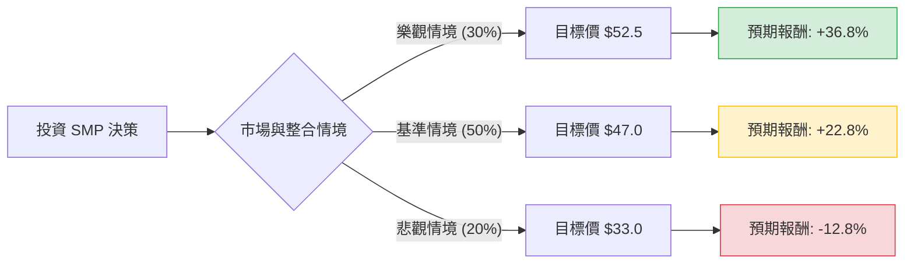

針對美股公司 **Standard Motor Products, Inc. (SMP)**，我結合了您提供的基本面數據以及最新的市場動態（包含 2024 年第三季財報與 Nissens 收購案），進行決策樹與期望值分析。

---

### 一、 核心假設與市場背景分析

在建立模型前，基於最新資訊設定以下核心假設：

1.  **收購綜效（Nissens Acquisition）**：SMP 最近完成了對歐洲 Nissens Automotive 的收購。這將顯著提升其在歐洲市場的份額及熱管理系統（Thermal Management）的產品線，但也增加了債務壓力（Debt/Eq 來到 1.04）。
2.  **車齡老化趨勢**：美國平均車齡已達 12.6 年，這對售後零件（Aftermarket）供應商 SMP 是長期利多。
3.  **估值水平**：目前 Forward P/E 僅 9.15，低於行業平均，且 PEG 為 0.95，顯示股價相對於成長性被低估。
4.  **宏觀風險**：高利率環境可能增加其債務利息支出，且經濟放緩可能影響消費者維修意願。

---

### 二、 決策樹分析 (Decision Tree)

以下為 SMP 未來一年的投資決策樹模型：

#### 節點詳細說明：

1.  **樂觀情境 (Bull Case) - 30% 機率**：
    *   **條件**：Nissens 整合速度優於預期，歐洲營收大幅增長；美國售後市場因冬季嚴寒帶動零件需求。
    *   **預期股價**：$52.5 (給予 P/E 14x)。
    *   **報酬計算**：(52.5 - 39.3) / 39.3 + 3.16% (股息) ≈ **+36.8%**。

2.  **基準情境 (Base Case) - 50% 機率**：
    *   **條件**：符合分析師預期，營收穩健增長，債務按計畫償還。
    *   **預期股價**：$47.0 (分析師平均目標價)。
    *   **報酬計算**：(47.0 - 39.3) / 39.3 + 3.16% (股息) ≈ **+22.8%**。

3.  **悲觀情境 (Bear Case) - 20% 機率**：
    *   **條件**：收購整合產生文化衝突或成本超支；高利率導致利息支出侵蝕利潤；經濟衰退導致修車需求下降。
    *   **預期股價**：$33.0 (回測 52 週低點支撐區)。
    *   **報酬計算**：(33.0 - 39.3) / 39.3 + 3.16% (股息) ≈ **-12.8%**。

---

### 三、 期望值分析 (Expected Value Analysis)

根據上述機率與報酬率，計算整體投資的期望報酬率：

#### 1. 計算公式：
$$EV = (P_{Bull} \times R_{Bull}) + (P_{Base} \times R_{Base}) + (P_{Bear} \times R_{Bear})$$

#### 2. 帶入數值：
*   **樂觀部分**：$0.30 \times 36.8\% = 11.04\%$
*   **基準部分**：$0.50 \times 22.8\% = 11.40\%$
*   **悲觀部分**：$0.20 \times (-12.8\%) = -2.56\%$

#### 3. 總計期望報酬率：
$$EV = 11.04\% + 11.40\% - 2.56\% = \mathbf{19.88\%}$$

---

### 四、 綜合評估與最終結論

#### 數據亮點總結：
*   **低估值**：Forward P/E 9.15 與 PEG 0.95 顯示股價具有安全邊際。
*   **高股息**：3.16% 的股息率在汽車零件業中相當穩健，提供下行保護。
*   **成長動能**：Sales Q/Q 達 24.94%，顯示收購與市場擴張已開始反映在營收上。
*   **技術面**：股價目前高於 SMA20, 50, 200，呈現多頭排列。

#### 潛在風險：
*   **債務比率**：Debt/Eq 1.04 略高，需關注後續利息覆蓋率。
*   **現金流**：P/FCF 為 19.19，相較於 P/E 略高，顯示資本支出較大。

#### **最終結論：適合投資 (Suitable for Investment)**

**理由：**
1.  **期望報酬率極佳**：經風險加權後的期望報酬率高達 **19.88%**，遠高於市場平均預期。
2.  **防禦與成長兼具**：SMP 既受益於「高車齡」的防禦性需求，又具備「歐洲收購」的成長題材。
3.  **估值修復空間**：目前股價 $39.3 距離分析師目標價 $47 仍有約 20% 的上漲空間，且 Forward P/E 顯示市場尚未完全反映其未來的盈利增長。

**建議操作：**
可在 $38 - $40 區間分批佈局，長期持有以領取股息並等待收購綜效發酵。若股價跌破 $33 (悲觀支撐位)，則需重新評估收購整合是否失敗。