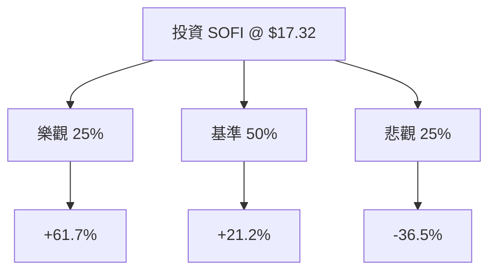

# SOFI Technologies Inc (SOFI) 量化投資分析報告

作為量化投資分析師，針對 SoFi 目前的數據與市場動態，我將透過機率思維與期望值（Expected Value, EV）模型進行深度拆解。

---

### 1. 核心驅動因素與風險 (Drivers & Risks)

#### **關鍵催化劑 (Catalysts)**
1.  **技術平台 (Technology Platform) 的規模效應**：SoFi 不僅是銀行，其 Galileo 與 Technisys 構成的金融服務底層架構正進入高利潤增長期。若該部門營收增速超過 20% 且利潤率擴張，將引發市場對其從「銀行股」向「高成長科技股」的估值重估。
2.  **降息循環帶來的貸款需求與成本優化**：隨著聯準會進入降息週期，SoFi 的融資成本（存款利息）下降速度預計快於貸款端，且低利率環境將刺激學生貸款再融資與個人貸款的需求回升。
3.  **GAAP 獲利能力的持續驗證**：SoFi 已實現連續季度盈利。未來 6-12 個月若 EPS 增長超預期（目前預期明年 EPS 增長 39.56%），將吸引更多機構投資者（目前機構持倉變動為 -4.82%，具備回補空間）。

#### **主要風險點 (Risks)**
1.  **信用風險與違約率上升**：若美國經濟進入硬著陸，SoFi 核心客戶群（高收入專業人士）的失業率上升，將導致其無擔保個人貸款的違約率（Charge-off rates）飆升，侵蝕利潤。
2.  **監管壓力與資本要求**：作為持牌銀行，監管機構可能提高資本充足率要求，這將限制 SoFi 的槓桿倍數與放貸規模，進而壓低 ROE（目前為 7.09%）。
3.  **競爭加劇導致利差收窄**：傳統銀行與其他金融科技公司（如 Robinhood, Affirm）在存款利率與貸款產品上的價格戰，可能迫使 SoFi 犧牲淨利差（NIM）以維持用戶增長。

---

### 2. 情境設定與機率賦予 (Scenario Modeling)

基於當前股價 **$17.32** 與基本面數據，設定未來 12 個月的三種情境：

#### **樂觀情境 (Bull Case)**
*   **發生條件**：技術平台營收佔比顯著提升；降息帶動貸款量爆發；EPS 增長超過 50%；成功納入標普 500 指數。
*   **預估機率**：25%
*   **目標價格與預期回報**：**$28.00 (+61.7%)**。基於 Forward P/E 35x（科技股估值）與 2025 年預期 EPS。

#### **基準情境 (Base Case)**
*   **發生條件**：業務按計畫增長，金融服務部門持續盈利，貸款違約率保持在可控範圍，符合分析師平均預期。
*   **預估機率**：50%
*   **目標價格與預期回報**：**$21.00 (+21.2%)**。接近分析師目標價 $20.14，基於 Forward P/E 25x。

#### **悲觀情境 (Bear Case)**
*   **發生條件**：宏觀經濟衰退導致信用損失大幅增加；營收增速放緩至個位數；市場情緒惡化導致估值回歸傳統銀行水平。
*   **預估機率**：25%
*   **目標價格與預期回報**：**$11.00 (-36.5%)**。基於 P/B 1.2x 的安全邊際支撐。

---

### 3. 期望值計算與決策樹 (EV Calculation & Decision Tree)

#### **決策樹結構**

#### **總期望值計算**
*   `EV = (0.25 * 61.7%) + (0.50 * 21.2%) + (0.25 * -36.5%)`
*   `EV = 15.425% + 10.6% - 9.125%`
*   **`EV = 16.9%`**

#### **風險回報比分析**
*   **上行潛力**：平均約 +41.5% (Bull & Base 加權)
*   **下行空間**：-36.5%
*   **不對稱性**：期望值為正（16.9%），且 PEG 僅為 0.53，顯示目前的增長預期並未被完全定價，具備投資吸引力。

---

### 4. 決策總結 (Decision Summary)

| 情境 | 發生機率 (%) | 預期報酬率 (%) | 關鍵驅動/觸發因素 |
| :--- | :--- | :--- | :--- |
| **樂觀 (Bull)** | 25% | +61.7% | 技術平台重估、降息紅利、EPS 暴擊 |
| **基準 (Base)** | 50% | +21.2% | 穩健執行力、金融服務規模化、符合預期 |
| **悲觀 (Bear)** | 25% | -36.5% | 經濟衰退、信用違約飆升、監管利空 |
| **整體期望值** | **100%** | **+16.9%** | **加權平均預期回報** |

**最終結論：**
1.  **投資建議**：**買入 (Buy)**
2.  **核心逻辑**：SOFI 的期望值回報率為 16.9%，顯著高於無風險利率與標普 500 長期平均回報。其 PEG 0.53 顯示股價相對於盈餘增長被低估。雖然短期波動大（Short Float 13.99%），但高空單比例在利多出現時易引發軋空，進一步推升樂觀情境的實現機率。
3.  **風控建議**：若股價跌破 **$14.88**（52週低點附近）或貸款違約率連續兩個季度超過 5%，則視為進入悲觀情境，應考慮減碼或執行止損，以保護資本。【結束指令】