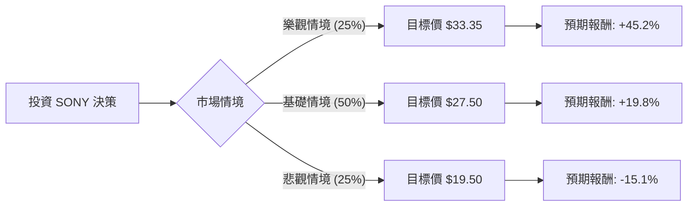

這份分析報告將結合您提供的財務數據與最新的市場動態（如 PS5 Pro 發售、半導體感測器需求、以及 2024 年 10 月進行的股票分割），利用**決策樹（Decision Tree）**與**期望值分析（Expected Value Analysis）**評估 SONY 的投資價值。

---

### 一、 核心假設與市場背景分析

在建立模型前，我們先整合基本面與最新資訊：

1.  **股票分割與估值**：SONY 於 2024 年 10 月完成了 1 拆 5 的股票分割。目前股價約 $23（對應分割前約 $115），P/E 17.65 倍，處於歷史中值偏低水位。
2.  **遊戲業務（G&NS）**：PS5 Pro 已上市，雖然定價高昂引起爭議，但其高毛利有助於提升利潤。此外，2025 年預期有《GTA VI》等大作帶動硬體更換潮。
3.  **影像感測器（I&SS）**：隨著智慧型手機市場回溫（尤其是 iPhone 16 系列採用高階感測器），SONY 作為全球龍頭將直接受益。
4.  **財務拆分計畫**：SONY 預計於 2025 年將金融業務（Sony Financial）部分拆分上市，這通常被視為釋放企業價值的利多。
5.  **技術面**：目前股價低於 SMA20, 50, 200，顯示短期趨勢偏弱，處於超賣或築底階段。

---

### 二、 決策樹分析圖 (Decision Tree)

我們預測未來一年的三種情境：

#### 節點詳細說明：

| 節點 (情境) | 發生機率 (P) | 預期股價 (1年) | 預期報酬率 (R) | 期望值 (P * R) |
| :--- | :--- | :--- | :--- | :--- |
| **樂觀情境 (Bull)** | 25% | $33.35 (分析師目標) | +45.2% | 11.3% |
| **基礎情境 (Base)** | 50% | $27.50 (估值修復) | +19.8% | 9.9% |
| **悲觀情境 (Bear)** | 25% | $19.50 (接近52W低點) | -15.1% | -3.78% |
| **總計** | **100%** | - | - | **17.42%** |

---

### 三、 計算過程與假設依據

#### 1. 期望值 (Expected Value, EV) 計算：
$$EV = (0.25 \times 45.2\%) + (0.50 \times 19.8\%) + (0.25 \times -15.1\%)$$
$$EV = 11.3\% + 9.9\% - 3.78\% = 17.42\%$$

#### 2. 情境假設依據：
*   **樂觀情境 (25%)**：
    *   PS5 Pro 銷量超預期，且《GTA VI》預熱帶動主機銷量。
    *   影像感測器受惠於 AI 手機浪潮，毛利大幅提升。
    *   金融業務拆分進度順利，市場給予更高估值。
    *   股價達到分析師平均目標價 $33.35。
*   **基礎情境 (50%)**：
    *   遊戲業務平穩，雖然硬體增長放緩，但 PS Plus 訂閱服務貢獻穩定現金流。
    *   P/E 從 17 倍回升至歷史平均約 20-21 倍。
    *   股價回升至 SMA200 以上水平。
*   **悲觀情境 (25%)**：
    *   全球消費性電子需求持續疲軟。
    *   日圓匯率劇烈波動影響海外營收折算。
    *   競爭對手（如 Microsoft/Nintendo）推出更具競爭力的產品。
    *   股價回測 52 週低點區域。

---

### 四、 綜合評估與最終結論

#### **最終判斷：適合投資 (Buy / Overweight)**

#### **理由如下：**

1.  **期望值正向**：計算出的年度預期報酬率為 **17.42%**，遠高於目前美債收益率與多數保守型投資工具，具備良好的風險回報比。
2.  **財務體質極佳**：
    *   **Debt/Eq 僅 0.21**，顯示債務極低，在當前高利率環境下具備極強的抗風險能力。
    *   **P/FCF (股價自由現金流比) 為 8.35**，顯示公司產生現金的能力極強，目前的股價相對於其現金流非常便宜。
3.  **估值吸引力**：Forward P/E 為 17.2，低於科技巨頭平均水平。且 PEG 為 3.0（雖然略高，但考慮到其娛樂與半導體複合產業特性，尚屬合理）。
4.  **催化劑 (Catalysts)**：
    *   2025 年金融業務拆分將釋放隱藏價值。
    *   遊戲產業即將進入下一波大作週期（2025 年）。
    *   目前技術指標（SMA20/50/200 均為負值）顯示股價處於短期底部，是分批布局的良機。

**投資建議：**
建議在 $22 - $23 區間分批進場。由於短期技術面偏弱（Perf Quarter -21%），投資者應保持耐心，以 12 個月以上的長線視角持有，以捕捉估值修復與業務拆分的紅利。

---
*風險提示：美股市場受總體經濟（如聯準會利率決策）影響大，且 SONY 作為跨國企業受匯率波動影響顯著，投資前請務必考量個人風險承受能力。*