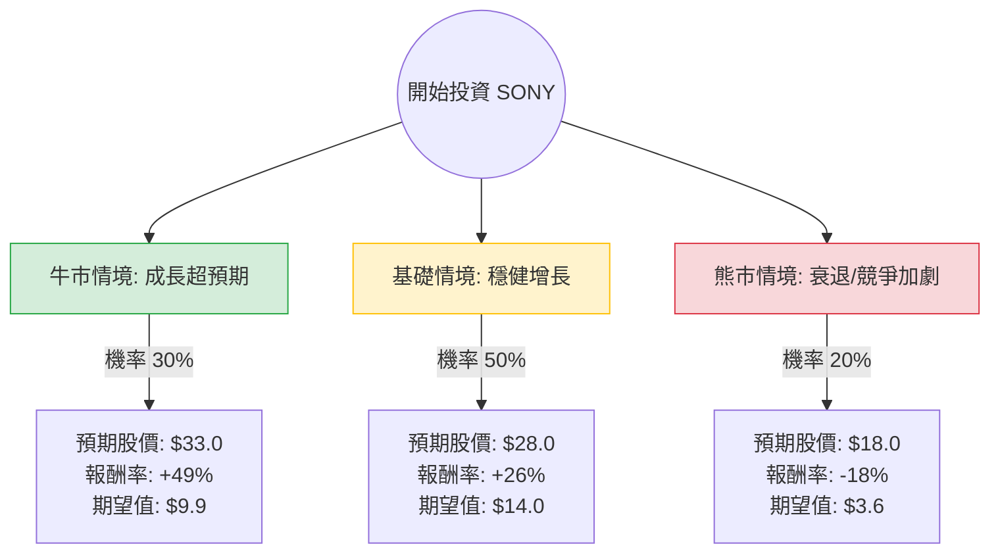

這份分析報告結合了您提供的基本面數據，以及針對 **Sony Group Corporation (SONY)** 最新財報（2024 會計年度第二季，截至 9 月底）與市場動態的即時搜尋資訊。

**注意：** Sony 於 2024 年 10 月 1 日進行了 **1:5 的股票分割**，因此目前的股價（約 $22.12）反映了分割後的價值。

---

### 一、 核心假設與市場動態分析

在構建決策樹前，我們基於以下關鍵因素設定假設：

1.  **遊戲與網路服務 (G&NS)**：PS5 Pro 已上市，雖然硬體進入生命週期中後期，但軟體銷售（如《黑神話：悟空》帶動的效應）與 PS Plus 訂閱服務利潤強勁。
2.  **影像與感測方案 (I&SS)**：受惠於智慧型手機（尤其是 iPhone 16 系列）對高階感測器的需求，此部門利潤大幅增長。
3.  **財務表現**：Sony 最近上修了全年營業利潤預測，顯示管理層對下半年（含聖誕旺季）持樂觀態度。
4.  **宏觀風險**：日圓匯率波動、全球消費性電子需求疲軟、以及遊戲開發成本攀升是主要下行風險。

---

### 二、 決策樹分析 (Decision Tree)

我們以 **未來 12 個月** 的投資預期為目標，設定三種情境：

#### 決策樹節點詳細說明：

| 情境 | 機率 (P) | 預期目標價 (TP) | 預期報酬率 (R) | 期望值貢獻 (P * TP) |
| :--- | :--- | :--- | :--- | :--- |
| **牛市 (Bull Case)** | 30% | $33.0 | +49.2% | $9.90 |
| **基礎 (Base Case)** | 50% | $28.0 | +26.6% | $14.00 |
| **熊市 (Bear Case)** | 20% | $18.0 | -18.6% | $3.60 |
| **總計** | **100%** | **加權預期股價** | **$27.50** | |

---

### 三、 計算過程與邏輯

#### 1. 期望值 (Expected Value, EV) 計算
*   **加權預期股價** = $(33.0 \times 0.3) + (28.0 \times 0.5) + (18.0 \times 0.2) = 9.9 + 14.0 + 3.6 = \mathbf{\$27.50}$
*   **預期總報酬率** = $(\$27.50 - \$22.12) / \$22.12 = \mathbf{+24.3\%}$

#### 2. 情境假設邏輯
*   **牛市情境 ($33.0)**：
    *   PS5 Pro 銷量超乎預期，且《GTA VI》預熱帶動硬體換機潮。
    *   影像感測器市佔進一步擴大，且日圓維持在有利於出口的區間。
    *   對應數據中的 Target Price ($30.5) 之溢價表現。
*   **基礎情境 ($28.0)**：
    *   符合分析師平均預期。Forward P/E 回歸至歷史均值（約 18-20x）。
    *   遊戲軟體銷售抵銷硬體增速放緩。
    *   ROE 維持在 13% 左右的健康水準。
*   **熊市情境 ($18.0)**：
    *   全球經濟衰退導致高價電子產品需求萎縮。
    *   感測器競爭對手（如三星）價格戰。
    *   股價回測 52 週低點（$19.62）以下。

---

### 四、 綜合基本面評估

*   **估值優勢**：Forward P/E 為 15.99，相較於其歷史平均與科技巨頭同業，目前估值並不昂貴。PEG 1.34 顯示其增長與估值尚屬合理。
*   **財務健康**：Debt/Eq 僅 0.21，負債比極低，財務結構非常穩健。
*   **技術面**：SMA20 與 SMA50 均呈現正向（+10%, +9%），顯示短期動能強勁，股價正從低位反彈。
*   **獲利能力**：ROE 13.02% 表現優異，雖然 EPS Q/Q 有所下滑，但最新財報顯示營業利潤已大幅回升。

---

### 五、 最終結論

**投資建議：適合投資 (Strong Buy / Accumulate)**

#### 理由：
1.  **期望值顯著為正**：計算出的加權預期股價為 **$27.50**，較目前市價有約 **24.3%** 的潛在漲幅，具備良好的風險報酬比。
2.  **結構性成長**：Sony 已成功轉型為以「內容與感測器」為核心的企業。即便硬體週期波動，其音樂、影視與遊戲訂閱的現金流極為穩定。
3.  **估值修復空間**：目前股價仍低於分析師平均目標價 ($30.5)，且在股票分割後，散戶進入門檻降低，有利於流動性與股價推升。
4.  **下行風險受控**：極低的負債比與強大的品牌護城河，使其在熊市情境下具有較強的抗跌性。

**建議操作：**
可在 $21.5 - $22.5 區間分批佈局，首波目標價看 $28.0，若 PS5 Pro 銷售數據亮眼或有大型併購案，可持有至 $30 以上。