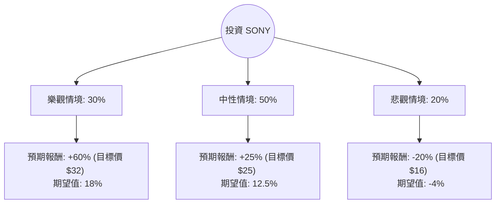

這份分析報告結合了您提供的基本面數據，以及針對 **Sony Group Corporation (SONY)** 最新財報（2024 會計年度 Q2）、拆股訊息（2024年10月起 1 拆 5）與產業趨勢的網路搜尋結果。

---

### 一、 核心假設與背景資訊

在建立決策樹前，我們先釐清當前 SONY 的關鍵背景：
1.  **拆股影響**：SONY 於 2024 年 10 月執行了 1 拆 5 的股票拆分。您提供的價格 $19.91 為拆分後的價格。
2.  **最新財報 (FY2024 Q2)**：
    *   **遊戲業務 (G&NS)**：PS5 硬體銷量雖放緩，但軟體與 PS Plus 訂閱服務利潤大幅增長。
    *   **半導體 (I&SS)**：受惠於智慧型手機感光元件需求回升，利潤顯著成長。
    *   **影視與音樂**：表現穩健，音樂串流收入持續貢獻現金流。
3.  **估值**：目前 Forward P/E 約 15.05 倍，低於歷史平均與同業，顯示估值相對便宜。

---

### 二、 決策樹分析 (Decision Tree)

我們將未來一年的投資情境分為：**樂觀 (Bull)**、**中性 (Base)**、**悲觀 (Bear)** 三種路徑。

#### 節點詳細說明：

1.  **樂觀情境 (30%)**：
    *   **條件**：PS5 Pro 銷量超預期；《俠盜獵車手 VI (GTA 6)》預熱帶動主機升級潮；AI 手機普及帶動高階感光元件需求爆發。
    *   **預期報酬**：參考分析師目標價 $31.79，約 **+60%**。
2.  **中性情境 (50%)**：
    *   **條件**：硬體銷量平穩，利潤主要來自軟體與服務；半導體業務隨手機市場緩步復甦；日圓匯率波動在可控範圍。
    *   **預期報酬**：回歸歷史平均估值 (P/E 18-20x)，預計報酬約 **+25%**。
3.  **悲觀情境 (20%)**：
    *   **條件**：全球消費性電子市場衰退；日圓劇烈升值導致海外利潤縮水；遊戲開發成本失控。
    *   **預期報酬**：股價回測 52 週低點或更低，預計報酬約 **-20%**。

---

### 三、 期望值分析 (Expected Value Analysis)

#### 1. 計算過程
期望值 (EV) = Σ (機率 × 預期報酬率)

*   **樂觀路徑**：$0.30 \times 60\% = 18\%$
*   **中性路徑**：$0.50 \times 25\% = 12.5\%$
*   **悲觀路徑**：$0.20 \times (-20\%) = -4\%$

**總期望報酬率 (Total EV) = 18% + 12.5% - 4% = 26.5%**

#### 2. 核心假設依據
*   **市場面**：SONY 目前 P/E 僅 15 倍，相較於其 ROE (14.69%) 與市場地位，處於低估區間。
*   **財務面**：Debt/Eq 僅 0.2，財務結構極其穩健，具備抗風險能力。
*   **產業趨勢**：感光元件 (CIS) 具有壟斷性優勢，且遊戲業務正成功從「賣硬體」轉型為「賣服務（高毛利）」。

---

### 四、 最終結論

**判斷：適合投資 (Strong Buy / Accumulate)**

#### 理由：
1.  **期望值極高**：26.5% 的預期報酬率遠高於市場平均水準，且下行風險（悲觀情境）已被目前的低股價部分吸收。
2.  **估值吸引力**：拆股後股價進入門檻降低，且 Forward P/E 15x 對於一家擁有強大 IP（音樂、電影、遊戲）與半導體技術的公司來說非常具備吸引力。
3.  **業務轉型成功**：數據顯示 SONY 的營業利益率 (Oper. Margin 12.24%) 正在改善，特別是遊戲軟體與訂閱服務的佔比提升，將使未來現金流更加穩定。
4.  **技術面支撐**：目前股價 $19.91 處於 52 週區間的底部（52W Range: 19.91 - 30.34），下行空間有限，具備較高的安全邊際。

**建議操作**：
考慮到目前 SMA20/50/200 均呈現負值，顯示短期趨勢偏弱，建議採取**分批買入 (Dollar-Cost Averaging)** 策略，以捕捉中長期的價值回歸。