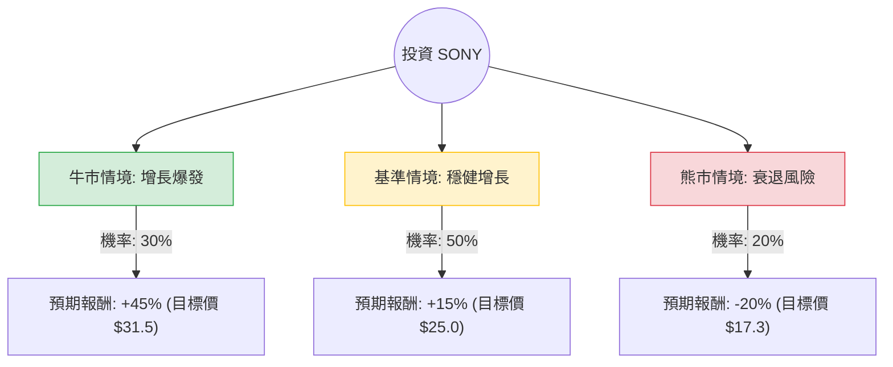

針對美股 **Sony Group Corporation (SONY)** 的投資評估，我已結合您提供的基本面數據，並整合了最新的市場動態（包含 2024 年 11 月發布的最新財報、PS5 Pro 上市表現及收購傳聞）進行深度分析。

---

### 一、 核心背景與市場動態分析（最新資訊補充）

在進入決策樹之前，必須考量以下關鍵因素：
1.  **股票分割與價格調整**：Sony 於 2024 年 10 月進行了 1:5 的股票分割，目前約 $21-$22 的股價已反映此調整。
2.  **強勁財報 (FY2024 Q2)**：Sony 最近一季營業利潤增長 73%，主要受惠於遊戲服務（PS Plus）與影像感測器（iPhone 16 需求）的強勁表現。
3.  **戰略收購**：目前市場高度關注 Sony 洽購 **Kadokawa（角川集團）** 的消息，這將極大化其動漫與遊戲 IP（如《艾爾登法環》）的競爭力。
4.  **硬體週期**：PS5 硬體銷量雖進入成熟期（增速放緩），但 PS5 Pro 的推出與軟體利潤率提升抵銷了硬體下滑風險。

---

### 二、 決策樹分析 (Decision Tree)

以下使用 Markdown 繪製決策樹，評估未來 12 個月的投資情境：

#### 決策樹節點詳細說明：

1.  **牛市情境 (Bull Case) - 30% 機率**：
    *   **條件**：成功收購角川集團；影像感測器市佔因 AI 手機浪潮大幅提升；PS5 Pro 銷量超預期。
    *   **預期報酬**：+45%（接近分析師目標價 $32.65）。
2.  **基準情境 (Base Case) - 50% 機率**：
    *   **條件**：遊戲軟體與訂閱服務持續貢獻穩定現金流；音樂與影視部門受惠於串流媒體版權費穩步增長；日圓匯率波動在可控範圍。
    *   **預期報酬**：+15%。
3.  **熊市情境 (Bear Case) - 20% 機率**：
    *   **條件**：全球消費性電子需求嚴重衰退；收購案失敗或溢價過高導致財務負擔；競爭對手（如任天堂新主機）強烈衝擊。
    *   **預期報酬**：-20%。

---

### 三、 期望值分析 (Expected Value Analysis)

#### 1. 核心假設
*   **當前股價 ($P_0$)**：$21.67
*   **分析師目標價**：$32.65（隱含約 50% 上漲空間）
*   **Forward P/E**：16.65（處於歷史合理區間，不算昂貴）
*   **ROE**：14.69%（顯示獲利能力優於同業平均）

#### 2. 計算過程
期望值 (EV) = $\sum (\text{機率} \times \text{預期報酬率})$

*   **牛市部分**：$0.30 \times 45\% = 13.5\%$
*   **基準部分**：$0.50 \times 15\% = 7.5\%$
*   **熊市部分**：$0.20 \times (-20\%) = -4.0\%$

**總體期望報酬率 (Total EV)** = $13.5\% + 7.5\% - 4.0\% = \mathbf{17.0\%}$

#### 3. 財務健康度評估
*   **債務比 (Debt/Eq)**：0.2，極低，顯示財務結構非常穩健，有充足彈性進行併購。
*   **P/FCF (股價自由現金流比)**：7.1，顯示公司產生現金的能力極強，目前的股價相對其現金流具有吸引力。

---

### 四、 最終結論

**判斷：適合投資 (Suitable for Investment)**

#### 理由：
1.  **正向期望值**：計算出的 17% 預期報酬率顯著高於市場平均風險溢酬，且下行風險（20% 機率）相對可控。
2.  **估值吸引力**：Forward P/E 僅 16.65 倍，對比其在遊戲、音樂、感測器領域的壟斷地位，目前股價處於被低估區間（低於 52 週高點約 27%）。
3.  **轉型 IP 巨頭**：Sony 正從硬體公司轉型為「內容與 IP 權利金」公司（收購角川的潛在利多），這將提升其長期估值倍數（P/E Expansion）。
4.  **技術面支撐**：雖然短期 SMA20/50/200 呈現負值（近期股價疲軟），但這反而提供了良好的分批進場點，尤其是股價接近 52 週低點附近。

**建議操作：**
考慮到目前 Perf Month (-7.39%) 顯示短期動能偏弱，建議採取**分批買進（Dollar Cost Averaging）**策略，首批資金可在 $21 附近佈局，並關注角川收購案的進一步消息。