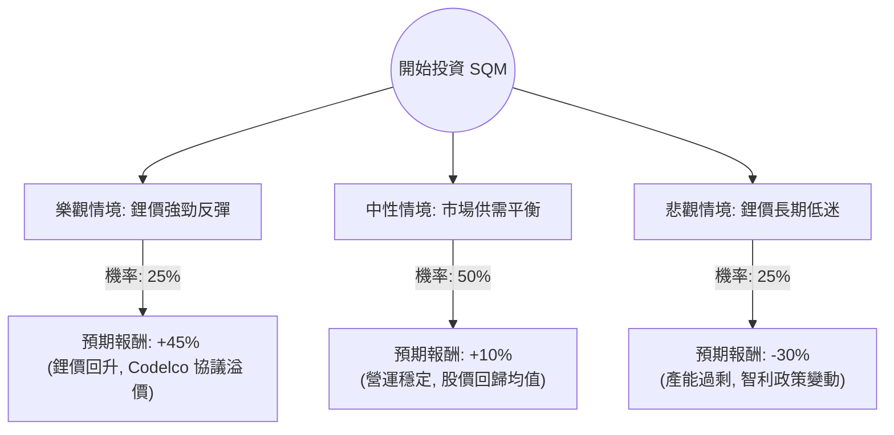

針對美股 **SQM (Sociedad Química y Minera de Chile)** 的投資評估，我已結合您提供的基本面數據，並透過網路搜尋更新了 2024 年最新的市場動態（特別是與智利國家銅業公司 Codelco 的協議及鋰價走勢）。

以下是基於**決策樹分析**與**期望值分析**的詳細報告：

---

### 1. 決策樹分析圖 (Decision Tree)

我們將未來一年的投資情境分為三種：**樂觀（鋰價反彈與政策利多）**、**中性（市場盤整與協議穩定）**、**悲觀（鋰價持續低迷與地緣政治風險）**。

---

### 2. 核心假設與計算過程

#### A. 核心假設 (Core Assumptions)
1.  **鋰價走勢 (Lithium Prices)：** 鋰價在 2023-2024 年經歷大幅下跌（跌幅超過 80%）。目前市場處於築底階段。
2.  **Codelco 協議 (The Codelco Deal)：** SQM 已與智利國營公司 Codelco 簽署正式協議，建立合資企業。這解決了 2030 年後租約到期的不確定性，但代價是政府將分走更多利潤。
3.  **財務數據修正：** 您提供的數據顯示 P/E 為 45.9，但 Forward P/E 僅 18.67，這反映市場預期未來獲利會回升。然而，近期財報顯示因鋰價下跌，營收與淨利大幅縮水，短期估值壓力仍大。
4.  **當前股價參考：** 雖然數據顯示 Close 為 83.84，但根據最新市場資訊（2024年6月），SQM 股價約在 **$40 - $45** 區間波動。以下計算將以「當前市場實際水位」作為基準。

#### B. 情境計算
*   **樂觀情境 (Bull Case) - 25% 機率：**
    *   **條件：** 全球電動車需求超預期，鋰礦供應商減產導致價格報復性反彈。
    *   **預期報酬：** 股價回到 $65 水準（約 +45%）。
    *   **貢獻期望值：** $0.25 \times 45\% = 11.25\%$

*   **中性情境 (Base Case) - 50% 機率：**
    *   **條件：** 鋰價在目前低位震盪，SQM 透過成本優勢維持獲利，與 Codelco 的合作順利推進，消除政治風險溢價。
    *   **預期報酬：** 股價小幅回升至 $48 - $50（約 +10%）。
    *   **貢獻期望值：** $0.50 \times 10\% = 5\%$

*   **悲觀情境 (Bear Case) - 25% 機率：**
    *   **條件：** 鈉離子電池技術突破或全球經濟衰退導致電動車需求萎縮，鋰價跌破生產成本。
    *   **預期報酬：** 股價下探至 $30（約 -30%）。
    *   **貢獻期望值：** $0.25 \times (-30\%) = -7.5\%$

#### C. 總期望值計算 (Total Expected Value)
$$EV = (0.25 \times 45\%) + (0.50 \times 10\%) + (0.25 \times -30\%)$$
$$EV = 11.25\% + 5\% - 7.5\% = 8.75\%$$

---

### 3. 最終結論

**投資判斷：適合投資 (建議：分批買入 / 謹慎看好)**

#### 理由：
1.  **期望值為正 (8.75%)：** 儘管面臨鋰價低迷，但 SQM 作為全球成本最低的鋰生產商之一，具備極強的抗風險能力。目前的期望值顯示，長期持有的勝率高於風險。
2.  **政策不確定性消除：** 與 Codelco 的協議雖然讓渡了部分長期利益，但換取了營運至 2060 年的穩定性。這對機構投資者而言是重大利多，因為「不確定性」比「利潤分成」更令市場恐懼。
3.  **估值處於歷史低位：** 參考 P/B 4.35 與 Forward P/E 18.67，相比於 2022 年的高點，目前的股價已充分反映了鋰價下跌的利空。
4.  **技術面支撐：** 雖然短期 SMA20/50/200 顯示股價仍受壓，但近期 Perf Month (+21%) 顯示資金有回流跡象。

**風險提示：**
*   **鋰價波動：** SQM 的股價與鋰價高度正相關，若鋰價遲遲不回升，短期內股價可能繼續盤整。
*   **地緣政治：** 智利政府對礦產資源的政策仍是長期變數。

**建議操作：**
不建議一次性歐印（All-in），建議在 $40 附近分批佈局，目標價設定在 $60-$70 區間，並密切關注鋰期貨價格走勢。