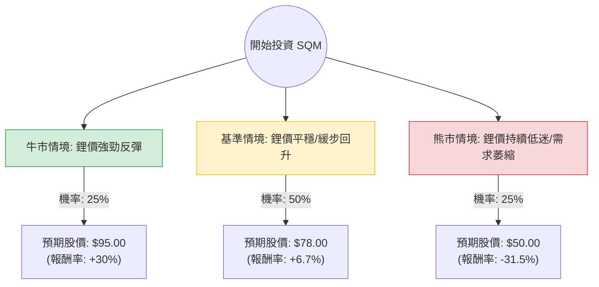

這份分析報告結合了您提供的基本面數據，以及針對 **SQM (Sociedad Química y Minera de Chile)** 的最新市場動態（特別是與智利國營銅業公司 Codelco 的協議、鋰價走勢及電動車市場需求）進行的綜合評估。

---

### 一、 核心假設與市場背景分析

在構建決策樹之前，我們必須確立以下三個核心變數：

1.  **鋰價走勢 (Lithium Prices)：** 鋰價在 2023 年大幅下跌後目前處於低位震盪。未來 12 個月的價格回升程度將直接決定 SQM 的獲利能力。
2.  **與 Codelco 的合資協議 (The Codelco Deal)：** SQM 已與 Codelco 簽署正式協議，成立由政府控股的合資企業以延續其在阿塔卡馬鹽沼（Salar de Atacama）的開採權至 2060 年。這消除了 2030 年租約到期的不確定性，但代價是利潤分成與政府控制權增加。
3.  **電動車 (EV) 需求成長：** 全球電動車銷量增速放緩，影響了電池材料的去庫存速度。

---

### 二、 決策樹分析 (Decision Tree)

以下是針對 SQM 未來一年表現的決策樹模型：

#### 節點詳細說明：

1.  **牛市情境 (Bull Case) - 25%：**
    *   **假設：** 鋰價因供應端減產超預期而快速回升；電動車需求在 2024 下半年強勁復甦。
    *   **預期報酬：** 參考 52 週高點 ($86.13) 並加上溢價，目標價約 **$95**。
2.  **基準情境 (Base Case) - 50%：**
    *   **假設：** 鋰價在目前水平築底，緩步回升；與 Codelco 的合作進展順利，市場給予估值修復。
    *   **預期報酬：** 接近分析師平均目標價 **$75.14 - $78**。
3.  **熊市情境 (Bear Case) - 25%：**
    *   **假設：** 鋰礦產能過剩持續，價格跌破生產成本線；智利政治環境出現新變數。
    *   **預期報酬：** 回測支撐位，目標價約 **$50**。

---

### 三、 期望值分析 (Expected Value Analysis)

#### 1. 計算過程
我們以目前股價 **$73.07** 為基準，計算一年後的預期價值 (EV)：

*   **EV = (牛市機率 × 牛市目標價) + (基準機率 × 基準目標價) + (熊市機率 × 熊市目標價)**
*   **EV** = (0.25 × 95) + (0.50 × 78) + (0.25 × 50)
*   **EV** = 23.75 + 39.00 + 12.50 = **$75.25**

#### 2. 預期報酬率計算
*   **預期報酬率** = (EV - 當前股價) / 當前股價
*   **預期報酬率** = (75.25 - 73.07) / 73.07 ≈ **2.98%**

#### 3. 關鍵財務指標解讀
*   **Forward P/E (14.63)：** 遠低於目前的 P/E (39.41)，顯示市場預期明年獲利將大幅改善（EPS next Y 增長率達 124%）。
*   **P/FCF (157.87)：** 自由現金流極低，反映了公司目前面臨巨大的資本支出壓力或營運現金流受鋰價拖累。
*   **Debt/Eq (0.86)：** 負債比率尚在可控範圍，但需留意利息支出。

---

### 四、 最終結論

#### **判斷：目前「不適合」作為短期或中期重倉投資（建議：觀望或分批小額佈局）**

#### **理由：**
1.  **期望值吸引力不足：** 經過計算，預期報酬率僅約 **2.98%**，遠低於目前美債殖利率或標普 500 指數的平均預期回報。這意味著承擔的高波動風險（鋰價波動）與潛在收益不成正比。
2.  **下行風險較大：** 熊市情境下的潛在跌幅 (-31.5%) 遠大於牛市情境的漲幅 (+30%)，盈虧比 (Risk/Reward Ratio) 不佳。
3.  **政策紅利已部分反映：** 與 Codelco 的協議達成後，股價已從低點反彈，目前的股價 ($73.07) 已非常接近分析師的平均目標價 ($75.14)，上行空間受到擠壓。
4.  **基本面壓力：** 雖然 Forward P/E 看似便宜，但 P/FCF 過高顯示公司現金流品質目前較差，且 ROE (9.87%) 較往年高峰期大幅下滑。

**建議：**
若您是長期看好鋰電池產業的投資者，建議等待股價回落至 **$60 - $65** 區間（增加安全邊際）或等待鋰價有明確的趨勢性反轉信號後再行介入。目前價位處於「價值合理但缺乏爆發力」的尷尬位置。