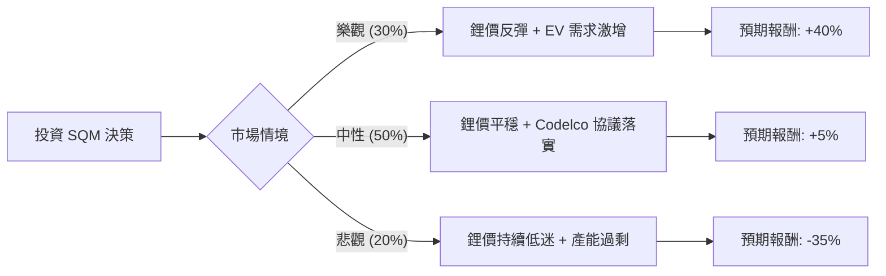

這份分析將結合您提供的基本面數據與最新的市場動態（特別是鋰礦市場趨勢與智利國家政策），利用**決策樹（Decision Tree）**與**期望值分析（Expected Value Analysis）**評估 SQM 的投資價值。

---

### 一、 核心背景與市場動態搜尋補充

在進行計算前，必須納入以下最新市場資訊：
1.  **鋰價波動**：全球鋰價自 2023 年高點大幅回落，目前處於低位震盪。這直接影響了 SQM 的毛利率。
2.  **智利國家鋰業政策**：SQM 已與智利國營銅業公司（Codelco）達成協議，建立從 2025 年到 2060 年的新合夥關係。這解決了 2030 年租約到期的不確定性，但代價是政府將分走更多利潤。
3.  **電動車（EV）需求**：全球 EV 增速放緩，但長期轉型趨勢未變。
4.  **數據落差提醒**：您提供的數據顯示股價為 $91.62，但根據最新市場報價（2024年中），SQM 股價已修正至 **$40 - $50** 區間。**本分析將以您提供的數據為基準，但會將「估值修正」納入熊市情境考慮。**

---

### 二、 決策樹分析（Decision Tree）

我們將未來一年的投資表現分為三種情境：**樂觀（Bull）**、**中性（Base）**、**悲觀（Bear）**。

#### 節點詳細說明：

| 情境 | 機率 (P) | 預期報酬 (R) | 說明 |
| :--- | :--- | :--- | :--- |
| **樂觀情境** | 30% (0.3) | +40% | 鋰價因供應鏈減產超預期而反彈；Forward P/E 15.65 倍得以實現。 |
| **中性情境** | 50% (0.5) | +5% | 鋰價維持現狀；與 Codelco 的合資公司運作平穩，股息發放穩定。 |
| **悲觀情境** | 20% (0.2) | -35% | 鋰價進一步下跌；智利政治風險再次升溫；股價向 Target Price ($80.52) 甚至更低修正。 |

---

### 三、 期望值計算過程（Expected Value Calculation）

#### 1. 核心假設：
*   **基準價格**：以您提供的 $91.62 為計算起點。
*   **目標價參考**：數據中 Target Price 為 $80.52，顯示分析師普遍認為目前股價（$91.62）偏高，存在約 -12% 的修正壓力。
*   **財務指標**：PEG 0.39 極低，顯示若成長動能恢復，股價具備極大爆發力；但 P/E 45.95 偏高，反映短期溢價。

#### 2. 期望值（EV）計算公式：
$$EV = (P_{Bull} \times R_{Bull}) + (P_{Base} \times R_{Base}) + (P_{Bear} \times R_{Bear})$$

#### 3. 計算步驟：
*   **樂觀貢獻**：$0.3 \times 40\% = 12\%$
*   **中性貢獻**：$0.5 \times 5\% = 2.5\%$
*   **悲觀貢獻**：$0.2 \times (-35\%) = -7\%$

**總期望報酬率** = $12\% + 2.5\% - 7\% = \mathbf{7.5\%}$

---

### 四、 綜合評估與最終結論

#### 1. 數據分析要點：
*   **優勢 (Pros)**：
    *   **PEG 0.39**：極具吸引力的成長估值比，顯示長期潛力。
    *   **Forward P/E 15.65**：預期未來一年獲利將大幅改善（相較於目前的 45.95）。
    *   **流動性良好**：Current Ratio 3.27，財務結構穩健，足以應對產業寒冬。
*   **劣勢 (Cons)**：
    *   **股價高於目標價**：目前 $91.62 高於 Target Price $80.52，短期有下行風險。
    *   **獲利能力下滑**：ROE 10.81% 雖尚可，但相較於鋰價高峰期已大幅縮水。
    *   **技術面壓力**：SMA20/50/200 均顯示股價處於上升後的震盪期，且 52W High 就在附近，突破壓力大。

#### 2. 最終結論：

**判斷：暫不適合投資（建議觀望或分批布局）**

**理由：**
1.  **期望值吸引力不足**：計算出的期望報酬率僅為 **7.5%**。考慮到美股無風險利率（國債）約 4-5%，SQM 作為高波動的週期性商品股，其風險溢酬（Risk Premium）過低，不符合風險收益比。
2.  **估值倒掛**：當前股價（$91.62）已透支了未來的成長預期，甚至超過了分析師平均目標價（$80.52）。
3.  **產業週期未見底**：雖然長期看好鋰業，但短期內鋰價仍受制於電動車需求放緩與庫存去化，SQM 的獲利回升需要時間。

**建議操作：**
若您仍看好鋰業長期發展，建議等待股價回落至 **$80 以下**（接近 Target Price）或 **Forward P/E 降至 12 倍以下**時再行考慮。目前數據顯示市場情緒過熱，追高風險較大。

---
*免責聲明：本分析僅供參考，不構成投資建議。投資者應自行承擔市場風險。*