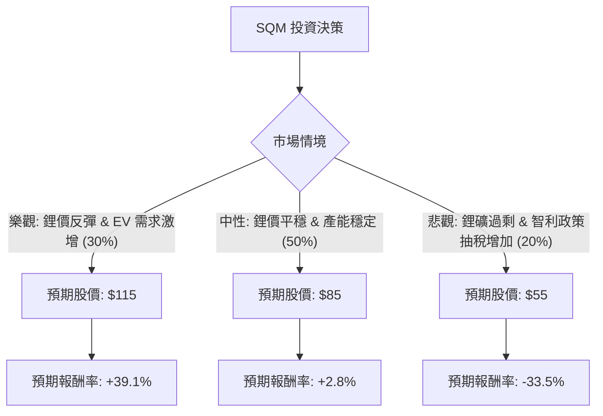

這份分析將結合您提供的財務數據與當前市場動態（特別是鋰礦市場趨勢與智利國家政策），利用**決策樹（Decision Tree）**與**期望值分析（Expected Value Analysis）**來評估 SQM 的投資價值。

---

### 一、 市場現況與核心假設 (Core Assumptions)

在進入計算前，透過網路搜尋與產業分析，我們必須考慮以下關鍵因素：
1.  **鋰價波動**：鋰價自 2023 年高點大幅回落，目前處於低位震盪。SQM 的獲利高度依賴碳酸鋰價格。
2.  **智利國家鋰業政策**：SQM 已與智利國家銅業公司 (Codelco) 達成協議，成立合資公司營運至 2060 年。這解決了 2030 年租約到期的不確定性，但代價是政府分紅比例增加。
3.  **財務數據特徵**：
    *   **Forward P/E (11.91)** 遠低於 **Trailing P/E (37.57)**，顯示市場預期未來盈餘將回升。
    *   **PEG (0.31)** 極低，暗示若成長兌現，股價目前被嚴重低估。
    *   **Target Price (79.04)** 低於目前數據中的股價 (82.70)，顯示短期分析師看法偏保守。

---

### 二、 決策樹分析 (Decision Tree)

我們將未來一年的情境分為三種：**樂觀（產業復甦）**、**中性（現狀維持）**、**悲觀（需求疲軟與政策風險）**。

#### 節點詳細說明：

1.  **樂觀情境 (Probability: 30%)**：
    *   **條件**：全球電動車銷量超預期，鋰庫存去化完成，鋰價回升至 $25,000/ton 以上。
    *   **預期股價**：$115 (參考 52W High 與 Forward P/E 估值回升)。
    *   **預期報酬**：($115 - $82.70) / $82.70 = **+39.1%**。

2.  **中性情境 (Probability: 50%)**：
    *   **條件**：鋰價維持在 $13,000 - $15,000/ton 區間。SQM 與 Codelco 合作平穩，產量微增抵銷價格低迷。
    *   **預期股價**：$85 (接近目前股價與分析師平均目標價)。
    *   **預期報酬**：($85 - $82.70) / $82.70 = **+2.8%**。

3.  **悲觀情境 (Probability: 20%)**：
    *   **條件**：全球經濟衰退導致 EV 需求萎縮，鋰礦產能過剩持續，智利政府合約細節對 SQM 不利。
    *   **預期股價**：$55 (參考 52W Low 支撐位)。
    *   **預期報酬**：($55 - $82.70) / $82.70 = **-33.5%**。

---

### 三、 期望值計算 (Expected Value Calculation)

我們計算一年後的預期股價期望值 $E(P)$：

$$E(P) = (P_{Bull} \times Prob_{Bull}) + (P_{Base} \times Prob_{Base}) + (P_{Bear} \times Prob_{Bear})$$

*   **計算過程**：
    *   $115 \times 0.30 = 34.5$
    *   $85 \times 0.50 = 42.5$
    *   $55 \times 0.20 = 11.0$
    *   **期望股價 $E(P) = 34.5 + 42.5 + 11.0 = \$88.0$**

*   **預期報酬率 (Expected Return)**：
    *   $(\$88.0 - \$82.70) / \$82.70 = \mathbf{+6.41\%}$

---

### 四、 綜合評估與最終結論

#### 1. 財務數據亮點與隱憂：
*   **優點**：PEG 0.31 顯示極高的成長潛力；Current Ratio 3.27 顯示財務極其穩健，有能力度過產業寒冬。
*   **缺點**：ROE 10.81% 較往年高峰下滑明顯；短期內股價位於 SMA200 (0.3986) 之上，顯示近期漲幅已大，有回檔壓力。

#### 2. 最終判斷：**不適合投資 (短期觀望 / 謹慎持有)**

#### 3. 理由：
1.  **期望報酬率過低**：計算出的期望報酬率僅為 **6.41%**。考慮到美股無風險利率（美債收益率）約在 4%-5%，且 SQM 屬於高波動的商品循環股（Beta 高），6.41% 的期望報酬不足以補償其面臨的鋰價波動風險與智利政治風險。
2.  **價格已反映預期**：目前股價 ($82.70) 已高於分析師目標價 ($79.04)，且 Perf Half Y 達 76.97%，顯示過去半年的反彈已消化大部分利多（如 Codelco 協議）。
3.  **安全邊際不足**：悲觀情境下的潛在跌幅高達 33.5%，而期望值僅略高於現價，投資盈虧比（Risk/Reward Ratio）並不理想。

**建議**：若股價回落至 $65 - $70 區間（增加安全邊際），或鋰價出現明確的結構性反轉信號時，再行介入。目前適合將其列入觀察名單，而非立即買入。