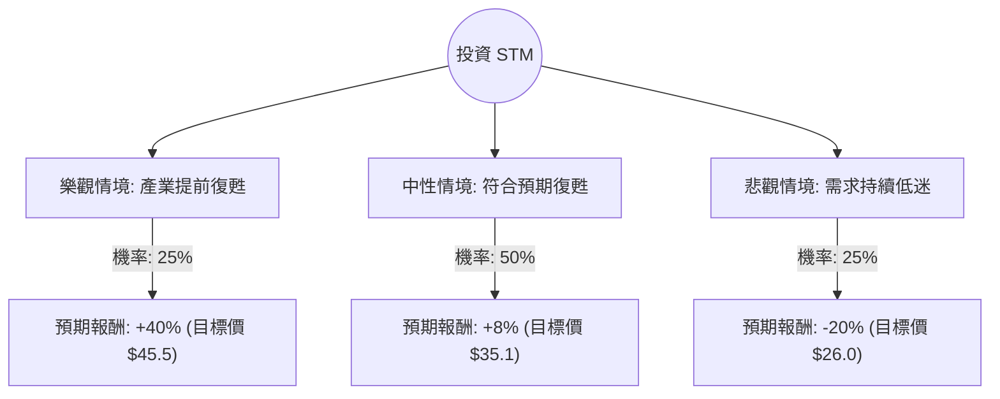

這份分析報告將結合您提供的財務數據與最新的市場動態（包含 2024 年半導體週期、汽車與工業市場需求、以及意法半導體 STM 的最新財報指引），利用**決策樹（Decision Tree）**與**期望值（Expected Value）**進行評估。

---

### 1. 核心背景與市場動態分析

在進入計算前，我們先整合最新資訊：
*   **當前挑戰**：STM 近期面臨汽車（Automotive）與工業（Industrial）市場需求疲軟。由於庫存調整，公司在 2024 年多次下調全年營收指引。
*   **增長動能**：碳化矽（SiC）技術領先，與特斯拉（Tesla）等車廠有長期合作。
*   **財務數據解讀**：
    *   **P/E (192.96) vs. Forward P/E (16.7)**：顯示目前處於獲利低谷，但市場預期明年 EPS 將大幅反彈（EPS next Y +71.07%）。
    *   **PEG (0.23)**：極低，代表若增長如期兌現，目前股價極具吸引力。
    *   **債務比 (0.14)**：財務結構非常穩健，有能力度過景氣寒冬。

---

### 2. 決策樹分析 (Decision Tree)

我們將未來一年的投資情境分為三種：**樂觀（強勁復甦）**、**中性（溫和增長）**、**悲觀（持續衰退）**。

#### 節點詳細說明：

| 情境 | 機率 (P) | 預期報酬 (R) | 說明 |
| :--- | :--- | :--- | :--- |
| **樂觀 (Bull)** | 25% | +40% | 汽車與工業庫存去化超預期，SiC 產能全開，股價重回歷史高位區間。 |
| **中性 (Base)** | 50% | +8% | 符合分析師平均目標價 ($35.13)，反映 2025 年獲利如期回升 70%。 |
| **悲觀 (Bear)** | 25% | -20% | 歐洲/中國經濟疲軟導致汽車需求進一步萎縮，股價回測 52 週低點支撐。 |

---

### 3. 期望值計算過程 (Expected Value Analysis)

#### A. 核心假設：
1.  **時間維度**：未來 12 個月。
2.  **基準價格**：以目前市價 **$32.54** 為基準。
3.  **報酬率設定**：
    *   樂觀：參考 52W High 與 Forward P/E 正常化後的估值。
    *   中性：參考數據中的 Target Price ($35.13)。
    *   悲觀：考慮到當前 P/E 過高，若獲利未改善，股價可能回測 $26 附近。

#### B. 期望值 (EV) 計算：
$$EV = (P_{Bull} \times R_{Bull}) + (P_{Base} \times R_{Base}) + (P_{Bear} \times R_{Bear})$$

*   **樂觀部分**：$0.25 \times 40\% = 10\%$
*   **中性部分**：$0.50 \times 8\% = 4\%$
*   **悲觀部分**：$0.25 \times (-20\%) = -5\%$

**總期望報酬率 (Total EV) = 10% + 4% - 5% = 9%**

---

### 4. 綜合評估與最終結論

#### 數據亮點總結：
*   **估值面**：雖然目前 P/E 高達 192，但這是因為處於獲利谷底。**Forward P/E 僅 16.7**，遠低於半導體行業平均，且 **PEG 0.23** 顯示增長潛力被低估。
*   **技術面**：股價目前在 SMA200 (+18.22%) 之上，顯示中長期趨勢已轉強，近期有築底回升跡象。
*   **風險面**：短期內（1-2 季）工業與汽車市場的波動仍是最大變數。

#### 最終判斷：適合投資 (適合中長期佈局)

**理由：**
1.  **期望值為正 (9%)**：雖然不是爆發性增長，但 9% 的期望報酬率優於許多保守型資產，且下行風險受限於其強大的資產負債表（Debt/Eq 0.14）。
2.  **獲利反轉預期**：數據顯示明年 EPS 預計增長 71.07%，這將是股價最強的催化劑。
3.  **安全邊際**：P/B 僅 1.67，對於一家擁有先進晶圓廠與技術專利的半導體公司而言，估值相對安全。

**建議操作策略：**
*   **分批進場**：由於短期市場對汽車半導體仍有疑慮，建議在 $30 - $32 區間分批建倉。
*   **停損設定**：若股價跌破 $26 (悲觀情境支撐)，代表產業衰退期長於預期，應重新評估。
*   **持有期限**：建議持有至 2025 年上半年，以等待獲利復甦兌現。

---
*免責聲明：以上分析僅供參考，不構成投資建議。投資者應自行承擔市場風險。*