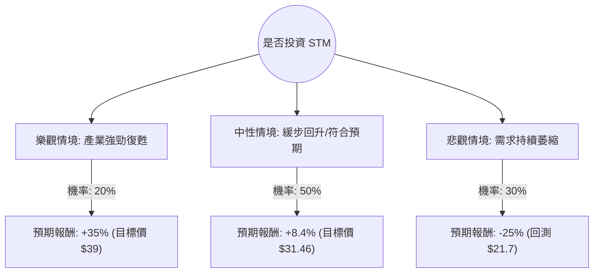

這份分析報告將結合您提供的基本面數據，以及最新的市場動態（包含 2024 年第三季財報表現與 2025 年產業展望），利用**決策樹（Decision Tree）**與**期望值分析（Expected Value Analysis）**評估意法半導體（STM）的投資價值。

---

### 1. 最新市場動態與背景分析 (Context)

在進入計算前，根據網路搜尋與最新財報整理以下關鍵資訊：
*   **核心市場疲軟：** STM 的主要營收來自汽車（Automotive）與工業（Industrial）。目前全球工業需求持續低迷，且汽車製造商（尤其是歐洲）正處於庫存調整期，導致 STM 近期多次下調財測。
*   **財務表現：** 2024 Q3 營收同比下降 23.5%，毛利率壓縮至 37.8%。公司預計 2025 年第一季營收將繼續面臨壓力。
*   **長期增長點：** 碳化矽（SiC）技術仍具領先地位，與華虹半導體在中國的合作以及與吉利汽車的長期協議是未來動能。
*   **估值：** 目前 P/E 較高（50.79）是因為盈餘（EPS）處於週期底部，但 Forward P/E（25.89）顯示市場預期明年獲利將回升。

---

### 2. 決策樹分析 (Decision Tree)

我們將未來一年的投資情境分為三種：**樂觀（產業快速復甦）**、**中性（緩步回升）**、**悲觀（衰退延長）**。

#### 節點詳細說明：

| 情境 | 機率 (P) | 預期報酬 (R) | 說明 |
| :--- | :--- | :--- | :--- |
| **樂觀 (Bull)** | 20% | +35% | 汽車庫存去化超預期，SiC 營收爆發，毛利率回升至 40% 以上。 |
| **中性 (Base)** | 50% | +8.4% | 符合分析師平均目標價 ($31.46)。工業市場持平，汽車市場緩慢復甦。 |
| **悲觀 (Bear)** | 30% | -25% | 歐洲車市持續衰退，中國競爭對手低價競爭，EPS 持續下修。 |

---

### 3. 期望值計算過程 (Expected Value Calculation)

#### A. 核心假設
1.  **現價：** $29.03
2.  **目標價參考：** 數據顯示 Target Price 為 $31.46（約 8.4% 漲幅）。
3.  **下行風險：** 參考 52W Low ($17.25) 與當前支撐位，若基本面惡化，股價可能回測 $21-$22 區間。
4.  **時間維度：** 未來 12 個月。

#### B. 計算公式
$EV = (P_{Bull} \times R_{Bull}) + (P_{Base} \times R_{Base}) + (P_{Bear} \times R_{Bear})$

#### C. 數值帶入
*   $EV = (0.20 \times 0.35) + (0.50 \times 0.084) + (0.30 \times -0.25)$
*   $EV = 0.07 + 0.042 - 0.075$
*   $EV = 0.037$

**最終期望值 (Expected Return): 3.7%**

---

### 4. 綜合評估與最終結論

#### 數據解讀：
1.  **期望值過低：** 3.7% 的預期報酬率顯著低於目前美債無風險利率（約 4.2%-4.5%），也低於標普 500 指數的歷史平均回報。這意味著承擔的波動風險（Beta）與潛在收益不成正比。
2.  **財務體質尚可：** Debt/Eq 僅 0.12，流動比率 3.22，顯示公司沒有破產風險，有足夠資金度過寒冬。
3.  **估值陷阱：** PEG 高達 5.77，顯示相對於其目前的增長速度，股價依然偏貴。EPS Q/Q 下降 31.34% 是一個嚴重的警訊。

#### 最終結論：**不適合投資 (暫時觀望)**

#### 理由：
1.  **風險回報比不佳：** 期望值僅 3.7%，在半導體下行週期中，向下的空間（-25%）與向上的空間（+8.4% 基準）不對稱。
2.  **缺乏短期催化劑：** 根據最新財報，STM 預計 2025 年上半年仍將面臨挑戰。目前股價雖已從高點回落，但尚未看到營收成長轉正（Sales Q/Q 為 -2.39%）。
3.  **產業逆風：** 歐洲汽車產業（如福斯、賓士）的疲軟直接打擊 STM 的核心業務，這並非短期內靠技術領先就能克服的宏觀問題。

**建議：** 
若您是長期投資者且看好 SiC 長線發展，建議等待 **$25 以下** 或 **營收年增率（Sales Y/Y）出現拐點** 時再行分批佈局。目前資金留在指數基金或高成長 AI 相關半導體股（如 NVDA, AVGO）的效率更高。