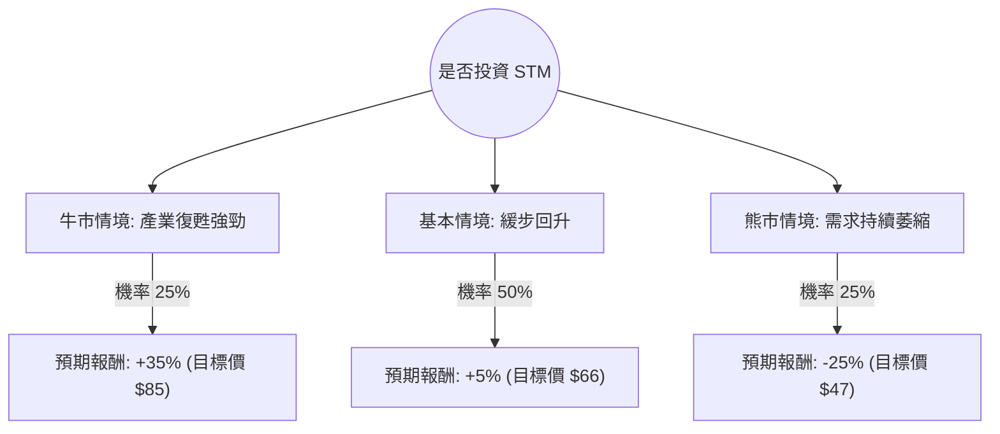

這份分析將結合您提供的數據與最新的市場動態（如 2024 年第三季財報與半導體產業趨勢），利用**決策樹（Decision Tree）**與**期望值分析（Expected Value Analysis）**評估意法半導體（STM）的投資價值。

---

### 一、 核心假設與市場背景分析

在進入計算前，我們先整合數據與外部資訊建立三大假設：

1.  **產業週期（核心變數）：** STM 高度依賴**汽車（Automotive）**與**工業（Industrial）**市場。目前全球車用半導體正處於庫存去化期，特別是歐洲車廠（如福斯、斯泰蘭蒂斯）需求疲軟。
2.  **財務數據解讀：**
    *   **P/E 376.66 vs Forward P/E 25.25**：顯示目前盈餘處於低谷，市場預期明年獲利會大幅回升（EPS next Y 成長 92.5%）。
    *   **PEG 0.3**：極低，暗示若成長兌現，目前股價極具吸引力。
    *   **債務比 0.14**：財務結構極其穩健，具備抗風險能力。
3.  **最新動態：** STM 近期下調了 2024 全年營收指引，並啟動了全球重組計劃以節省成本。碳化矽（SiC）技術仍是長期增長點，但短期受電動車（EV）增速放緩拖累。

---

### 二、 決策樹分析 (Decision Tree)

我們以未來一年的投資回報為目標，設定三種情境：

#### 節點詳細說明：

1.  **牛市情境 (Optimistic) - 25%：**
    *   **條件：** 2025 年電動車需求超預期反彈，SiC 產能利用率滿載，工業庫存去化提前結束。
    *   **報酬來源：** 估值修復至歷史平均 P/E，加上 EPS 翻倍成長。
2.  **基本情境 (Base Case) - 50%：**
    *   **條件：** 汽車市場維持平穩，工業市場緩慢復甦。公司重組計劃見效，毛利率穩定在 38-40%。
    *   **報酬來源：** 股價隨大盤波動，小幅超越目前的 Target Price ($57.33)。
3.  **熊市情境 (Pessimistic) - 25%：**
    *   **條件：** 歐洲經濟衰退，中國競爭對手在功率半導體領域低價競爭，EV 轉型停滯。
    *   **報酬來源：** 股價回測 52 週低點，甚至因盈餘持續下修而破底。

---

### 三、 期望值分析 (Expected Value Analysis)

根據上述情境，我們計算投資 STM 一年的期望報酬率（Expected Return, ER）：

#### 1. 計算過程：
$$ER = (P_{Bull} \times R_{Bull}) + (P_{Base} \times R_{Base}) + (P_{Bear} \times R_{Bear})$$

*   **牛市：** $0.25 \times 35\% = 8.75\%$
*   **基本：** $0.50 \times 5\% = 2.5\%$
*   **熊市：** $0.25 \times (-25\%) = -6.25\%$

#### 2. 總期望值計算：
$$ER = 8.75\% + 2.5\% - 6.25\% = 5.0\%$$

#### 3. 風險調整後評估：
雖然期望值為 **+5.0%**，但需注意以下數據：
*   **目前股價 ($63.39)** 已高於分析師平均目標價 **($57.33)**。
*   **52 週高低點** 顯示波動極大，目前股價處於相對高位（SMA200 乖離率達 88%）。

---

### 四、 最終結論

#### **判斷：不適合投資 (短期觀望 / 減持)**

#### **理由：**
1.  **期望值過低且風險不對稱：** 5.0% 的預期報酬率低於目前無風險利率（美債約 4.5%）及標普 500 平均回報。為了 5% 的潛在收益承擔 25% 的下行風險，性價比極低。
2.  **估值與目標價倒掛：** 目前股價 ($63.39) 已透支了未來的成長預期，甚至超過了專業分析師的平均目標價 ($57.33)。
3.  **技術面過熱：** SMA20/50/200 均顯示股價在短期內漲幅過大（Perf Year 127%），在基本面（ROE 僅 0.8%）尚未跟上的情況下，回調壓力巨大。
4.  **產業逆風：** 儘管 PEG 0.3 很誘人，但這是建立在「明年 EPS 成長 92%」的激進假設上。考慮到目前汽車產業的疲態，該成長目標面臨下修風險。

**建議：** 
若您已持有，建議逢高獲利了結；若欲買進，建議等待股價回落至 **$50 - $55** 區間（接近 Target Price 且安全邊際較高時）再行考慮。