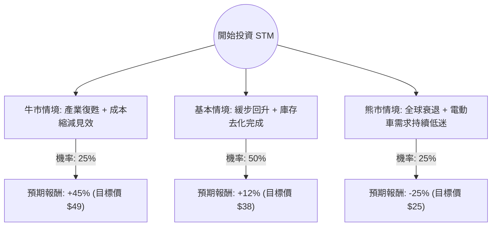

這份分析報告將結合您提供的財務數據與最新的市場動態（包含 2024 年第三季財報與 2025-2027 策略更新），利用**決策樹（Decision Tree）**與**期望值分析（Expected Value Analysis）**評估意法半導體（STM）的投資價值。

---

### 1. 核心背景與市場動態分析

在進入計算前，我們先整合最新的外部資訊：
*   **近期業績：** STM 剛經歷了充滿挑戰的一年，主要受工業市場疲軟和汽車庫存調整影響。2024 Q3 營收年減 26.6%，但毛利率維持在 37.8% 左右。
*   **轉型計畫：** 公司剛宣布一項重大的**重組計畫**，目標是在 2027 年前節省約 20 億美元的成本，並將營收目標調整為 2030 年達到 200 億美元以上。
*   **產業趨勢：** 碳化矽（SiC）仍是長期增長引擎，儘管電動車（EV）短期需求放緩，但 STM 在該領域仍具領先地位。
*   **估值矛盾：** 目前 P/E 高達 190（反映過去一年獲利暴跌），但 Forward P/E 僅 17.1，顯示市場預期明年獲利將大幅回升。

---

### 2. 決策樹分析 (Decision Tree)

我們以 **12 個月** 為投資期限，設定三種可能的情境：

#### 決策樹節點詳細說明：

| 情境 | 機率 (P) | 預期報酬 (R) | 說明 |
| :--- | :--- | :--- | :--- |
| **牛市 (Bull Case)** | 25% | +45% | 工業市場提前復甦，SiC 需求因新車型爆發，成本節省計畫進度超前。 |
| **基本 (Base Case)** | 50% | +12% | 符合公司指引，2025 下半年開始回溫，Forward P/E 回歸歷史均值。 |
| **熊市 (Bear Case)** | 25% | -25% | 歐洲/中國經濟疲軟加劇，電動車普及停滯，競爭對手（如英飛凌、安森美）價格戰。 |

---

### 3. 期望值計算過程 (Expected Value Calculation)

#### A. 核心假設：
1.  **當前股價：** $33.99 (約 $34)。
2.  **分析師目標價：** 數據顯示為 $34.42，但這是基於過去 90 天的平均。考慮到 Forward P/E 17.1 與 EPS 增長預期（EPS next Y %: 69.58%），基本情境的目標價設在 $38 較為合理。
3.  **下行風險：** 52 週低點約在 $17.25，但考慮到目前 P/B 僅 1.68，且債務極低（Debt/Eq: 0.12），股價在 $25 具有極強支撐。

#### B. 期望值 (EV) 計算：
$$EV = (P_{Bull} \times R_{Bull}) + (P_{Base} \times R_{Base}) + (P_{Bear} \times R_{Bear})$$

*   **牛市貢獻：** $0.25 \times 45\% = 11.25\%$
*   **基本情境貢獻：** $0.50 \times 12\% = 6.0\%$
*   **熊市貢獻：** $0.25 \times (-25\%) = -6.25\%$

**總體期望報酬率 = 11.25% + 6.0% - 6.25% = 11.0%**

---

### 4. 綜合評估與最終結論

#### 數據亮點分析：
*   **財務穩健性：** Current Ratio 3.36 且 Debt/Eq 0.12，這是一張極其乾淨的資產負債表，代表 STM 有能力度過景氣寒冬並進行大規模重組。
*   **估值吸引力：** PEG 0.24 顯示相對於未來的增長預期，目前的股價被嚴重低估。
*   **技術面：** 股價近期表現強勁（Perf Quarter: 50.49%），顯示市場底部已過，資金正在重新流入。

#### 最終結論：適合投資 (Cautious Buy)

**判斷理由：**
1.  **正向期望值：** 11% 的預期報酬率優於許多成熟工業股，且下行風險受限於低 P/B 與強大的現金流。
2.  **轉型紅利：** 20 億美元的成本削減計畫將在 2025 年開始反映在利潤率上，這是一個強大的催化劑（Catalyst）。
3.  **週期底部：** 數據顯示 EPS Q/Q 雖然大幅下滑，但 Forward P/E 遠低於 Trailing P/E，這典型的「利空出盡」特徵。

**建議操作：**
*   **分批進場：** 由於短期內（Perf Month: 17.88%）漲幅已大，建議在 $32-$34 區間分批布局。
*   **長期持有：** STM 的價值在於 2026-2027 年的結構性獲利改善，適合中長期投資者。

**風險提示：** 需密切關注 2025 Q1 的汽車半導體庫存數據，若去化速度不如預期，股價可能回測 $30 支撐位。