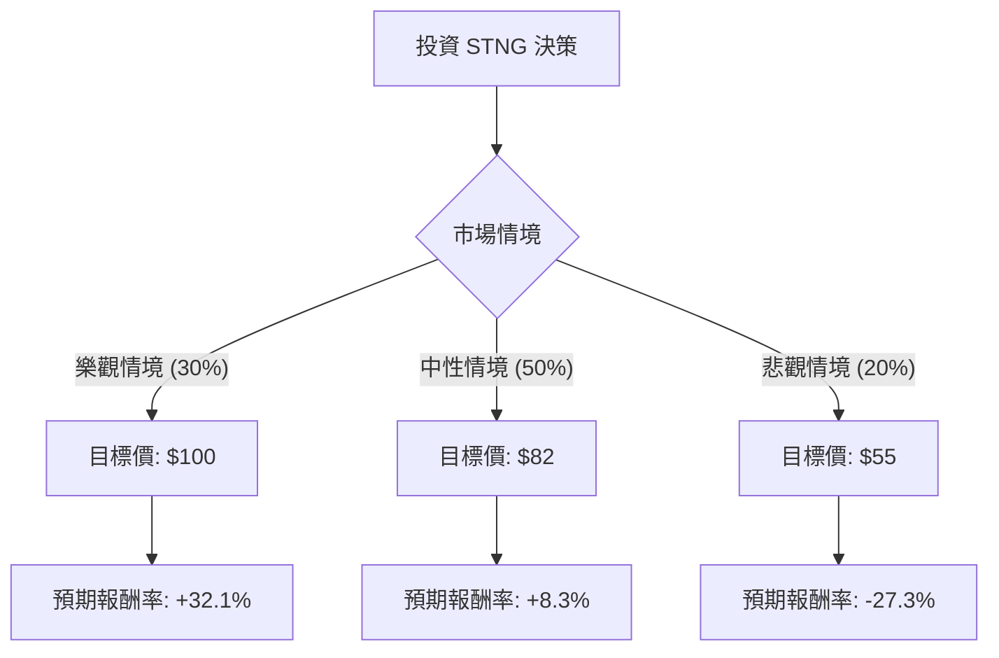

這份分析報告將結合您提供的基本面數據與最新的市場動態（包含紅海局勢、成品油輪產業趨勢及 Scorpio Tankers (STNG) 的最新財務策略），利用**決策樹（Decision Tree）**與**期望值分析（Expected Value Analysis）**評估其投資價值。

---

### 一、 核心假設與市場背景分析

在構建決策樹之前，我們基於最新資訊設定以下核心假設：

1.  **產業趨勢（利多）**：紅海危機導致航程拉長（Ton-mile demand 增加），成品油輪（Product Tanker）供給成長受限（新船訂單處於歷史低點），支撐運費（Spot Rates）維持高檔。
2.  **財務狀況（強勁）**：STNG 的債務股本比（Debt/Eq）僅 0.19，遠低於產業平均。公司正積極進行股份回購與債務去槓桿化。
3.  **估值（合理偏低）**：P/E 10.62 倍，雖 Forward P/E 升至 14.23（預示未來獲利可能因高基期而放緩），但 P/B 1.22 仍屬健康。
4.  **風險（利空）**：全球經濟衰退導致石油需求下降；地緣政治衝突突然緩解導致航線回歸正常，運費將快速修正。

---

### 二、 決策樹分析 (Decision Tree)

我們以未來一年的投資回報為目標，設定三種情境：**樂觀（牛市）**、**中性（基準）**與**悲觀（熊市）**。

#### 節點詳細說明：

1.  **樂觀情境 (Bull Case) - 30% 機率**
    *   **條件**：地緣政治持續緊張，成品油需求超預期，運費維持在極高水準。
    *   **預期股價**：$100 (突破歷史高點，反映強勁現金流)。
    *   **報酬計算**：($100 - $75.71) / $75.71 = **+32.1%**。

2.  **中性情境 (Base Case) - 50% 機率**
    *   **條件**：運費維持目前高位震盪，公司持續回購股票，市場給予合理估值。
    *   **預期股價**：$82 (接近分析師平均目標價 $81.82)。
    *   **報酬計算**：($82 - $75.71) / $75.71 = **+8.3%**。

3.  **悲觀情境 (Bear Case) - 20% 機率**
    *   **條件**：全球經濟衰退，紅海局勢和平解決，運費大幅回落。
    *   **預期股價**：$55 (回測 SMA200 以下支撐位)。
    *   **報酬計算**：($55 - $75.71) / $75.71 = **-27.3%**。

---

### 三、 期望值分析 (Expected Value Analysis)

#### 1. 股價期望值計算
$$EV_{price} = (P_{bull} \times Price_{bull}) + (P_{base} \times Price_{base}) + (P_{bear} \times Price_{bear})$$
$$EV_{price} = (0.3 \times 100) + (0.5 \times 82) + (0.2 \times 55)$$
$$EV_{price} = 30 + 41 + 11 = \mathbf{\$82.0}$$

#### 2. 預期報酬率計算 (含股息)
*   **資本利得期望報酬**：($82.0 - $75.71) / $75.71 = **8.31%**
*   **股息收益率 (Dividend %)**：**2.22%**
*   **總期望報酬率 (Total EV Return)**：8.31% + 2.22% = **10.53%**

---

### 四、 綜合評估與最終結論

#### 核心數據支持：
*   **技術面**：股價目前高於 SMA20, 50, 200，顯示強勢多頭排列。
*   **財務面**：Quick Ratio (9.23) 與 Current Ratio (9.33) 極高，顯示公司完全沒有短期財務壓力，有極大空間增加派息或回購。
*   **效率面**：ROE 11.35% 雖非頂尖，但在資本密集型的航運業中配合低負債比，表現相當穩健。

#### 最終判斷：**適合投資 (Buy / Overweight)**

#### 理由：
1.  **正向期望值**：計算出的總期望報酬率約為 **10.53%**，在當前高利率環境下仍具備吸引力。
2.  **下行風險受控**：STNG 的資產負債表極其乾淨（Debt/Eq 0.19），這為股價提供了強大的防禦墊，即便運費下跌，公司也不易陷入財務危機。
3.  **供需結構性利多**：成品油輪的供給短缺是未來 1-2 年的硬傷，這使得「中性情境」發生的機率最高，且具備向上修正的潛力。
4.  **股東回饋**：低 P/E (10.62) 配合積極的股份回購，能有效支撐每股盈餘 (EPS) 的增長。

**建議操作策略：**
目前股價接近 52 週高點，建議採取**分批進場**策略。若股價回測 $70-$72 (SMA50 附近) 將是更佳的買入點。停損位可設在 $60 (悲觀情境支撐點)。

---
*免責聲明：本分析僅供參考，不構成投資建議。股市有風險，投資需謹慎。*