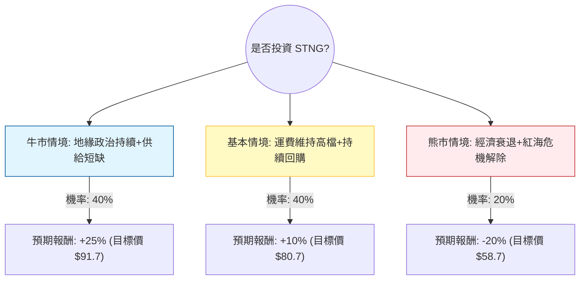

針對美股 **Scorpio Tankers Inc. (STNG)** 的投資評估，我結合了您提供的基本面數據以及最新的市場動態（包含成品油輪產業趨勢、地緣政治影響及公司財務策略）進行分析。

---

### 一、 市場背景與最新動態分析

在進入決策樹之前，我們先彙整當前的核心資訊：
1.  **產業趨勢（利多）**：成品油輪（Product Tanker）正處於高循環期。由於紅海危機導致航線繞道（好望角），大幅增加了「噸海里（ton-mile）」需求。同時，全球成品油輪的新船訂單量仍處於歷史低點，供給受限支撐了高運費。
2.  **財務狀況（極強）**：STNG 的 **Debt/Eq 僅 0.19**，且 **Current Ratio 高達 9.33**，顯示其資產負債表極其穩健。公司正利用強大的現金流進行大規模股票回購與債務償還。
3.  **估值與表現**：目前 P/E 10.15 倍，低於歷史平均；但股價已接近 52 週高點（$73.37），且 SMA20/50/200 均顯示強勢多頭排列，短期可能存在過熱回調風險。
4.  **風險（利空）**：分析師預期明年 EPS 可能下滑 (-17.09%)，這反映了市場擔心高運費環境無法長期維持，或全球經濟放緩壓抑石油需求。

---

### 二、 決策樹分析 (Decision Tree)

以下是針對未來 6-12 個月投資 STNG 的決策模型：

#### 決策樹節點詳細說明：

1.  **牛市情境 (Bull Case) - 40%**：
    *   **假設**：紅海局勢長期化，且夏季旅遊旺季帶動成品油需求超預期。
    *   **結果**：運費（Spot Rates）進一步飆升，公司 EPS 超越預期，觸發估值修復。
    *   **預期報酬**：+25%（參考歷史高點與強勁現金流估值）。

2.  **基本情境 (Base Case) - 40%**：
    *   **假設**：運費維持在目前獲利水平，公司繼續執行回購與發放股利（2.26%）。
    *   **結果**：股價穩步向分析師平均目標價 $81.09 靠攏。
    *   **預期報酬**：+10%（接近 Target Price 的漲幅）。

3.  **熊市情境 (Bear Case) - 20%**：
    *   **假設**：全球經濟陷入衰退導致石油需求萎縮，或中東局勢突然和平解決導致航線恢復正常。
    *   **結果**：噸海里需求驟降，運費回落至盈虧平衡點附近。
    *   **預期報酬**：-20%（股價回測 SMA200 或更低支撐）。

---

### 三、 期望值分析 (Expected Value Analysis)

#### 1. 核心假設
*   **當前股價 ($P_0$)**：$73.37
*   **持有期間**：12 個月
*   **股利收益**：2.26% (固定計入)
*   **資本利得期望值計算**：
    $$EV_{capital} = (0.4 \times 25\%) + (0.4 \times 10\%) + (0.2 \times -20\%)$$
    $$EV_{capital} = 10\% + 4\% - 4\% = 10\%$$

#### 2. 總期望報酬率 (Total Expected Return)
$$Total EV = EV_{capital} + Dividend \% = 10\% + 2.26\% = 12.26\%$$

#### 3. 計算過程總結
*   **加權預期股價**：$73.37 \times (1 + 10\%) = \$80.71$ (與分析師目標價 $81.09 極為接近)。
*   **風險回報比**：潛在獲利空間（牛市 +25%）大於潛在虧損空間（熊市 -20%），且高勝率情境（牛+基本 = 80%）均為正報酬。

---

### 四、 最終結論

**投資建議：適合投資 (Buy / Overweight)**

#### 理由：
1.  **正向期望值**：經機率加權後的總期望報酬率約為 **12.26%**，在當前高利率環境下仍具備吸引力。
2.  **極佳的財務韌性**：STNG 的低負債比（0.19）與極高的流動比率（9.33）為其提供了強大的抗風險能力，即便進入熊市情境，公司也不存在破產風險，且有能力在低價時加速回購。
3.  **供需結構性利多**：成品油輪的供給缺口非短期內能解決（造船需 2-3 年），這為股價提供了堅實的底部支撐。
4.  **技術面支撐**：雖然股價處於高位，但 P/E 僅 10 倍，並未出現泡沫化跡象。

**操作建議：**
由於目前股價接近 52 週高點且偏離 SMA200 較遠（+36.74%），建議**採取「分批分段買入」策略**，或等待股價回調至 SMA50（約 $68-$70 區間）時再行加碼，以降低短期追高風險。

---
*免責聲明：以上分析僅供參考，不構成具體投資建議。股市投資有風險，投資人應依據自身風險承受能力做出決策。*