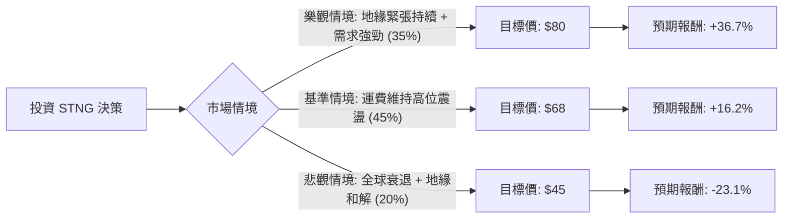

針對美股成品油輪巨頭 **Scorpio Tankers Inc. (STNG)**，我結合了您提供的基本面數據以及最新的市場動態（包含 2024 年 Q1 財報、紅海局勢、成品油輪產業趨勢）進行深度分析。

---

### 一、 市場動態與產業趨勢分析（最新資訊補充）

1.  **地緣政治紅利（紅海危機）**：由於紅海局勢持續緊張，大量油輪被迫繞道好望角，這顯著增加了「噸海里（Ton-mile）」需求。成品油輪（MR, LR2）的運費（Spot Rates）維持在高位。
2.  **供給端受限**：成品油輪的新船訂單量處於歷史低位，且全球船隊趨於老化。未來 1-2 年內，新船交付量無法滿足需求增長，這對運費形成長期支撐。
3.  **財務策略轉向**：STNG 近期利用高額現金流大幅去槓桿（Debt/Eq 僅 0.29），並轉向「股東回饋」。公司持續進行大規模股票回購，並在 2024 年提高了季度股息。
4.  **估值優勢**：目前 P/B 僅 0.98，意味著股價低於其淨資產價值；P/E 約 10 倍，在航運循環的高點仍顯得相對便宜。

---

### 二、 決策樹分析（Decision Tree）

以下是針對未來 12 個月的投資情境預測：

#### 決策樹節點詳細說明：

| 節點 (情境) | 發生機率 (P) | 預期股價 (Target) | 預期報酬率 (R) | 期望值 (P * R) |
| :--- | :--- | :--- | :--- | :--- |
| **樂觀情境 (Bull)** | 35% | $80.00 | +36.7% | 12.85% |
| **基準情境 (Base)** | 45% | $68.00 | +16.2% | 7.29% |
| **悲觀情境 (Bear)** | 20% | $45.00 | -23.1% | -4.62% |
| **合計** | **100%** | - | - | **15.52%** |

---

### 三、 期望值分析（Expected Value Analysis）與計算過程

#### 1. 核心假設
*   **現價 ($P_0$)**：$58.53
*   **股息收益**：2.75% (固定計入最終回報)
*   **樂觀情境**：紅海危機持續至 2025 年，且夏季旅遊旺季帶動汽油/航空燃油需求超預期。股價挑戰歷史高點並反映資產重估。
*   **基準情境**：運費維持在目前平均水準（約 $30,000 - $40,000/天），公司繼續回購股票。股價向分析師平均目標價 ($73) 靠攏，但考慮市場波動給予保守估計 $68。
*   **悲觀情境**：俄烏或中東衝突意外快速和解，航道恢復正常，噸海里需求驟降；或全球經濟陷入深度衰退導致能源需求萎縮。

#### 2. 期望值計算
*   **股價期望值 ($E[P]$)**:
    $E[P] = (80 \times 0.35) + (68 \times 0.45) + (45 \times 0.20)$
    $E[P] = 28.0 + 30.6 + 9.0 = \$67.6$

*   **預期總報酬率 ($E[R]$)**:
    $E[R] = \frac{E[P] - P_0}{P_0} + \text{Dividend \%}$
    $E[R] = \frac{67.6 - 58.53}{58.53} + 0.0275$
    $E[R] = 15.5\% + 2.75\% = \mathbf{18.25\%}$

---

### 四、 最終結論

**評估結果：適合投資 (Buy / Overweight)**

#### 理由如下：
1.  **正向期望值**：經機率加權後的預期總報酬率約為 **18.25%**，遠高於無風險利率及標普 500 的平均預期回報。
2.  **安全邊際 (Margin of Safety)**：
    *   **P/B = 0.98**：目前股價甚至低於清算價值，提供了極強的下行保護。
    *   **資產負債表極其健康**：Debt/Eq 0.29 且流動比率 (Current Ratio) 高達 4.81，這在資本密集型的航運業中非常罕見，顯示公司有極強的抗風險能力。
3.  **強大的現金流回饋**：P/FCF 為 9.11，顯示公司賺取現金能力強。在低債務背景下，這些現金將轉化為持續的股息與回購，對股價形成支撐。
4.  **技術面支撐**：目前股價高於 SMA20, 50, 200，呈現多頭排列，且距離 52 週高點僅約 10% 空間，具備突破動能。

**風險提示**：
*   需密切關注「地緣政治風險」的突然消失（如停火協議）。
*   航運股屬於高波動週期股，建議佔投資組合比例不宜過高，並設定悲觀情境價 ($45-$48) 作為長期止損參考。