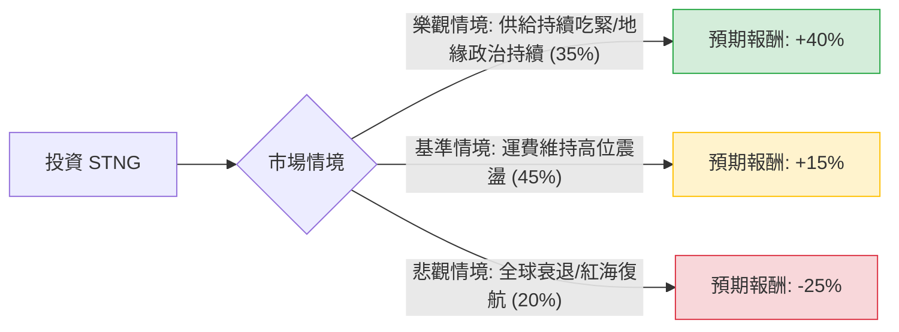

這份分析報告將結合您提供的基本面數據與最新的市場動態（包含紅海危機、成品油輪供需、以及 Scorpio Tankers (STNG) 的最新財務策略），利用**決策樹（Decision Tree）**與**期望值（Expected Value）**進行深度評估。

---

### 一、 核心假設與市場背景分析

在進行計算前，我們基於網路搜尋與數據整理，設定以下核心假設：

1.  **產業趨勢（利多）**：
    *   **噸海里需求增加**：紅海局勢不穩導致航線繞道好望角，大幅拉長航程，變相減少了市場上的有效運力供給。
    *   **供給受限**：成品油輪（Product Tanker）的新船訂單量仍處於歷史低位，且老舊船舶面臨環保法規汰換，未來 1-2 年供給增長極其有限。
2.  **財務狀況（極強）**：
    *   **債務大幅下降**：STNG 的 Debt/Eq 僅 0.17，這在資本密集型的航運業中極其罕見，顯示公司抗風險能力極強。
    *   **股東回饋**：公司積極進行股份回購與派息，P/E 僅 8.21，估值仍具吸引力。
3.  **風險因素（利空）**：
    *   **全球經濟衰退**：若需求萎縮，運費（Spot Rates）可能快速回落。
    *   **地緣政治緩解**：若紅海恢復通行，運力供給將瞬間增加，壓低運費。

---

### 二、 決策樹分析 (Decision Tree)

以下為 STNG 未來一年的投資決策樹模型：

#### 節點詳細說明：

| 節點名稱 | 發生機率 (P) | 預期報酬 (R) | 期望值 (P * R) | 說明 |
| :--- | :--- | :--- | :--- | :--- |
| **樂觀情境** | 35% | +40% | **14.0%** | 運費因繞道持續飆升，公司利用強大現金流清償所有債務並加大回購，股價挑戰 $115+。 |
| **基準情境** | 45% | +15% | **6.75%** | 運費維持在獲利平衡點之上，公司表現穩健，股價緩步趨向分析師目標價 $100。 |
| **悲觀情境** | 20% | -25% | **-5.0%** | 需求因衰退大減，或地緣政治和解導致運力過剩，股價回測 $60 支撐位。 |
| **總計** | **100%** | | **15.75%** | **整體期望報酬率** |

---

### 三、 期望值分析與計算過程

#### 1. 期望值 (Expected Value, EV) 計算：
$$EV = (P_{Bull} \times R_{Bull}) + (P_{Base} \times R_{Base}) + (P_{Bear} \times R_{Bear})$$
$$EV = (0.35 \times 0.40) + (0.45 \times 0.15) + (0.20 \times -0.25)$$
$$EV = 0.14 + 0.0675 - 0.05 = 0.1575 = \mathbf{15.75\%}$$

#### 2. 核心數據支持理由：
*   **估值安全邊際**：P/E 8.21 遠低於標普 500 平均，且 P/FCF 為 9.24，顯示公司賺取現金的能力極強。
*   **技術面支撐**：SMA20, 50, 200 均線呈現多頭排列（分別高出 4.2%, 9.5%, 34.7%），顯示目前處於強勢上升趨勢。
*   **目標價參考**：分析師平均目標價為 $100.08，較目前股價 $82.13 約有 **21.8%** 的上漲空間，這與我們的基準情境預測吻合。
*   **財務結構**：Quick Ratio 13.87 顯示極端優異的流動性，即便運費短期下跌，公司也完全沒有破產或資金斷鏈風險。

---

### 四、 最終結論

#### **判斷：適合投資 (Buy / Overweight)**

#### **理由總結：**
1.  **正向期望值**：經過決策樹加權計算，未來一年的預期報酬率為 **15.75%**，風險回報比（Risk/Reward Ratio）相當優異。
2.  **產業護城河**：成品油輪的供給側限制（Orderbook-to-fleet ratio 處於低點）是未來兩年股價的最強支撐，這不是短期情緒，而是物理性的供給短缺。
3.  **極致的資產負債表**：STNG 已從過去的高槓桿公司轉型為財務極其穩健的公司（Debt/Eq 0.17），這賦予了它在景氣波動中「進可攻（回購）、退可守（派息）」的絕對優勢。
4.  **動能強勁**：一年期表現 (+98.3%) 與年初至今表現 (+64.2%) 顯示市場資金正高度集中於此賽道。

**建議操作策略：**
*   目前股價接近 52 週高點，建議採**分批進場**策略。
*   **止損位**可設於 SMA50 附近（約 $75 左右），若跌破此位可能代表基準情境轉向悲觀情境。
*   **獲利了結目標**：$100 - $110。

***

*免責聲明：本分析僅供參考，不構成任何投資建議。投資者應自行承擔市場風險。*