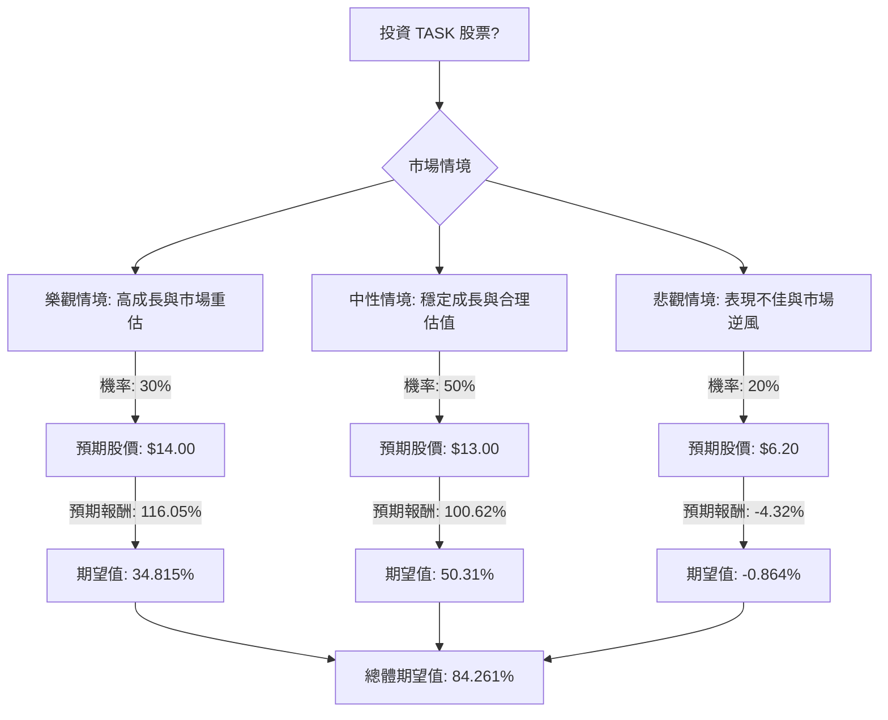

根據對美股公司 TaskUs, Inc. (NASDAQ: TASK) 的決策樹分析與期望值分析，並參考其基本面數據及最新市場資訊，評估該股票目前是否適合投資。

### 公司概覽與市場動態

TaskUs, Inc. (NASDAQ: TASK) 是一家提供數位外包服務的公司，專注於客戶體驗和內容安全解決方案，服務於社群媒體、電子商務、遊戲、串流媒體、金融服務和醫療保健等多個行業。該公司總部位於美國德克薩斯州新布朗費爾斯，擁有約 65,500 名員工。

**產業趨勢：** TaskUs 處於數位外包和業務流程外包 (BPO) 領域，特別是其 AI 服務是增長最快的業務線，顯示公司正積極利用人工智慧轉型帶來的機會。

**近期財務表現 (截至 2026 年 4 月 25 日)：**
*   **2025 財年第四季度營收：** 3.13 億美元，年增 14.1%，超出預期。
*   **2025 財年全年營收：** 11.84 億美元，年增 19.0%。
*   **2025 財年第四季度調整後每股盈餘 (EPS)：** 0.40 美元，超出預期。
*   **2026 年營收指引：** 預計在 12.1 億至 12.4 億美元之間。
*   **2026 年調整後 EBITDA 利潤率指引：** 約 19%。
*   **特別現金股利：** 於 2026 年 3 月 25 日支付每股 3.65 美元的特別現金股利。

**基本面數據分析 (補充最新資訊)：**
*   **收盤價 (Close):** 6.48 美元 (與近期股價約 6.20 - 7.43 美元一致)。
*   **市盈率 (P/E):** 5.89 (遠期市盈率為 4.27)，相對較低，可能暗示被低估或市場存在疑慮。
*   **市淨率 (P/B):** 0.98 (低於 1，通常被視為價值被低估的指標)。
*   **52 週股價範圍:** 6.20 - 11.99 美元 (最高達 18.39 美元)。
*   **目標價 (Target Price):** 12.0 美元 (分析師平均目標價介於 13.00 至 14.25 美元之間，最高達 18.00 美元，最低為 12.00 美元)。
*   **股東權益報酬率 (ROE):** 18.65%，**資產報酬率 (ROA):** 10.21%，**投資報酬率 (ROI):** 11.94%，顯示公司盈利能力良好。
*   **流動比率 (Current Ratio) 和速動比率 (Quick Ratio):** 均為 3.12，顯示公司流動性非常強勁。
*   **負債權益比 (Debt/Eq):** 0.5，負債水平適中，資產負債表被描述為「完美無瑕」。
*   **毛利率 (Gross Margin):** 32.7%，**營業利潤率 (Oper. Margin):** 12.04%，**淨利潤率 (Profit Margin):** 8.64%，顯示公司營運效率良好。
*   **分析師評級 (Recom):** 2.88，共識評級為「持有」。平均目標價預示著 87.59% 至 119.91% 的上漲潛力。
*   **近期表現：** 週、月、季、半年、年及年初至今表現均為負值，顯示近期股價表現不佳，且過去一年跑輸美國專業服務業和整體市場。
*   **內部人交易：** 近期有高管出售股票的記錄。
*   **股價波動性：** 過去三個月和一年內股價波動較大。

### 核心假設

1.  **市場環境：** 假設美國股市整體保持穩定或溫和增長，但特定行業和小型股可能面臨波動。
2.  **公司財務表現：** TaskUs 將繼續實現營收增長，特別是在 AI 服務領域，並維持健康的利潤率，符合其 2026 年的財務指引。
3.  **產業趨勢：** 數位外包和 BPO 行業，尤其是與 AI 相關的服務，將持續受到市場需求驅動。
4.  **分析師預期：** 分析師的目標價區間為未來股價提供了合理的參考，儘管「持有」的共識評級表明市場存在一定觀望情緒。
5.  **投資時點：** 由於特別股利已於 2026 年 3 月 25 日支付，本次分析不將其納入未來投資的預期報酬計算中。

### 決策樹分析與期望值計算

我們將基於當前股價 6.48 美元，設定三種未來情境，並評估其期望報酬。

#### 決策樹

#### 計算過程

**當前股價 (Current Price):** $6.48

**1. 樂觀情境 (Optimistic Scenario)**
*   **情境名稱：** 高成長與市場重估
*   **情境描述：** TaskUs 成功把握 AI 服務機會，市場份額擴大，盈利能力顯著提升，市場對其估值進行重估，股價達到分析師目標價區間的較高水平。
*   **機率 (Probability, P1)：** 30%
*   **預期股價 (Expected Stock Price, S1)：** $14.00 (參考分析師最高目標價區間)
*   **預期報酬 (Return, R1)：** (($14.00 - $6.48) / $6.48) = 1.1605 = 116.05%
*   **期望值 (Expected Value, EV1)：** P1 \* R1 = 0.30 \* 1.1605 = 0.34815 (或 34.815%)

**2. 中性情境 (Neutral Scenario)**
*   **情境名稱：** 穩定成長與合理估值
*   **情境描述：** TaskUs 按照 2026 年指引穩健增長，維持現有估值水平，股價向分析師平均目標價靠攏。
*   **機率 (Probability, P2)：** 50%
*   **預期股價 (Expected Stock Price, S2)：** $13.00 (參考分析師平均目標價)
*   **預期報酬 (Return, R2)：** (($13.00 - $6.48) / $6.48) = 1.0062 = 100.62%
*   **期望值 (Expected Value, EV2)：** P2 \* R2 = 0.50 \* 1.0062 = 0.5031 (或 50.31%)

**3. 悲觀情境 (Pessimistic Scenario)**
*   **情境名稱：** 表現不佳與市場逆風
*   **情境描述：** TaskUs 面臨激烈競爭，AI 轉型不及預期，或遭遇宏觀經濟逆風，導致股價下跌至 52 週低點。
*   **機率 (Probability, P3)：** 20%
*   **預期股價 (Expected Stock Price, S3)：** $6.20 (參考 52 週低點)
*   **預期報酬 (Return, R3)：** (($6.20 - $6.48) / $6.48) = -0.0432 = -4.32%
*   **期望值 (Expected Value, EV3)：** P3 \* R3 = 0.20 \* -0.0432 = -0.00864 (或 -0.864%)

**總體期望值 (Overall Expected Value, EV_total)：**
EV_total = EV1 + EV2 + EV3 = 0.34815 + 0.5031 + (-0.00864) = 0.84261

因此，總體期望報酬率約為 **84.26%**。

### 最終結論

根據決策樹分析和期望值計算，TaskUs (TASK) 目前**適合投資**。

**簡短理由：**
儘管 TaskUs 過去一年股價表現不佳且存在內部人賣股等風險，但其強勁的基本面數據（如低市盈率、低市淨率、高 ROE/ROA/ROI、強勁的流動性）、穩健的營收和盈利增長、以及在 AI 服務領域的發展潛力，使其具有顯著的價值被低估的特徵。分析師的平均目標價也顯示出巨大的上漲空間。綜合考量樂觀、中性和悲觀情境下的期望值，總體期望報酬率高達 84.26%，表明投資該股票具有吸引力的潛在回報。