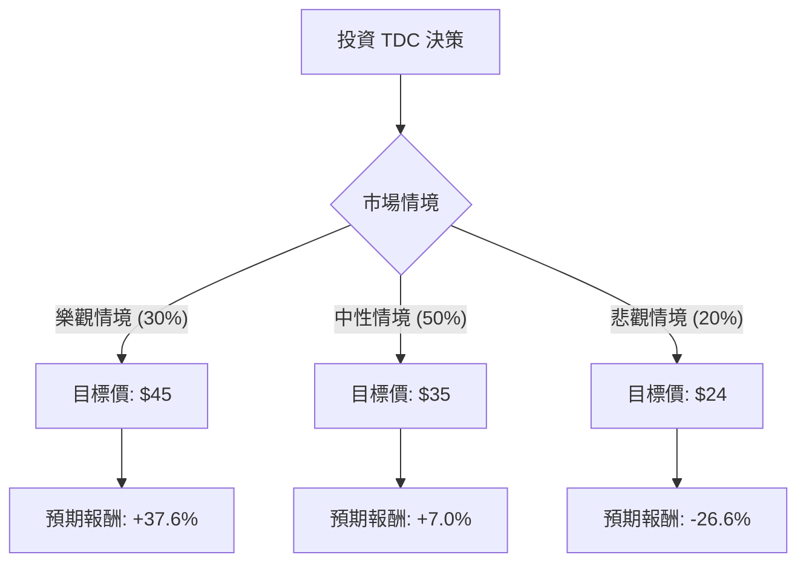

這份分析報告將針對 **Teradata Corporation (TDC)** 進行深入評估。Teradata 是一家專注於雲端數據分析和資料倉儲的老牌科技公司，目前正處於從傳統地端（On-premise）轉型為雲端訂閱制（SaaS）的關鍵期。

以下結合您提供的數據與最新的市場動態（包含 2024 年 Q3 財報表現與產業趨勢）進行決策樹與期望值分析。

---

### 一、 核心假設與市場背景分析

在繪製決策樹前，我們基於以下關鍵資訊設定假設：

1.  **雲端轉型進度（核心動能）：** Teradata 的公共雲端 ARR（年度經常性收入）持續增長，但總營收成長緩慢。市場關注其 VantageCloud 平台能否在與 Snowflake 和 Databricks 的競爭中守住大客戶。
2.  **估值水平：** 目前 P/E 僅 7.27，遠低於科技產業平均，顯示市場對其轉型仍有疑慮（Value Trap 風險），但 P/FCF（股價自由現金流比）為 4.46，顯示現金流極其強勁。
3.  **AI 需求：** 企業對 AI 數據準備的需求增加，Teradata 的 ClearScape Analytics 是其主要增長點。
4.  **財務壓力：** 負債率（Debt/Eq 0.99）偏高，且空單餘額（Short Float 16.36%）較高，顯示市場空頭勢力強大。

---

### 二、 決策樹分析 (Decision Tree)

我們將未來一年的投資情境分為三種：**樂觀（雲端爆發）、中性（穩健轉型）、悲觀（競爭失利）**。

#### 節點詳細說明：

| 情境 | 機率 | 觸發條件 | 預期股價 | 預期報酬率 |
| :--- | :--- | :--- | :--- | :--- |
| **樂觀 (Bull)** | 30% | 雲端 ARR 增長超預期，AI 整合帶動新客戶，空頭回補引發擠壓。 | $45.00 | +37.6% |
| **中性 (Base)** | 50% | 轉型進度符合預期，維持現有大客戶，股價回歸分析師平均目標價。 | $35.00 | +7.0% |
| **悲觀 (Bear)** | 20% | 客戶流失至 Snowflake，宏觀經濟導致 IT 支出縮減，高負債壓力增加。 | $24.00 | -26.6% |

---

### 三、 期望值分析 (Expected Value Analysis)

#### 1. 計算過程
期望值 (EV) = Σ (各情境機率 × 各情境報酬率)

*   **樂觀貢獻：** $0.30 \times 37.6\% = 11.28\%$
*   **中性貢獻：** $0.50 \times 7.0\% = 3.50\%$
*   **悲觀貢獻：** $0.20 \times (-26.6\%) = -5.32\%$

**總期望報酬率 = 11.28% + 3.50% - 5.32% = 9.46%**

#### 2. 期望價值 (Expected Price)
EV Price = $(0.30 \times 45) + (0.50 \times 35) + (0.20 \times 24)$
EV Price = $13.5 + 17.5 + 4.8 = \mathbf{\$35.8}$

相較於目前股價 **$32.70**，預期有約 **9.48%** 的上漲空間。

---

### 四、 綜合評估與最終結論

#### 數據亮點與隱憂：
*   **優勢：** P/E 7.27 極低，具備強大的安全邊際；ROE 1.17 顯示資產利用率極高；P/FCF 4.46 顯示公司賺取現金的能力非常強，足以支撐債務與研發。
*   **劣勢：** 營收成長（Sales Q/Q 6.22%）不算爆發性；Short Float (16.36%) 顯示專業機構對其前景仍有較大分歧。
*   **技術面：** 股價目前在 SMA20, 50, 200 之上（分別高出 12%~21%），短期有過熱跡象，但長期趨勢轉強。

#### 最終判斷：適合投資 (Cautious Buy)

**理由：**
1.  **正向期望值：** 經過加權計算，預期報酬率約為 **9.46%**，且期望股價 ($35.8) 高於目前市價。
2.  **極低估值：** 在科技股普遍昂貴的當下，TDC 的低 P/E 提供了一定的防禦性。
3.  **現金流支撐：** 強勁的自由現金流是轉型期的保命符，降低了破產或財務危機的風險。
4.  **空頭擠壓潛力：** 高比例的空單一旦遇到利多消息（如財報超預期），容易引發快速上漲。

**建議策略：**
*   **進場點：** 由於目前股價高於 SMA200 達 21%，建議不要一次性歐印（All-in），可等待股價回測 $31.5 - $32.0 區間分批佈局。
*   **止損點：** 若股價跌破 $28.0 (跌破主要支撐位)，需重新評估轉型是否失敗。
*   **目標：** 首波目標看分析師平均價 $35，若雲端數據持續亮眼，可看至 $42 以上。

**風險提示：** Teradata 面對的是極其激烈的雲端原生競爭對手，若其 VantageCloud 無法展現出差異化優勢，該股可能長期維持低估值（價值陷阱）。