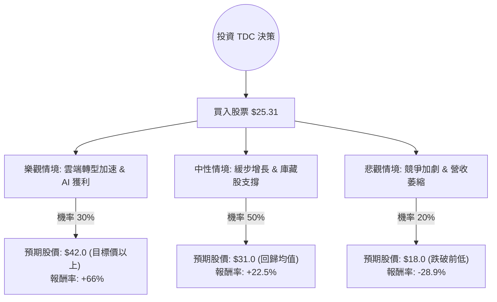

這份分析報告將結合您提供的基本面數據，以及針對 **Teradata (TDC)** 的最新市場動態（雲端轉型進度、AI 佈局、競爭對手壓力）進行綜合評估。

---

### 一、 市場現況與最新動態補充 (Web Search Summary)

1.  **雲端轉型壓力**：Teradata 正處於從傳統地端（On-premise）轉向雲端訂閱制（VantageCloud）的關鍵期。雖然雲端年度經常性收入（Cloud ARR）持續增長，但總營收增長緩慢，面臨 Snowflake、Databricks 及三大公有雲（AWS, Azure, Google）的強力競爭。
2.  **AI 佈局**：公司近期強調其 AI 數據平台能力，特別是與 Microsoft Azure 的整合，旨在吸引需要處理大規模企業級數據的 AI 應用客戶。
3.  **財務健康度**：負債比（Debt/Eq: 2.42）偏高，且流動比率（0.92）低於 1，顯示短期資金壓力較大。但其 ROE 極高（71.6%），反映出公司在資本運用效率上極強，且 P/FCF（8.46）顯示現金流產生能力優異。
4.  **市場情緒**：股價目前處於 52 週低點附近，且低於 SMA20、SMA50，技術面偏弱。然而，分析師平均目標價為 $37.1，隱含約 46% 的上漲空間。

---

### 二、 決策樹分析 (Decision Tree Analysis)

我們將未來一年的投資情境分為三種：**樂觀（轉型成功+AI帶動）**、**中性（穩健過渡）**、**悲觀（競爭失利+債務壓力）**。

---

### 三、 期望值分析 (Expected Value Analysis)

#### 1. 核心假設
*   **樂觀情境 (30%)**：VantageCloud 滲透率超預期，AI 需求帶動大客戶續約，Forward P/E 回升至歷史均值 15x 以上。預期股價 $42。
*   **中性情境 (50%)**：雲端增長抵銷地端下滑，公司持續利用自由現金流進行庫藏股回購（Insider Trans 雖微減但 P/FCF 仍低）。預期股價 $31（接近 SMA200 與分析師目標價的中間值）。
*   **悲觀情境 (20%)**：Snowflake 等對手蠶食市佔，毛利率受壓，高負債導致利息支出侵蝕利潤。預期股價 $18。

#### 2. 計算過程
期望報酬率 (Expected Return, ER) 計算公式：
$$ER = \sum (Probability_i \times Return_i)$$

*   **樂觀報酬**：$(42.0 - 25.31) / 25.31 = +65.94\%$
*   **中性報酬**：$(31.0 - 25.31) / 25.31 = +22.48\%$
*   **悲觀報酬**：$(18.0 - 25.31) / 25.31 = -28.88\%$

**總期望報酬率計算：**
$$ER = (0.3 \times 65.94\%) + (0.5 \times 22.48\%) + (0.2 \times -28.88\%)$$
$$ER = 19.78\% + 11.24\% - 5.78\% = 25.24\%$$

**期望價值 (Expected Value, EV)：**
$$EV = \$25.31 \times (1 + 25.24\%) = \$31.70$$

---

### 四、 綜合評估與最終結論

#### 1. 基本面優劣勢總結
*   **優勢 (Pros)**：
    *   **估值極低**：Forward P/E 僅 9.33，P/FCF 8.46，遠低於科技股平均。
    *   **獲利能力**：ROE 71.6% 顯示極強的股東權益回報。
    *   **現金流**：P/FCF 顯示公司有足夠現金流應對債務或進行回購。
*   **劣勢 (Cons)**：
    *   **成長停滯**：近期股價表現（Perf YTD -13.8%）反映市場對其轉型速度的疑慮。
    *   **財務結構**：Debt/Eq 2.42 偏高，在當前高利率環境下具備風險。
    *   **技術面**：股價處於空頭排列（SMA20/50 均為負值）。

#### 2. 最終判斷：適合投資 (適合價值投資者/逆向投資者)

**結論：適合投資 (Buy / Overweight)**

**理由：**
1.  **期望值具吸引力**：計算出的期望報酬率為 **25.24%**，遠高於市場平均預期報酬。
2.  **安全邊際**：目前股價 ($25.31) 接近 52 週低點，且 Forward P/E 僅 9 倍，下行空間相對有限（悲觀情境已考慮跌破支撐）。
3.  **轉型價值**：Teradata 擁有深厚的企業級客戶基礎，這類客戶遷移成本高，只要雲端產品（VantageCloud）能維持競爭力，其經常性收入將提供強大的底部支撐。
4.  **分析師共識**：目標價 $37.1 與目前股價有巨大落差，顯示市場可能過度低估其轉型潛力。

**建議操作：**
由於技術面仍疲軟，建議採取**分批進場**策略，並密切關注下一季的 **Cloud ARR 增長率** 與 **毛利率 (Gross Margin)** 是否能維持在 60% 左右。若股價跌破 $20 則需重新評估悲觀情境是否演變為長期衰退。