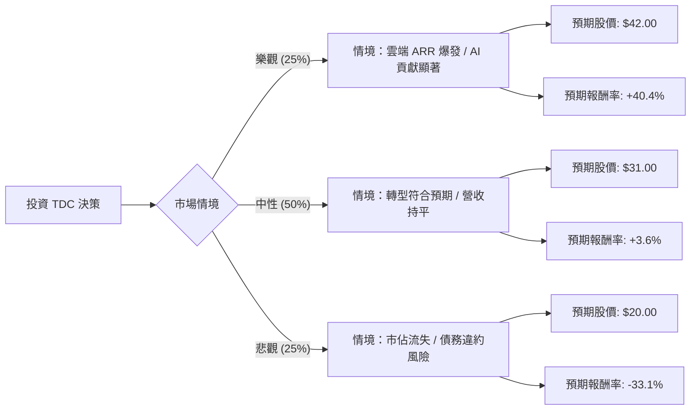

這份分析報告將結合您提供的基本面數據與最新的市場動態（包含 Teradata Q3 財報表現與產業趨勢），利用**決策樹（Decision Tree）**與**期望值分析（Expected Value Analysis）**評估 TDC 的投資價值。

---

### 一、 核心假設與市場背景分析

在建立模型前，我們先整合最新資訊：
1.  **轉型陣痛期**：Teradata 正從傳統地端（On-premise）轉向雲端訂閱制（VantageCloud）。雖然雲端 ARR（年度經常性收入）增長強勁，但總營收（Sales Q/Q -5.45%）仍受舊業務萎縮影響。
2.  **AI 題材**：公司積極推動「AI-ready data」，與 Microsoft Azure 和 AWS 深度整合，這是未來的增長動能。
3.  **財務壓力**：負債權益比（Debt/Eq）高達 2.62，流動比率（Current Ratio）僅 0.9，顯示短期財務結構偏緊。
4.  **估值矛盾**：目前股價（$29.91）已高於分析師平均目標價（$28.82），且 PEG 高達 3.07，顯示成長性相對於股價偏貴。

---

### 二、 決策樹分析圖 (Decision Tree)

我們將未來一年的情境分為三種：**樂觀（雲端轉型超預期）**、**中性（維持現狀）**、**悲觀（競爭加劇與債務壓力）**。

---

### 三、 期望值計算過程

#### 1. 參數設定與理由
*   **樂觀情境 (25%)**：
    *   **理由**：AI 需求帶動企業數據清洗需求，Teradata 雲端業務增長抵銷地端萎縮，Forward P/E 從 11.8x 修復至 18x。
    *   **目標價**：$42.00。
*   **中性情境 (50%)**：
    *   **理由**：公司維持目前的轉型速度，營收微幅波動。股價受限於高債務與分析師目標價（$28.82），僅隨大盤小幅波動。
    *   **目標價**：$31.00。
*   **悲觀情境 (25%)**：
    *   **理由**：Snowflake 與 Databricks 強力競爭導致客戶流失；高利率環境下，2.62 的 Debt/Eq 導致利息支出侵蝕利潤。
    *   **目標價**：$20.00（接近 52 週低點）。

#### 2. 期望值 (EV) 計算
$$EV = (P_{樂觀} \times V_{樂觀}) + (P_{中性} \times V_{中性}) + (P_{悲觀} \times V_{悲觀})$$

*   **預期股價期望值**：
    *   $EV = (0.25 \times 42.00) + (0.50 \times 31.00) + (0.25 \times 20.00)$
    *   $EV = 10.5 + 15.5 + 5.0 = \mathbf{\$31.00}$

*   **預期報酬率期望值**：
    *   $E(R) = \frac{31.00 - 29.91}{29.91} \approx \mathbf{3.64\%}$

---

### 四、 綜合評估與最終結論

#### 1. 數據亮點與隱憂
*   **優勢**：ROE (68.6%) 極高，顯示資產運用效率優異；P/FCF (9.82) 顯示現金流產生能力強，足以支撐目前的庫藏股計畫。
*   **劣勢**：**目前的股價 ($29.91) 已經透支了大部分的利多**。分析師平均目標價僅 $28.82，意味著專業機構認為目前股價已處於高位。
*   **風險**：短期流動性不足（Quick Ratio 0.89），且 Sales Q/Q 負成長，顯示轉型尚未完全轉化為總體營收動能。

#### 2. 最終判斷：**不適合投資 (建議觀望 / Hold)**

**理由如下：**
1.  **期望報酬率過低**：計算出的期望報酬率僅為 **3.64%**，遠低於標普 500 指數的歷史平均報酬率，且未能補償其高債務帶來的風險。
2.  **估值已達上限**：股價已超越分析師目標價，且 PEG (3.07) 顯示相對於其 5% 的預期 EPS 增長率，目前的股價過於昂貴。
3.  **技術面轉弱**：SMA20 (-2.33%) 顯示短期動能正在轉弱，雖然 SMA200 仍為正值，但近期表現（Perf Month -2.6%）顯示市場對其最新財報或展望持保留態度。
4.  **財務結構風險**：在當前高利率環境下，高負債比（Debt/Eq 2.62）是巨大的潛在炸彈，一旦雲端轉型速度放緩，財務壓力將迅速放大。

**建議操作：**
若您已持有，建議逢高減碼；若尚未進場，建議等待股價回落至 **$24 - $26** 區間（提供更高的安全邊際）或等待營收年增率（Sales Y/Y）轉正後再行考慮。