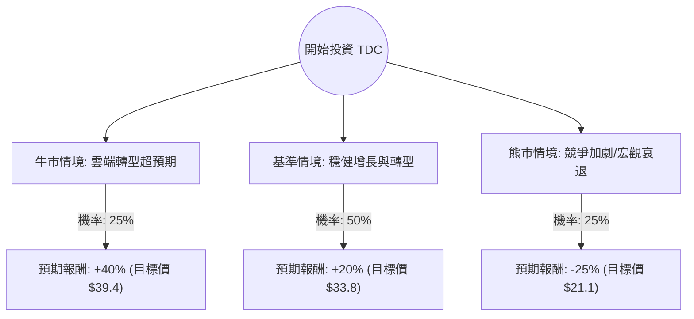

這份分析報告將結合您提供的基本面數據與最新的市場動態（如 Teradata 的雲端轉型進度、AI 佈局及競爭壓力），利用**決策樹（Decision Tree）**與**期望值分析（Expected Value Analysis）**評估 TDC 的投資價值。

---

### 一、 核心假設與市場背景分析

在建立決策樹之前，我們基於數據與最新市場資訊設定以下核心假設：

1.  **雲端轉型（Cloud Transition）：** Teradata 正從傳統地端（On-premise）轉向訂閱制雲端服務（VantageCloud）。**Cloud ARR（雲端年度經常性收入）** 是衡量其成功與否的關鍵指標。
2.  **AI 驅動需求：** 企業對 AI 數據基礎設施的需求增加，Teradata 的 ClearScape Analytics 可能帶來新成長動能。
3.  **財務健康度：** 雖然 ROE 高達 71.6%，但 Debt/Eq（債務股本比）高達 2.42，顯示財務槓桿較高。Forward P/E 僅 11.03 倍，顯示市場給予的估值相對保守（低於軟體業平均）。
4.  **競爭壓力：** 面對 Snowflake、Databricks 及三大公有雲（AWS/Azure/GCP）的強力競爭。

---

### 二、 決策樹分析 (Decision Tree)

以下為 TDC 未來一年的投資決策模型：

#### 節點詳細說明：

1.  **牛市情境 (Bull Case) - 25% 機率：**
    *   **條件：** Cloud ARR 增長率超過 35%，AI 相關合約大幅增加，利潤率因規模效應提升。
    *   **預期報酬：** 股價回升至 52 週高點附近，約 **+40%**。
2.  **基準情境 (Base Case) - 50% 機率：**
    *   **條件：** 雲端轉型進度符合預期，抵銷了傳統業務的萎縮。分析師平均目標價 $35.73 逐步實現。
    *   **預期報酬：** 約 **+20%**（接近分析師目標價與目前股價的價差）。
3.  **熊市情境 (Bear Case) - 25% 機率：**
    *   **條件：** 宏觀經濟導致企業 IT 支出縮減，或 Snowflake 等競爭對手搶奪核心客戶。高債務比率在利率維持高位時產生壓力。
    *   **預期報酬：** 股價回測 52 週低點或更低，約 **-25%**。

---

### 三、 期望值計算過程 (Expected Value Calculation)

我們將各情境的「機率」乘以「預期報酬率」來計算總期望報酬：

*   **公式：** $EV = (P_{Bull} \times R_{Bull}) + (P_{Base} \times R_{Base}) + (P_{Bear} \times R_{Bear})$

| 情境 | 機率 (P) | 預期報酬率 (R) | 加權期望值 |
| :--- | :--- | :--- | :--- |
| **牛市** | 0.25 | +40% | +10.0% |
| **基準** | 0.50 | +20% | +10.0% |
| **熊市** | 0.25 | -25% | -6.25% |
| **總計** | **1.00** | | **+13.75%** |

**計算結果：**
TDC 的年度預期報酬率（Expected Return）約為 **13.75%**。

---

### 四、 綜合評估與最新動態補充

1.  **估值優勢：** Forward P/E 11.03 倍與 P/FCF 10.07 倍顯示該股目前處於「價值區」。相較於其他雲端數據公司，TDC 的價格非常便宜。
2.  **獲利能力：** 59.7% 的毛利率與 18.3% 的 ROI 顯示其核心業務仍具備強大的賺錢能力。
3.  **技術面：** 目前股價 $28.13 高於 SMA200 (25.47%)，顯示中長期趨勢偏多，且近期有 50% 的半年漲幅，動能尚存。
4.  **風險點：** 內部人交易（Insider Trans）為 -2.11%，機構交易（Inst Trans）為 -6.59%，顯示內部人士與法人近期有小幅減持，這是一個警訊。

---

### 五、 最終結論

**投資建議：適合投資（分批買入 / 謹慎看多）**

#### 理由：
1.  **期望值為正：** 13.75% 的預期報酬率優於市場平均預期，且具備安全邊際（低 Forward P/E）。
2.  **轉型紅利：** Teradata 成功從硬體轉向雲端軟體，這類轉型通常會伴隨估值修復（Re-rating）。
3.  **AI 題材：** 作為企業級數據倉庫的元老，TDC 在 AI 時代擁有高質量的數據資產，是潛在的併購目標或 AI 受益者。

**操作建議：**
由於債務比率較高且機構近期有減持跡象，建議不要一次性重倉。可在股價回測 **$26 - $27 (SMA 支撐位)** 附近分批佈局，首要目標價設在分析師共識的 **$35.73**，停損位設在 **$23**（跌破近期支撐）。