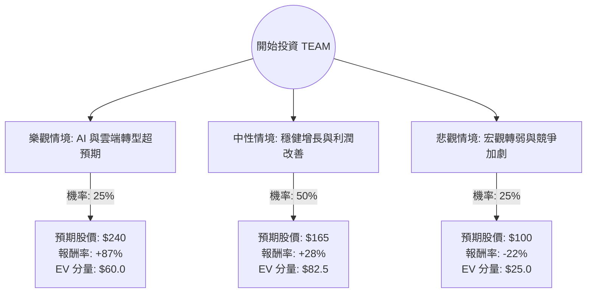

這份分析報告將結合您提供的基本面數據與最新的市場動態（如 2024 年財報表現、AI 產品進展及領導層變動），利用**決策樹（Decision Tree）**與**期望值分析（Expected Value Analysis）**評估 Atlassian (TEAM) 的投資價值。

---

### 一、 市場現況與核心假設

在進行計算前，我們先整合最新資訊：
1.  **最新財報動態**：Atlassian 近期公佈的財報顯示營收增長強勁（約 30%），但對未來雲端遷移（Cloud Migration）的指引較為保守，導致股價近期出現劇烈波動。
2.  **AI 佈局**：公司推出了 Atlassian Intelligence 與新產品 Rovo，旨在提升客單價（ARPU），這是長期增長的關鍵。
3.  **領導層變動**：共同創辦人 Scott Farquhar 離職，市場正在觀察單一 CEO 體制下的執行力。
4.  **估值水平**：目前股價約 $128，遠低於 52 週高點（$326），Forward P/E 為 22.8，相較於其 83% 的高毛利，估值已進入相對合理的區間。

---

### 二、 決策樹分析 (Decision Tree)

我們將未來一年的表現分為三種情境：**樂觀（Bull）**、**中性（Base）**、**悲觀（Bear）**。

---

### 三、 期望值計算過程

#### 1. 核心假設與參數設定
*   **當前股價 ($P_0$)**: $128.44
*   **情境 A：樂觀 (Bull Case)**
    *   **假設**：AI 產品 Rovo 快速變現，雲端遷移進度超前，營收維持 30% 以上增長，且自由現金流（FCF）大幅轉正。
    *   **目標價**：參考分析師平均目標價 $239.37（取整為 $240）。
    *   **機率**：25%。
*   **情境 B：中性 (Base Case)**
    *   **假設**：公司達到財報指引，雲端業務穩健，營收增長約 20-25%，利潤率緩步提升。
    *   **目標價**：給予 Forward P/E 30x 或 P/S 8x 估值，約 $165。
    *   **機率**：50%。
*   **情境 C：悲觀 (Bear Case)**
    *   **假設**：宏觀經濟導致企業 IT 支出縮減，競爭對手（如 Monday.com, ClickUp）蠶食市佔，領導層更迭產生動盪。
    *   **目標價**：回測 52 週低點並考慮下行壓力，約 $100。
    *   **機率**：25%。

#### 2. 期望值 (Expected Value, EV) 計算
$$EV = (P_{Bull} \times Prob_{Bull}) + (P_{Base} \times Prob_{Base}) + (P_{Bear} \times Prob_{Bear})$$
$$EV = (240 \times 0.25) + (165 \times 0.50) + (100 \times 0.25)$$
$$EV = 60 + 82.5 + 25 = 167.5$$

#### 3. 預期報酬率計算
$$\text{Expected Return} = \frac{EV - P_0}{P_0} = \frac{167.5 - 128.44}{128.44} \approx 30.4\%$$

---

### 四、 綜合評估與數據解讀

*   **財務健康度**：TEAM 擁有極高的毛利率（83%），這在軟體業是頂尖水平。雖然目前 ROE 為負，但 Forward P/E (22.8) 顯示市場預期明年將轉虧為盈。
*   **技術面壓力**：股價目前低於 SMA20, SMA50, SMA200，顯示短期趨勢極度疲軟，處於超賣區間。
*   **估值吸引力**：PEG 為 1.01，這對於一家高成長的 SaaS 公司來說是非常具吸引力的數值（通常 < 1 被視為低估）。

---

### 五、 最終結論

**判斷：適合投資（分批買入）**

#### 理由：
1.  **期望值顯著為正**：計算出的期望股價為 **$167.5**，較目前股價有約 **30.4%** 的潛在漲幅，具備良好的風險報酬比（Risk-Reward Ratio）。
2.  **基本面護城河強**：Jira 和 Confluence 在開發者社群中有極高的黏著度，雲端轉型的陣痛期已接近尾聲。
3.  **估值已大幅修正**：股價已從高點回落超過 60%，目前的 P/S 6.19 倍處於歷史低位區間，下行風險相對有限。
4.  **AI 催化劑**：Atlassian Intelligence 的整合有望在未來 2-4 個季度內開始貢獻營收，成為股價反彈的動力。

**風險提示**：
*   短期內股價受技術面壓制，可能仍有 10-15% 的下探空間（至 $110 附近）。
*   建議採取**分批進場（Dollar-Cost Averaging）**策略，以應對短期市場波動。