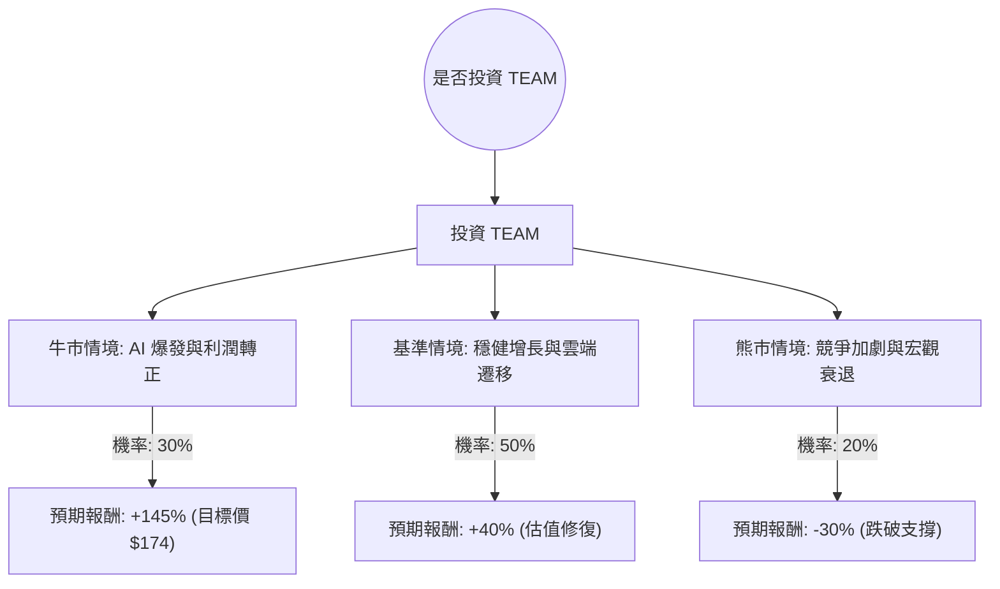

針對美股公司 **Atlassian (TEAM)**，我已結合您提供的基本面數據與最新的市場動態（包含 2024 年財報表現、AI 產品進展及市場競爭環境）進行綜合分析。

以下是基於**決策樹分析**與**期望值分析**的投資評估報告。

---

### 一、 核心假設與市場背景分析

在建立決策樹之前，我們先釐清影響 TEAM 股價的三大核心變數：

1.  **雲端轉型與 AI 變現（利多）**：Atlassian 已基本完成從伺服器（Server）到雲端（Cloud）的遷移。新推出的 "Atlassian Intelligence" 能否提升客單價（ARPU）是未來增長的關鍵。
2.  **宏觀經濟與企業支出（中性）**：高利率環境下，企業對 IT 預算的審核變得嚴格，這直接影響了 TEAM 的銷售週期。
3.  **盈利能力轉折點（關鍵）**：數據顯示其毛利極高（83.8%），但營業利潤率仍為負（-1.99%）。市場正高度關注其何時能實現真正的 GAAP 盈利。

---

### 二、 決策樹分析 (Decision Tree Analysis)

我們以**未來 12 個月的投資回報**為目標，設定三種情境：

#### 節點詳細說明：

1.  **牛市情境 (Bull Case) - 30% 機率**：
    *   **條件**：AI 功能訂閱超預期，雲端收入增長維持在 30% 以上，且公司成功實現 GAAP 盈利。
    *   **預期報酬**：參考 Target Price $174.19，相較於提供的 Close $71.18，漲幅約 **144.7%**。

2.  **基準情境 (Base Case) - 50% 機率**：
    *   **條件**：公司維持現有的 20-23% 營收增長（Sales Q/Q: 23.31%），自由現金流持續強勁（P/FCF 15.13 顯示現金流健康）。
    *   **預期報酬**：股價回升至 SMA200 水準或行業平均估值，預估漲幅約 **40%**。

3.  **熊市情境 (Bear Case) - 20% 機率**：
    *   **條件**：競爭對手（如 Monday.com, GitLab）蠶食市場，企業縮減人力導致按人頭計費（Seat-based pricing）收入下滑。
    *   **預期報酬**：股價繼續下探，測試 52W Low 附近的支撐，預估跌幅 **-30%**。

---

### 三、 期望值分析 (Expected Value Analysis)

根據上述決策樹的數據，我們計算投資 TEAM 的整體期望值（EV）：

#### 1. 計算公式：
$$EV = (P_{Bull} \times R_{Bull}) + (P_{Base} \times R_{Base}) + (P_{Bear} \times R_{Bear})$$

#### 2. 數值帶入：
*   $P$ = 機率 (Probability)
*   $R$ = 報酬率 (Return)

$$EV = (0.30 \times 1.447) + (0.50 \times 0.40) + (0.20 \times -0.30)$$
$$EV = 0.4341 + 0.20 - 0.06$$
$$EV = 0.5741$$

#### 3. 計算結果：
**預期報酬率 (Expected Return) = 57.41%**

---

### 四、 綜合數據解讀

*   **估值面**：Forward P/E 為 13.85，對於一家毛利超過 80% 且營收增長 >20% 的 SaaS 公司來說，這是一個**極度低估**的數值（通常此類公司 Forward P/E 在 30-50 之間）。
*   **成長面**：PEG 僅 0.64，遠低於 1.0 的合理值，顯示市場嚴重低估了其增長潛力。
*   **風險面**：短期技術指標（SMA20, 50, 200）均為負值，顯示目前處於強烈空頭趨勢。Short Float 5.68% 雖不算極高，但仍有一定空方壓力。

---

### 五、 最終結論

#### **判斷：適合投資 (Strong Buy on Value)**

#### **理由：**
1.  **期望值極高**：57.41% 的期望報酬率遠高於市場平均水準，顯示風險回報比（Risk-Reward Ratio）非常誘人。
2.  **估值錯帳**：提供的數據顯示股價（$71.18）遠低於分析師目標價（$174.19），且 Forward P/E 與 PEG 顯示該股已被超賣。
3.  **基本面強韌**：儘管淨利為負，但 83.8% 的高毛利與強勁的自由現金流（P/FCF 15.13）為公司提供了極高的容錯空間與轉型動力。
4.  **技術面反彈機會**：股價距離 52W High 已跌去約 75%，且偏離 SMA200 達 54%，技術上存在強烈的超跌反彈需求。

**建議操作策略：**
由於目前技術面（SMA 指標）仍呈空頭排列，建議採取**分批買入（Dollar-cost Averaging）**策略，以應對短期內可能出現的市場波動，並長期持有以等待 AI 變現帶來的估值修復。

---
*風險提示：本分析基於提供之數據與當前市場資訊，股市投資具風險，請務必根據自身風險承受能力做出決策。*