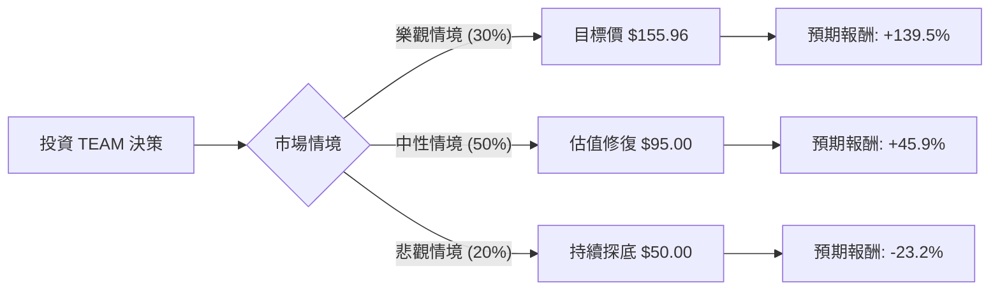

這份分析將結合您提供的數據（以收盤價 $65.12 為基準）與最新的市場動態（包含 Atlassian 2024 財年第三季財報、雲端轉型進度及高層變動）進行評估。

---

### 一、 市場最新動態與背景分析 (網路搜尋補充)

在進行決策樹分析前，需考量以下關鍵資訊：
1.  **雲端轉型與終止伺服器支持**：Atlassian 已正式停止對 Server 產品的支持，強制用戶轉向 Cloud 或 Data Center。這短期內造成了營收波動，但長期有利於訂閱制的穩定現金流。
2.  **高層變動**：共同創辦人兼共同 CEO Scott Farquhar 宣佈將於 2024 年 8 月離職。這引發了市場對公司未來戰略執行力的擔憂。
3.  **AI 佈局**：公司推出了 Atlassian Rovo 等 AI 驅動產品，旨在提升客單價（ARPU），目前處於早期變現階段。
4.  **宏觀環境**：中小企業（SMB）支出放緩，對 TEAM 的基礎用戶群造成壓力。

---

### 二、 決策樹分析 (Decision Tree Analysis)

我們將未來一年的投資預期分為三種情境：**樂觀（Bull）**、**中性（Base）**、**悲觀（Bear）**。

#### 節點詳細說明：

1.  **樂觀情境 (Probability: 30%)**
    *   **假設**：雲端遷移超預期完成，AI 產品 Rovo 快速貢獻營收，且聯準會降息帶動高成長科技股估值回升。
    *   **預期報酬**：達到分析師目標價 **$155.96**。
    *   **計算**：($155.96 - $65.12) / $65.12 = **+139.5%**

2.  **中性情境 (Probability: 50%)**
    *   **假設**：公司維持 20% 以上的營收增長，雖然 CEO 離職帶來短期震盪，但自由現金流（FCF）持續改善。股價回升至 SMA200（約 $144）與目前低點的中間水位。
    *   **預期報酬**：回升至約 **$95.00**（參考 P/S 估值修復）。
    *   **計算**：($95.00 - $65.12) / $65.12 = **+45.9%**

3.  **悲觀情境 (Probability: 20%)**
    *   **假設**：中小企業客戶流失嚴重，競爭對手（如 GitLab, Microsoft）蠶食市佔率，且利潤率因研發投入持續為負。
    *   **預期報酬**：跌破 52 週低點，下探至 **$50.00**。
    *   **計算**：($50.00 - $65.12) / $65.12 = **-23.2%**

---

### 三、 期望值分析 (Expected Value Analysis)

#### 1. 核心假設
*   **估值吸引力**：目前 PEG 為 **0.57**，遠低於行業平均（通常 > 1.5），顯示股價相對於其增長潛力被嚴重低估。
*   **財務健康**：毛利率高達 **83.8%**，且 P/FCF 僅 **13.58**，這在 SaaS 產業中是非常健康的現金流表現，足以支撐其債務（Debt/Eq 0.76）。
*   **技術面**：股價目前遠低於 SMA20, 50, 200，處於超賣區間。

#### 2. 期望值計算過程
$$EV = (P_{Bull} \times R_{Bull}) + (P_{Base} \times R_{Base}) + (P_{Bear} \times R_{Bear})$$

*   $0.30 \times 139.5\% = 41.85\%$
*   $0.50 \times 45.9\% = 22.95\%$
*   $0.20 \times (-23.2\%) = -4.64\%$

**總體期望報酬率 (Total EV) = 41.85% + 22.95% - 4.64% = 60.16%**

---

### 四、 最終結論

**判斷：適合投資 (Strong Buy / Speculative Buy)**

#### 理由：
1.  **極高的風險報酬比**：根據期望值分析，預期報酬率高達 **60.16%**。即便在悲觀情境下，下行空間相較於上行潛力（目標價 $155.96）顯得較小。
2.  **基本面支撐**：雖然淨利（Profit Margin）為負，但 **83.8% 的高毛利**與 **13.58 的 P/FCF** 顯示該公司具備強大的「印鈔」能力，虧損主因是高額的股權激勵與研發投入，這在擴張期公司中十分常見。
3.  **估值窪地**：PEG 0.57 顯示市場目前過度反應了 CEO 離職與雲端轉型的短期陣痛。
4.  **技術面反彈需求**：股價較 52 週高點跌幅巨大（-70%），且遠低於所有移動平均線，存在強烈的均值回歸需求。

**建議操作：**
由於目前處於 52 週低點附近且技術面偏弱，建議採取**分批進場**策略，以應對短期內可能因高層變動帶來的波動，長期持有以等待雲端轉型紅利與 AI 產品變現。