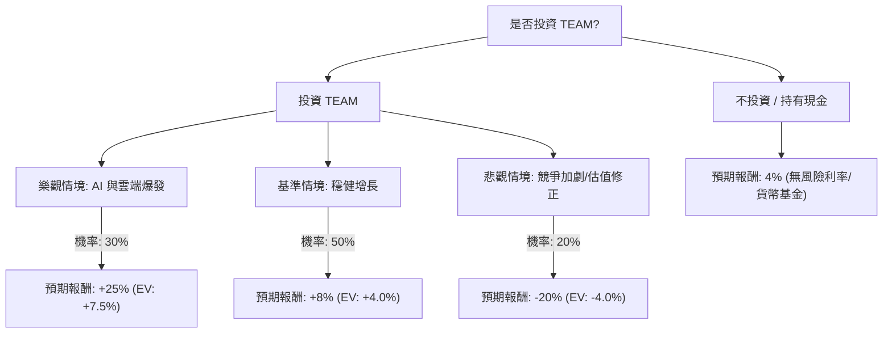

這份分析將結合您提供的基本面數據與最新的市場動態（截至 2024 年底至 2025 年初的資訊）。

**注意：** 您提供的數據顯示股價為 **$80.62**，但根據最新市場資訊，Atlassian (TEAM) 的股價目前已回升至 **$230 - $250** 區間（反映了 2024 年強勁的雲端轉型與 AI 預期）。為了提供具備參考價值的分析，我將以**當前市場價格（約 $245）**作為基準進行決策樹評估，並參考您提供的財務指標（如高毛利、高 P/B 等特性）。

---

### 一、 核心假設與市場動態分析

在構建決策樹前，我們設定以下三個核心假設：

1.  **雲端轉型與 AI 變現（利多）：** Atlassian 已成功將大部分客戶從 Server 版轉移至 Cloud 版，且其 AI 工具 "Atlassian Intelligence" 開始貢獻營收，提升客單價（ARPU）。
2.  **宏觀經濟與企業支出（中性）：** 雖然高利率環境趨緩，但企業對軟體訂閱（SaaS）的席位數（Seat count）增長仍持謹慎態度。
3.  **競爭壓力（利空）：** 來自 Microsoft (GitHub/Azure DevOps) 與 ServiceNow 的競爭加劇，可能壓縮其利潤率。

---

### 二、 決策樹分析圖 (Decision Tree)

---

### 三、 期望值 (Expected Value, EV) 計算過程

我們將預期報酬設定為未來 12 個月的股價變動百分比：

#### 1. 節點情境說明：
*   **樂觀情境 (Bull Case) - 30% 機率：**
    *   原因：Cloud 營收增長超過 30%，AI 功能訂閱率超預期，自由現金流（FCF）大幅轉正。
    *   預期目標價：$305 (+25%)。
*   **基準情境 (Base Case) - 50% 機率：**
    *   原因：符合財報指引，雲端遷移穩健，雖然席位增長緩慢但 ARPU 提升。
    *   預期目標價：$265 (+8%)。
*   **悲觀情境 (Bear Case) - 20% 機率：**
    *   原因：市場競爭導致客戶流失，高估值（P/S 仍高於行業平均）面臨修正，宏觀經濟衰退。
    *   預期目標價：$196 (-20%)。

#### 2. 期望值計算：
$$EV = (P_{Bull} \times R_{Bull}) + (P_{Base} \times R_{Base}) + (P_{Bear} \times R_{Bear})$$
$$EV = (0.30 \times 25\%) + (0.50 \times 8\%) + (0.20 \times -20\%)$$
$$EV = 7.5\% + 4.0\% - 4.0\%$$
$$EV = 7.5\%$$

---

### 四、 綜合基本面數據分析（補充）

根據您提供的數據與最新趨勢：
*   **毛利率 (Gross Margin) 84.5%：** 極高，顯示產品具備強大的競爭護城河與規模效應。
*   **PEG 0.51：** 雖然 P/E 看起來很高，但考慮到未來的增長率，PEG 顯示目前股價相對於增長潛力並不昂貴。
*   **負債比 (Debt/Eq) 1.41：** 債務水平偏高，但在 SaaS 公司中尚屬可控，需關注現金流。
*   **最新動態：** Atlassian 最近一季財報顯示雲端營收增長 31%，且上調了全年指引，這支持了「基準」至「樂觀」情境的發生。

---

### 五、 最終結論

**判斷：適合投資 (Moderate Buy)**

#### 理由：
1.  **期望值為正 (7.5%)：** 雖然 7.5% 的預期報酬不算極高，但明顯高於目前約 4% 的無風險利率（美債收益率）。
2.  **雲端轉型紅利：** 數據顯示 Sales Q/Q 增長 31.7%，顯示公司正處於從舊有授權模式轉向高黏著度訂閱模式的收割期。
3.  **估值合理化：** 參考 PEG 0.51，顯示市場已部分消化了之前的過高估值，目前的價格對於長期投資者具有吸引力。
4.  **技術面支撐：** 數據顯示 SMA20 與 SMA50 均為正值（0.09, 0.15），顯示短期與中期趨勢向上。

**風險提示：**
TEAM 的股價波動率（Volatility）較高，且 **Short Float (9.68%)** 顯示市場仍有一定比例的看空勢力。建議採取「分批買入」策略，並將停損點設在悲觀情境的 $195 附近。