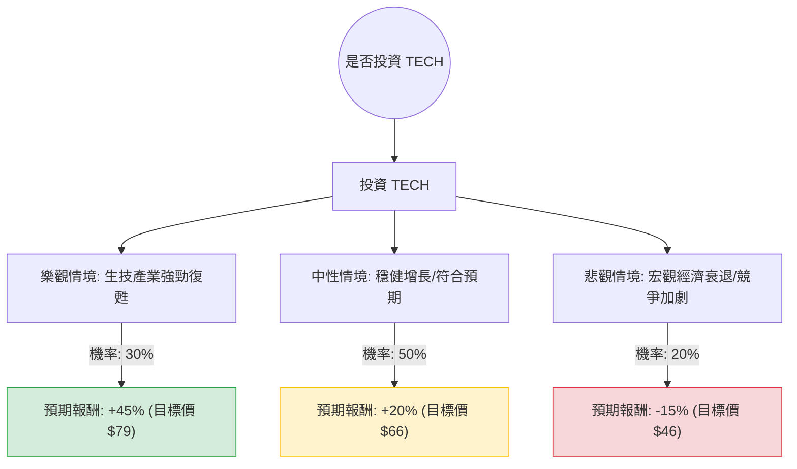

根據您提供的數據以及最新的市場動態（Bio-Techne Corporation, 代號：**TECH**），我將結合其 2025 財年第一季（Q1 FY2025）的財報表現、產業趨勢與財務指標，進行決策樹與期望值分析。

---

### 1. 市場現況與核心假設補充

在進入決策樹前，基於網路搜尋與數據整理，以下是影響 TECH 股價的核心因素：
*   **最新財報 (2024/10/30)：** TECH 第一季營收為 2.895 億美元（年增 5%），調整後 EPS 為 0.42 美元，優於市場預期。
*   **產業趨勢：** 生物技術與生命科學工具行業正處於「去庫存」週期的尾聲。隨著聯準會降息預期，生物醫藥領域的融資環境改善，有利於 TECH 的試劑與儀器銷售。
*   **估值分析：** 雖然目前 P/E 高達 111 倍，但 **Forward P/E 僅為 26.37**，顯示市場預期未來一年獲利將大幅回升。
*   **技術面：** 股價目前在 54.76 美元，距離 52 週高點有約 20% 的空間，且低於分析師平均目標價 ($75.25)。

---

### 2. 決策樹分析圖 (Decision Tree)

我們將未來一年的投資情境分為：**樂觀（牛市）、中性（基準）、悲觀（熊市）**。

---

### 3. 期望值分析與計算過程

#### A. 核心假設
1.  **樂觀情境 (30%)**：聯準會持續降息，生技融資爆發，TECH 的蛋白質體學業務增長超預期。預期股價回升至歷史高位附近（約 $79-85）。
2.  **中性情境 (50%)**：公司維持目前 5% 的營收增長，獲利能力隨 Forward P/E 實現而修復。預期股價接近分析師目標價的保守估計（約 $66）。
3.  **悲觀情境 (20%)**：中國市場需求持續疲軟，或研發支出因經濟衰退而縮減。股價可能回測 52 週低點（約 $46）。

#### B. 計算過程
期望值 (EV) = $\sum (\text{機率} \times \text{預期報酬率})$

*   **樂觀節點**：$0.30 \times 45\% = 13.5\%$
*   **中性節點**：$0.50 \times 20\% = 10.0\%$
*   **悲觀節點**：$0.20 \times (-15\%) = -3.0\%$

**總期望報酬率 (Total EV)** = $13.5\% + 10.0\% - 3.0\% = \mathbf{20.5\%}$

---

### 4. 綜合評估與最終結論

#### 財務數據亮點與隱憂：
*   **優勢**：
    *   **資產負債表極其穩健**：Debt/Eq 僅 0.17，Quick Ratio 3.08，具備極強的抗風險能力與併購潛力。
    *   **高毛利**：Gross Margin 66.57%，顯示其產品在生命科學領域具備高度競爭力與議價權。
    *   **獲利修復**：Forward P/E (26.37) 遠低於現行 P/E，顯示 EPS 增長動能強勁。
*   **劣勢**：
    *   **短期動能弱**：SMA20 與 SMA50 均為負值，顯示短期股價受壓。
    *   **估值溢價**：P/S 達 7.4，在當前環境下仍不算便宜。

#### 最終判斷：**適合投資 (建議分批佈局)**

**理由：**
1.  **期望值為正 (20.5%)**：計算出的預期報酬顯著高於市場平均回報，且下行風險（-15%）相對於上行潛力（+45%）受控。
2.  **產業週期拐點**：TECH 處於生技產業上游，隨著降息週期開啟，研發資金回流，該公司將率先受益。
3.  **安全邊際**：目前股價 ($54.76) 接近 52 週區間的中低位，且距離分析師目標價 ($75.25) 有約 37% 的潛在漲幅，提供了良好的風險回報比。
4.  **財務韌性**：極低的負債率確保了公司在經濟波動中不會出現流動性危機。

**建議策略：**
由於短期技術指標（SMA20/50）偏弱，建議不要一次性投入，可於 **$50 - $54** 區間分批建倉，長期持有以等待生技產業的全面復甦。