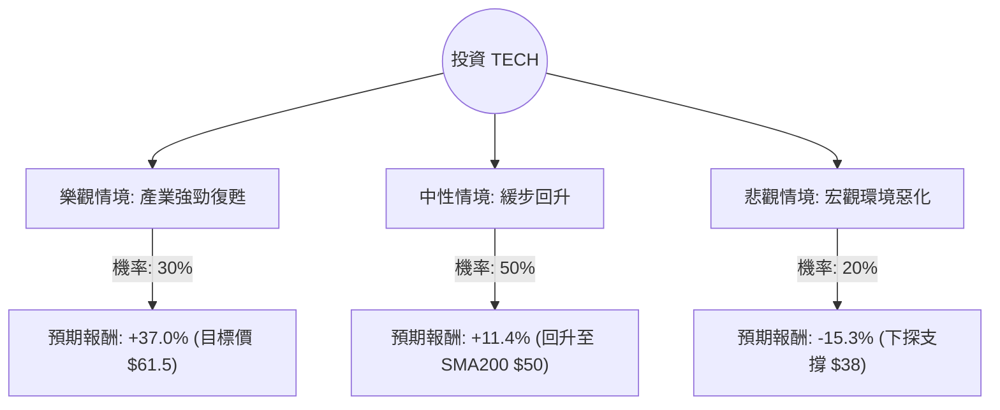

這份分析報告將針對 **Bio-Techne Corporation (股票代碼：TECH)** 進行深入評估。Bio-Techne 是全球領先的生命科學試劑、儀器與診斷產品供應商。

我們將結合您提供的財務數據與最新的市場動態（包含 2024 年 5 月發布的最新財報資訊與產業趨勢），利用**決策樹（Decision Tree）**與**期望值（Expected Value）**進行分析。

---

### 一、 核心背景與市場動態分析

在進入計算前，我們先整合最新的外部資訊：
1.  **最新財報表現**：Bio-Techne 近期公布的財報顯示，受生物技術融資環境疲軟及中國市場復甦緩慢影響，營收增長承壓。這解釋了為何 `Perf Week (-16.34%)` 與 `Perf Month (-17.57%)` 表現極差。
2.  **產業趨勢**：生命科學工具行業目前處於「去庫存」末期。雖然短期內製藥公司研發支出謹慎，但長期看好細胞與基因治療（CGT）的需求。
3.  **財務健康度**：數據顯示 `Debt/Eq (0.14)` 極低，`Current Ratio (4.49)` 極高，顯示公司財務極其穩健，有能力度過行業寒冬。
4.  **估值面**：`P/E (68.11)` 偏高，但 `Forward P/E (22.83)` 顯示市場預期明年獲利將大幅回升。

---

### 二、 決策樹分析 (Decision Tree)

我們將未來一年的投資情境分為三種：**樂觀（產業復甦）**、**中性（維持現狀）**、**悲觀（衰退加劇）**。

#### 節點詳細說明：

1.  **樂觀情境 (Bull Case) - 30% 機率**：
    *   **前提**：聯準會降息帶動生技融資回暖，中國市場需求超預期復甦。
    *   **預期報酬**：達到分析師平均目標價 **$61.5**。
    *   **計算**：$(61.5 - 44.89) / 44.89 = +37.0\%$

2.  **中性情境 (Base Case) - 50% 機率**：
    *   **前提**：去庫存結束，營收恢復個位數增長，股價回到 200 日均線（SMA200）水平。
    *   **預期報酬**：回升至約 **$50.0**。
    *   **計算**：$(50.0 - 44.89) / 44.89 = +11.4\%$

3.  **悲觀情境 (Bear Case) - 20% 機率**：
    *   **前提**：高利率環境持續更久，主要客戶（大型藥廠）進一步削減研發預算。
    *   **預期報酬**：股價跌破近期低點，下探至 **$38.0**。
    *   **計算**：$(38.0 - 44.89) / 44.89 = -15.3\%$

---

### 三、 期望值分析 (Expected Value Analysis)

#### 1. 計算過程：
期望值 (EV) = $\sum (\text{機率} \times \text{預期報酬})$

*   **樂觀貢獻**：$0.30 \times 37.0\% = 11.1\%$
*   **中性貢獻**：$0.50 \times 11.4\% = 5.7\%$
*   **悲觀貢獻**：$0.20 \times (-15.3\%) = -3.06\%$

**總期望報酬率 (Total EV) = $11.1\% + 5.7\% - 3.06\% = 13.74\%$**

#### 2. 核心假設：
*   **市場假設**：假設生技產業的融資週期已接近底部，未來 12 個月不會發生嚴重的全球性經濟衰退。
*   **財務假設**：Forward P/E 22.83 倍是合理的，反映了公司在蛋白質科學領域的護城河。
*   **技術假設**：目前股價處於 52 週低點附近（$44.89$ 接近 $45.12$），技術面超賣（SMA20/50/200 皆為負值），存在反彈動能。

---

### 四、 最終結論

**評估結果：適合投資 (建議分批買入)**

#### 理由如下：

1.  **期望值為正 (13.74%)**：儘管短期股價動能極差（Perf Week -16%），但從期望值角度看，目前的下行風險已部分反映在股價中，潛在報酬高於風險。
2.  **估值吸引力**：目前的股價已跌至 52 週低點邊緣。相較於 $61.5$ 的目標價，安全邊際（Margin of Safety）正在擴大。
3.  **極佳的財務韌性**：`Debt/Eq 0.14` 與 `Current Ratio 4.49` 顯示該公司沒有破產風險，能支撐其在產業低谷期進行研發或併購。
4.  **反轉契機**：`EPS Q/Q 1.2815` 顯示獲利能力仍強，只要營收（Sales Q/Q）止跌回升，股價極易因空頭回補（Short Float 8.55%）而快速反彈。

**風險提示**：
由於近期股價呈現「接刀子（Falling Knife）」態勢，建議投資者**不要一次性投入**，應採取**分批佈局（Dollar-cost averaging）**策略，並密切關注下一季財報中關於中國市場與生物技術融資環境的指引。若股價跌破 $38 (悲觀支撐點)，應重新評估投資邏輯。