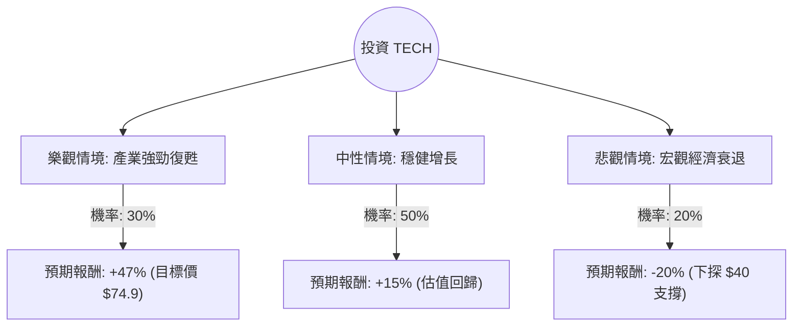

這份分析報告將針對美股代號 **TECH（Bio-Techne Corporation）** 進行深入評估。Bio-Techne 是一家領先的生命科學試劑、儀器與服務供應商，主要服務於生物製藥與學術研究領域。

以下結合您提供的數據與最新的市場動態（包含 2024 年財報表現與產業趨勢），進行決策樹與期望值分析。

---

### 一、 核心假設與市場背景分析

在建立模型前，我們先釐清影響 TECH 股價的核心變數：

1.  **估值修復（Valuation Re-rating）**：目前 P/E 高達 99 倍，但 Forward P/E 僅約 23 倍。這顯示市場預期未來一年盈餘將大幅增長（EPS next Y 預期增長 10.24%）。
2.  **產業復甦**：生命科學工具產業在 2023-2024 年因生物製藥融資環境收緊而承壓。隨著利率可能下調，研發經費（R&D Spending）預計在 2025 年回升。
3.  **財務穩健度**：TECH 擁有極高的毛利率（66.57%）與極低的負債比（Debt/Eq 0.17），且流動比率（4.54）極佳，具備抗風險能力。
4.  **技術面**：目前股價處於 52 週低點附近（$50.95），距離分析師平均目標價（$74.91）有約 **47%** 的潛在漲幅。

---

### 二、 決策樹分析（Decision Tree）

我們將未來一年的投資情境分為三種：**樂觀（牛市）、中性（基準）、悲觀（熊市）**。

#### 節點詳細說明：

1.  **樂觀情境 (Bull Case) - 30% 機率**：
    *   **前提**：聯準會降息帶動生技融資熱潮，公司新產品（如空間生物學儀器）銷量超預期。
    *   **預期報酬**：達到分析師目標價 $74.91，漲幅約 **+47%**。
2.  **中性情境 (Base Case) - 50% 機率**：
    *   **前提**：生物製藥支出緩步回升，公司維持 10% 以上的 EPS 增長，Forward P/E 實現。
    *   **預期報酬**：股價回升至 SMA200 以上，預估漲幅約 **+15%**（約 $58.6）。
3.  **悲觀情境 (Bear Case) - 20% 機率**：
    *   **前提**：高利率環境持續更久，學術研究經費縮減，競爭加劇導致利潤率下滑。
    *   **預期報酬**：跌破 52 週低點，回測長期支撐位，預估跌幅 **-20%**（約 $40.7）。

---

### 三、 期望值分析（Expected Value Analysis）

#### 1. 計算過程
期望值 (EV) = Σ (各情境機率 × 各情境報酬率)

*   **樂觀情境**：$0.30 \times 47\% = 14.1\%$
*   **中性情境**：$0.50 \times 15\% = 7.5\%$
*   **悲觀情境**：$0.20 \times (-20\%) = -4.0\%$

**總體期望報酬率 (Total EV) = 14.1% + 7.5% - 4.0% = 17.6%**

#### 2. 核心指標參考
*   **風險回報比 (Risk/Reward Ratio)**：潛在獲利 (47%) / 潛在虧損 (20%) ≈ **2.35**。通常大於 2 被視為具備吸引力的投資。
*   **安全邊際**：目前股價 $50.95 接近 52 週低點（$46.01），下行空間相對有限，提供了較好的安全邊際。

---

### 四、 最終結論

#### **評估結果：適合投資 (Buy / Overweight)**

#### **判斷理由：**
1.  **期望值為正且具吸引力**：17.6% 的預期年化報酬率優於標普 500 指數的長期平均表現。
2.  **估值吸引力**：雖然當前 P/E 較高，但這是由於短期盈餘受壓所致。Forward P/E (23.29) 對於一家毛利率超過 66% 且處於壟斷/高技術門檻賽道的公司來說並不昂貴。
3.  **財務體質極佳**：低負債（0.17）與高流動比率（4.54）確保公司能度過任何短期經濟波動，甚至進行併購。
4.  **技術面超賣**：股價 YTD 下跌 13.37%，且低於 SMA20、50、200，顯示市場情緒已過度悲觀，目前是逆向投資的良好時機。

#### **投資建議與風險提示：**
*   **建議**：可考慮在 $50 附近分批建倉。
*   **風險**：需密切關注每季的 **Sales Q/Q** 增長率。若銷售額持續萎縮（目前為 -0.39%），則需重新評估中性情境的機率。此外，生技產業對利率極度敏感，若通膨回升導致降息延後，股價回升時間將拉長。