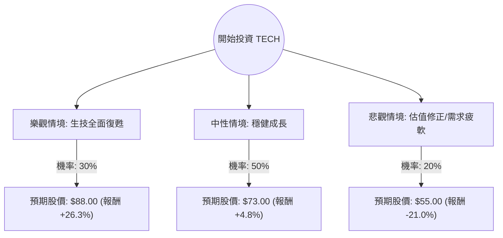

這份分析報告將針對 **Bio-Techne Corporation (股票代碼：TECH)** 進行深入評估。Bio-Techne 是全球生命科學試劑、儀器與診斷產品的領導供應商。

我將結合您提供的數據與最新的市場動態（包含 2024 年 10 月底發布的最新財報資訊），利用**決策樹**與**期望值分析**來評估其投資價值。

---

### 一、 核心假設與市場背景分析

在建立決策樹之前，我們必須基於數據與現狀設定核心假設：

1.  **估值壓力（Valuation）：** 目前 P/E 高達 142 倍，雖然 Forward P/E 降至 31.5 倍，顯示市場預期未來盈餘將大幅成長，但 PEG 為 3.14，顯示股價相對於成長速度依然偏貴。
2.  **產業趨勢（Industry Trend）：** 生技製藥產業（Biopharma）在經歷了 2023 年的支出縮減後，2024 下半年開始出現復甦跡象。聯準會降息預期有利於生技公司取得融資，進而增加對 TECH 產品的採購。
3.  **最新財報表現（Q1 FY2025）：** TECH 於 10 月 30 日公布財報，營收成長 5%（有機成長 4%），調整後 EPS 為 0.42 美元，優於預期。細胞與基因治療（CGT）領域表現強勁。
4.  **風險因素：** 中國市場需求疲軟、大型藥廠資本支出回收速度慢於預期。

---

### 二、 決策樹分析 (Decision Tree)

我們將未來一年的投資情境分為三種：**樂觀（牛市）、中性（基準）、悲觀（熊市）**。

#### 節點詳細說明：

1.  **樂觀情境 (Bull Case) - 30% 機率：**
    *   **條件：** 聯準會持續降息，生技融資環境大好；中國市場超預期復甦；新產品（如 Lunaphore 空間生物學平台）貢獻顯著。
    *   **預期股價：** $88.00 (參考 52 週高點並加上成長溢價)。
2.  **中性情境 (Base Case) - 50% 機率：**
    *   **條件：** 營收維持 5-8% 的穩健成長；利潤率因效率提升而改善；股價維持在分析師平均目標價附近。
    *   **預期股價：** $73.00 (略高於目前 Target Price $70.00，反映近期財報利多)。
3.  **悲觀情境 (Bear Case) - 20% 機率：**
    *   **條件：** 高估值引發修正；生技大廠持續縮減研發預算；宏觀經濟衰退。
    *   **預期股價：** $55.00 (回測 52 週低點支撐區)。

---

### 三、 期望值分析 (Expected Value Analysis) 計算過程

我們以目前股價 **$69.65** 為基準進行計算。

#### 1. 預期股價計算：
$$EV_{Price} = (P_{Bull} \times Price_{Bull}) + (P_{Base} \times Price_{Base}) + (P_{Bear} \times Price_{Bear})$$
$$EV_{Price} = (0.30 \times 88.00) + (0.50 \times 73.00) + (0.20 \times 55.00)$$
$$EV_{Price} = 26.40 + 36.50 + 11.00 = \mathbf{73.90}$$

#### 2. 預期報酬率計算：
$$Expected\ Return = \frac{EV_{Price} - Current\ Price}{Current\ Price}$$
$$Expected\ Return = \frac{73.90 - 69.65}{69.65} \approx \mathbf{6.1\%}$$

#### 3. 考慮股息 (Dividend)：
TECH 的股息率約為 0.46%，加入總回報：
$$Total\ Expected\ Return = 6.1\% + 0.46\% = \mathbf{6.56\%}$$

---

### 四、 最終結論

#### **判斷：不適合立即重倉投資（建議：觀望或分批小額佈局）**

#### **理由：**

1.  **期望報酬率吸引力不足：** 經過加權計算，未來一年的預期總報酬率僅約 **6.56%**。在目前高利率環境下（無風險利率如美債約 4% 以上），此報酬率相對於 TECH 承擔的高波動（P/E 142倍）並不具備足夠的風險補償（Risk Premium）。
2.  **估值過高（Valuation Wall）：** 雖然 Forward P/E 顯示盈餘會成長，但 PEG 3.14 顯示市場已經提前反應了大部分的成長預期。目前股價 ($69.65) 已非常接近分析師平均目標價 ($70.00)，上行空間受限。
3.  **技術面與資金面：** 雖然 SMA20/50/200 呈現多頭排列，且近期表現（Perf Month +19.5%）強勁，但這也意味著短期內股價可能過熱，存在回檔風險。
4.  **基本面亮點與隱憂並存：** 優點是資產負債表極其健康（Debt/Eq 0.2, Current Ratio 4.22），且毛利率極高（66.7%）；缺點是營收成長（Sales Q/Q -1%）尚未展現出強大的爆發力。

**總結：**
TECH 是一家基本面優秀、財務穩健的好公司，但**目前的價格並非理想的買點**。建議等待股價回落至 $60 - $65 區間，或等待營收成長率有更顯著的突破（Double-digit growth）時再行介入，以獲取更高的期望報酬。