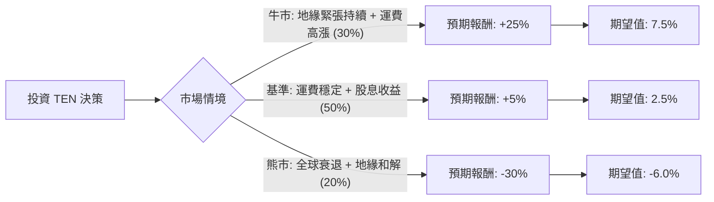

這份分析報告將針對 **Tsakos Energy Navigation Ltd. (TEN)** 進行深入評估。TEN 是一家領先的國際油輪運營商，主要從事原油和成品油的運輸。

透過結合您提供的數據與最新的市場動態（如紅海危機、地緣政治對航運費率的影響、以及公司最近的財報表現），我將使用**決策樹**與**期望值分析**來評估其投資價值。

---

### 一、 核心假設與市場背景分析

在建立決策樹之前，我們必須設定以下核心假設：

1.  **地緣政治溢價（關鍵因素）：** 目前紅海局勢導致航程拉長，推升了噸海里（Ton-mile）需求。若局勢緩解，運費（Spot Rates）將面臨下行壓力。
2.  **船隊更新與估值：** TEN 的 P/B 僅 0.72，顯示股價低於淨資產價值。公司正在進行船隊現代化（出售舊船、購入新船），這有助於維持長期競爭力。
3.  **週期性風險：** 航運業具備高度週期性。目前股價處於 52 週高點附近（距離高點僅 -2.8%），且過去一年漲幅達 144%，需警惕「利多出盡」的風險。
4.  **財務狀況：** 雖然 Debt/Eq 為 1.06 略高，但對於資本密集型的航運業屬正常範圍。EPS Q/Q 增長 302% 表現極其強勁。

---

### 二、 決策樹分析 (Decision Tree)

我們將未來一年的投資情境分為三種：**牛市（持續擴張）**、**基準（平穩運行）**、**熊市（週期反轉）**。

#### 節點詳細說明：

1.  **牛市情境 (Probability: 30%)**
    *   **條件：** 中東局勢持續緊張，OPEC+ 維持產量但出口路徑受阻，導致運費維持在高位。
    *   **預期報酬：** 股價突破 $50，加上約 3.7% 的股息，總報酬預計 **+25%**。
2.  **基準情境 (Probability: 50%)**
    *   **條件：** 市場供需平衡，TEN 透過長期租約鎖定獲利，船隊更新計畫順利。
    *   **預期報酬：** 股價在 $40-$45 震盪，主要收益來自股息與小幅估值修復，總報酬預計 **+5%**。
3.  **熊市情境 (Probability: 20%)**
    *   **條件：** 全球經濟衰退導致石油需求下降，或地緣政治迅速降溫導致航線回歸正常，運費崩跌。
    *   **預期報酬：** 股價回測 SMA200 或更低，總報酬預計 **-30%**。

---

### 三、 期望值計算過程 (Expected Value Analysis)

**期望值 (EV) 公式：**
$EV = \sum (Probability_i \times Return_i)$

*   **牛市貢獻：** $0.30 \times 25\% = 7.5\%$
*   **基準貢獻：** $0.50 \times 5\% = 2.5\%$
*   **熊市貢獻：** $0.20 \times (-30\%) = -6.0\%$

**總期望報酬率：**
$7.5\% + 2.5\% - 6.0\% = \mathbf{4.0\%}$

---

### 四、 綜合評估與最新資訊補充

1.  **估值優勢：** P/E 9.72 與 P/B 0.72 顯示該股在基本面上依然「便宜」。相較於同業，TEN 的資產折價提供了一定的安全邊際。
2.  **技術面警訊：** 股價目前遠高於 SMA200 (56.7%)，且 Perf Year 達 144%。這意味著市場已經反映了大部分的利多。
3.  **分析師目標價：** 數據顯示 Target Price 為 $44.0，與目前市價 $42.76 極為接近，上漲空間僅剩約 2.9%。
4.  **最新動態：** 根據最新財報，TEN 正在積極利用高運費環境去槓桿化並更新船隊。然而，EPS next Y 預期下降 49.13%，這是一個重大的負面信號，顯示市場預期明年獲利將大幅萎縮。

---

### 五、 最終結論

**判斷：目前「不適合」激進買入，建議「觀望」或「逢高減碼」。**

#### 理由：
1.  **期望值過低：** 計算出的期望報酬率僅為 **4.0%**。考慮到航運股的高波動性（Beta 值高），這個期望值甚至低於目前的無風險利率（如美債殖利率），風險報酬比（Risk-Reward Ratio）不具吸引力。
2.  **上漲空間受限：** 股價已極度接近分析師目標價（$44），且處於 52 週高點邊緣，短期內缺乏進一步推升的催化劑。
3.  **獲利預期衰退：** 數據中顯示明年 EPS 預計衰退近 50%，這通常是週期性行業見頂的徵兆。
4.  **技術面過熱：** 股價偏離均線過遠，存在技術性回調的需求。

**建議操作：**
*   **持股者：** 建議分批獲利了結，或設置嚴格的移動止損（如 SMA20 跌破時出場）。
*   **空手者：** 等待股價回落至 SMA50 甚至 SMA200 附近，且 P/B 進一步下探時，再重新評估進入機會。