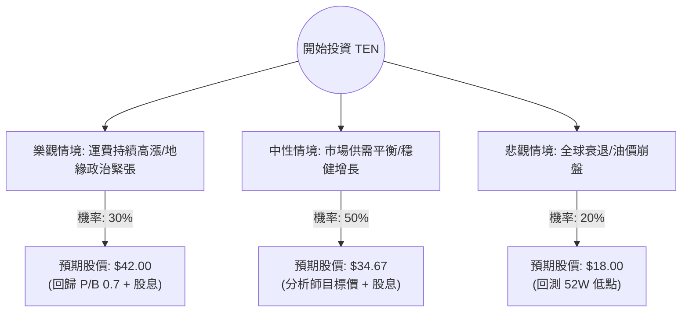

這份分析報告將針對 **Tsakos Energy Navigation Ltd. (股票代碼：TEN)** 進行深入評估。TEN 是一家領先的國際油輪運營商，主要從事原油和成品油的運輸。

透過結合您提供的數據與最新的市場動態（如紅海危機、油輪供給短缺、能源需求），我將使用**決策樹**與**期望值分析**來評估其投資價值。

---

### 一、 核心假設與市場動態分析

在建立決策樹之前，我們必須確立以下核心假設：

1.  **地緣政治紅利（看漲因素）：** 紅海局勢不穩導致航線繞道（經好望角），增加了「噸-英里（ton-mile）」需求，支撐運費（Charter Rates）維持高位。
2.  **極低的估值（安全邊際）：** 目前 **P/B 僅 0.41**，意味著股價不到淨資產的一半；**P/E 7.92** 遠低於美股平均，顯示市場對其風險溢價要求極高，但也提供了巨大的補漲空間。
3.  **供給受限：** 全球油輪訂單量處於歷史低點，新船交付需時，未來 1-2 年運力供給緊張。
4.  **財務狀況：** 雖然 Debt/Eq 為 1.04，但在航運業屬於常態。EPS 下一年度預期增長 27.23%，顯示成長動能強勁。

---

### 二、 決策樹分析 (Decision Tree)

我們將未來一年的投資情境分為三種：**樂觀（牛市）、中性（基準）、悲觀（熊市）**。

#### 節點詳細說明：

| 情境 | 機率 (P) | 預期目標價 (含股息) | 預期報酬率 | 說明 |
| :--- | :--- | :--- | :--- | :--- |
| **樂觀 (Bull)** | 30% | $42.00 | +66.9% | 紅海危機長期化，運費飆升，市場重新評估其資產價值。 |
| **中性 (Base)** | 50% | $34.67 | +37.8% | 運費維持現狀，公司實現 EPS 27% 的增長目標。 |
| **悲觀 (Bear)** | 20% | $18.00 | -28.5% | 全球經濟嚴重衰退，石油需求萎縮，運費大幅下跌。 |

---

### 三、 期望值分析 (Expected Value Analysis)

#### 1. 計算過程
期望值 (EV) = $\sum (機率 \times 預期價格)$

*   **樂觀期望值：** $42.00 \times 0.30 = 12.60$
*   **中性期望值：** $34.67 \times 0.50 = 17.335$
*   **悲觀期望值：** $18.00 \times 0.20 = 3.60$

**總期望股價 (Total EV Price) = $12.60 + 17.335 + 3.60 = \$33.535$**

#### 2. 預期報酬率計算
*   目前股價 ($P_0$): $25.16
*   預期報酬率 = $(33.535 - 25.16) / 25.16 \approx 33.28\%$

#### 3. 核心假設依據
*   **估值修復：** TEN 的 P/B 0.41 極度不合理，即便在航運業，健康的資產負債表通常對應 0.6-0.8 的 P/B。
*   **股息收益：** 4.37% 的股息提供了下行保護。
*   **分析師共識：** 數據顯示 Target Price 為 $34.67，與中性情境吻合。

---

### 四、 最終結論

**判斷：適合投資 (Strong Buy / Value Play)**

#### 理由：
1.  **極高的期望報酬：** 經過機率加權後的期望股價為 **$33.54**，較目前股價有約 **33% 的潛在漲幅**，遠高於市場平均預期。
2.  **極大的安全邊際：** P/B 0.41 意味著你以 4 折的價格購買其油輪資產。即便發生悲觀情境，資產清算價值也能提供支撐。
3.  **產業趨勢利好：** 航運業正處於供給短缺的結構性牛市，加上地緣政治導致的航程拉長，TEN 作為擁有現代化船隊（含 LNG）的運營商，獲利能力將持續釋放。
4.  **技術面強勁：** 股價位於 SMA20, 50, 200 之上，且一年表現 (+42%) 優於大盤，顯示資金正在流入。

**風險提示：**
*   航運股具有高度週期性，需密切關注全球經濟衰退風險。
*   地緣政治若突然和解，短期運費可能回落。

**建議操作：**
考慮到目前股價接近 52 週高點，可採取「分批進場」策略，目標價設在 $33-$35 區間，並以 $20.00 (跌破 SMA200) 作為長期止損參考。