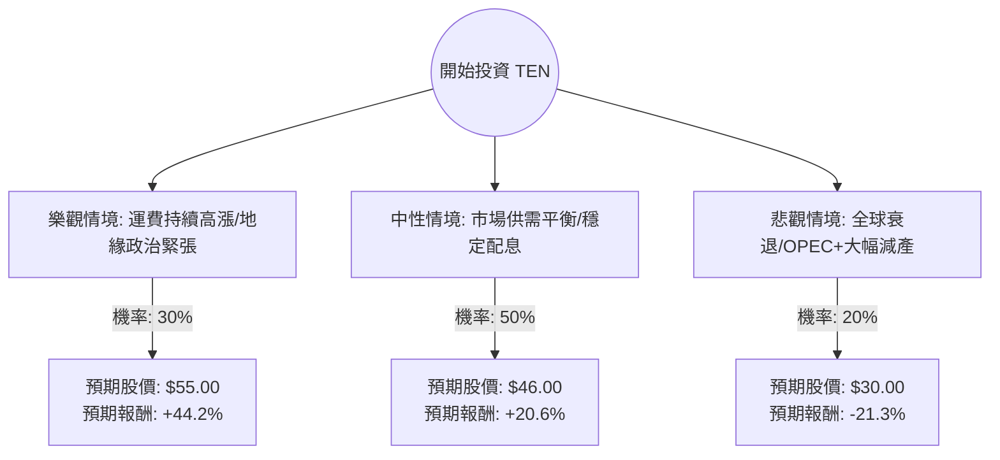

這份分析報告將結合您提供的基本面數據，以及針對 **Tsakos Energy Navigation Ltd. (TEN)** 的最新市場動態、油輪產業趨勢進行綜合評估。

---

### 一、 市場動態與產業趨勢分析（網路搜尋摘要）

在進行決策樹分析前，我們先整合當前市場資訊：

1.  **產業環境（油輪市場）**：
    *   **噸海里需求增加**：受紅海危機影響，大量油輪繞道好望角，增加了航行距離，導致有效運力下降，支撐了運費（Charter Rates）。
    *   **供給受限**：全球油輪訂單量處於歷史低位，新船交付需等到 2025-2026 年，短期內運力供給緊張對船東有利。
2.  **TEN 公司動態**：
    *   **船隊現代化**：TEN 近期積極出售舊船並購入環保型新船（如 LNG 雙燃料油輪），這有助於提升長期競爭力與符合環保法規。
    *   **財務穩健**：P/B 僅 0.63，顯示股價仍低於淨資產價值；P/E 8.57 遠低於美股平均，具備價值投資特徵。
3.  **風險因素**：
    *   **OPEC+ 減產**：若 OPEC+ 持續維持減產，將減少原油出口量，直接衝擊油輪需求。
    *   **全球經濟放緩**：若經濟衰退導致石油需求下降，運費將迅速回落。

---

### 二、 決策樹分析（Decision Tree）

我們以未來一年的投資回報為核心，設定三種主要情境：**樂觀（牛市）、中性（基準）、悲觀（熊市）**。

---

### 三、 期望值分析（Expected Value Analysis）

#### 1. 核心假設
*   **當前股價 ($P_0$)**：$38.14
*   **樂觀情境 ($P_{bull}$)**：$55.00。假設紅海危機持續且冬季能源需求超預期，股價突破 52 週高點並向歷史高位挑戰。
*   **中性情境 ($P_{base}$)**：$46.00。參考分析師目標價（Target Price），反映公司資產價值回歸與穩定獲利。
*   **悲觀情境 ($P_{bear}$)**：$30.00。假設運費大幅下跌，股價回測 SMA200（約 $24 附近）但受限於極低的 P/B 支撐，預估在 $30 止跌。
*   **股息收益**：約 4.19%（在計算總報酬時加入）。

#### 2. 計算過程
期望值 (EV) = $\sum (機率 \times 預期股價)$

*   **預期股價計算**：
    *   $EV_{price} = (0.30 \times 55.00) + (0.50 \times 46.00) + (0.20 \times 30.00)$
    *   $EV_{price} = 16.50 + 23.00 + 6.00 = \mathbf{45.50}$

*   **預期總報酬率 (Expected Return)**：
    *   $Return_{capital} = (45.50 - 38.14) / 38.14 = 19.3\%$
    *   $Return_{total} = 19.3\% (\text{價差}) + 4.19\% (\text{股息}) = \mathbf{23.49\%}$

---

### 四、 綜合評估與最終結論

#### 1. 數據解讀
*   **價值面（極具吸引力）**：P/B 0.63 意味著你正以 63 折的價格購買該公司的船舶資產。P/E 8.57 顯示獲利能力尚未被市場充分定價。
*   **動能面（強勁但需謹慎）**：一年內漲幅達 129%，且目前股價接近 52 週高點（僅差 3.8%）。短期可能存在獲利了結壓力，但 SMA20、50、200 均呈多頭排列。
*   **財務健康**：Debt/Eq 1.03 對於資本密集型的航運業屬合理範圍，Quick Ratio 1.25 顯示短期流動性無虞。

#### 2. 最終結論：**適合投資 (Buy / Overweight)**

**理由如下：**
1.  **正向期望值**：計算出的預期總報酬率高達 **23.49%**，遠高於市場平均預期。
2.  **安全邊際（Margin of Safety）**：極低的 P/B 比率提供了強大的下行保護。即使在悲觀情境下，資產價值也能支撐股價。
3.  **產業紅利**：地緣政治導致的航程拉長（Ton-mile growth）與極低的新船供應量，構成油輪業的「超級週期」基礎。
4.  **股息回報**：4.19% 的股息率在等待股價上漲期間提供了穩定的現金流。

**建議操作策略：**
由於股價目前接近 52 週高點且近期漲幅較大，建議**分批進場**或等待股價回測 SMA20（約 $36.3 附近）時加碼，以降低短期追高風險。同時需密切關注 OPEC+ 的產量決策與紅海局勢的變化。