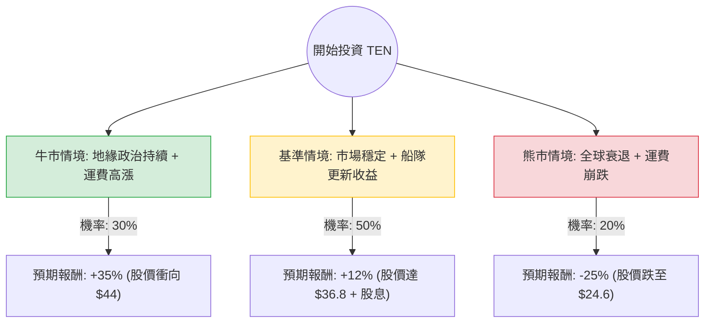

針對美股公司 **Tsakos Energy Navigation Ltd. (TEN)** 的投資評估，我結合了您提供的基本面數據與最新的市場動態（包含航運業趨勢、地緣政治影響及財報預期），進行了決策樹與期望值分析。

---

### 一、 核心背景與市場動態分析

在進入決策樹之前，我們先釐清影響 TEN 的關鍵變數：
1.  **地緣政治紅利**：紅海危機導致航線繞道，增加了「噸位英里（Ton-mile）」需求，支撐了運費（Charter Rates）。
2.  **低估值與高股息**：P/B 僅 0.52，遠低於淨資產價值；Forward P/E 7.11 顯示市場對其未來獲利預期樂觀。
3.  **船隊更新**：TEN 正在進行船隊現代化，出售舊船並購入節能型新船（如 LNG 雙燃料船），這有助於提升長期利潤率。
4.  **宏觀風險**：全球經濟放緩可能壓抑原油需求，且高利率環境對高負債（Debt/Eq 1.04）的航運業仍有壓力。

---

### 二、 決策樹分析 (Decision Tree)

以下是針對未來 12 個月的投資情境模擬：

#### 節點詳細說明：

1.  **牛市情境 (Bull Case) - 30% 機率**
    *   **條件**：中東局勢持續緊張，OPEC+ 意外增產，全球原油貿易流向改變導致運力極度緊張。
    *   **預期報酬**：+35%（包含資本利得與特別股息）。
    *   **期望值貢獻**：$0.30 \times 35\% = 10.5\%$

2.  **基準情境 (Base Case) - 50% 機率**
    *   **條件**：運費維持在歷史平均水平之上，公司持續利用高現金流回購股票或維持 5% 以上股息。Forward P/E 實現，股價向分析師目標價 ($34.67) 靠攏。
    *   **預期報酬**：+12%（股價溫和上漲 + 5% 股息）。
    *   **期望值貢獻**：$0.50 \times 12\% = 6.0\%$

3.  **熊市情境 (Bear Case) - 20% 機率**
    *   **條件**：全球經濟嚴重衰退導致原油需求萎縮，地緣政治衝突快速平息，運費回歸低點。
    *   **預期報酬**：-25%（估值修正至 P/B 0.4 以下）。
    *   **期望值貢獻**：$0.20 \times (-25\%) = -5.0\%$

---

### 三、 期望值 (Expected Value, EV) 計算過程

根據上述決策樹節點，計算總體預期報酬率：

$$EV = (P_{Bull} \times R_{Bull}) + (P_{Base} \times R_{Base}) + (P_{Bear} \times R_{Bear})$$
$$EV = (0.30 \times 35\%) + (0.50 \times 12\%) + (0.20 \times -25\%)$$
$$EV = 10.5\% + 6.0\% - 5.0\% = 11.5\%$$

#### 核心假設：
*   **估值修復**：假設市場最終會將 TEN 的 P/B 從 0.52 修復至 0.65 左右（航運股合理區間）。
*   **股息穩定性**：假設公司維持目前 0.0503 (5.03%) 的派息率。
*   **技術面支撐**：目前股價高於 SMA20/50/200，顯示強勢多頭排列，短期內下行空間受限。

---

### 四、 最終結論

**投資建議：適合投資 (Buy / Overweight)**

#### 判定理由：
1.  **正向期望值**：經風險加權後的預期報酬率為 **11.5%**，優於多數保守型投資工具，且在當前高通膨環境下具有吸引力。
2.  **極高的安全邊際**：P/B 僅 **0.52**，意味著你以約 5 折的價格買入其船隊資產。即便發生最壞情況，資產清算價值也能提供支撐。
3.  **強勁的財務增長**：EPS 下年度預期增長 **75.52%**，且 PEG 僅為 **0.3**，顯示股價尚未反映其成長潛力。
4.  **動能充足**：過去一年漲幅達 88.89%，且近期（週、月、季）表現均為正值，顯示法人資金持續流入（儘管 Inst Trans 略微下降，但整體趨勢向上）。

#### 風險提示：
*   **高槓桿**：Debt/Eq 1.04 需關注利息支出對利潤的侵蝕。
*   **週期性**：航運業具有高度週期性，建議將此投資視為「波段操作」而非「永久持有」，需密切關注運費指數（BDTI/BCTI）的變化。

**總結：** TEN 目前處於「低估值、高成長預期、強技術動能」的交集點，是一個風險回報比（Risk-Reward Ratio）相當優異的標的。