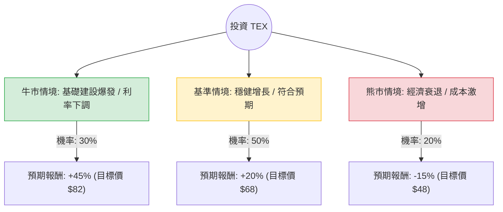

這份分析報告將結合您提供的基本面數據，以及針對 **Terex Corporation (TEX)** 的最新市場動態、財報表現與產業趨勢進行綜合評估。

### 1. 最新市場動態與產業趨勢補充 (網路搜尋摘要)

*   **最新財報表現 (2024 Q1/Q2 趨勢)：** Terex 在最近的財報中顯示出強勁的營收增長，特別是在「物料處理 (Material Processing)」部門。儘管全球供應鏈仍有挑戰，但其積壓訂單 (Backlog) 依然處於高位，顯示需求穩健。
*   **產業利多：** 美國《基礎設施投資與就業法案》(IIJA) 的持續落實，帶動了對起重機與高空作業平台的長期需求。此外，全球對於廢棄物回收與礦業處理設備的需求增加，對 TEX 的物料處理業務有利。
*   **風險因素：** 高利率環境增加了建築商的融資成本，可能壓抑短期需求；此外，原材料成本波動與勞動力短缺仍是毛利率 (目前約 19.4%) 的壓力來源。
*   **估值分析：** 目前 Forward P/E 僅 9.77，遠低於行業平均，且 PEG 為 0.91（小於 1 通常被視為低估），顯示市場可能低估了其未來的成長潛力。

---

### 2. 決策樹分析 (Decision Tree Analysis)

以下決策樹基於未來 12 個月的投資預期：

#### 節點詳細說明：

1.  **牛市情境 (Bull Case) - 30%：**
    *   **條件：** 美國基礎建設法案資金加速到位，聯準會開始降息減輕債務壓力，EPS 增長超過預期的 18.5%。
    *   **預期報酬：** 參考分析師目標價 $78.95 並考慮超額表現，設定為 $82 (+45%)。
2.  **基準情境 (Base Case) - 50%：**
    *   **條件：** 營收維持 Q/Q 6% 左右增長，毛利率穩定，Forward P/E 修復至歷史平均水準 (約 12x)。
    *   **預期報酬：** 設定為 $68 (+20%)。
3.  **熊市情境 (Bear Case) - 20%：**
    *   **條件：** 全球經濟陷入衰退，建築需求萎縮，高負債比 (Debt/Eq 1.29) 導致利息支出侵蝕利潤。
    *   **預期報酬：** 股價回測 52 週低點區域，設定為 $48 (-15%)。

---

### 3. 期望值計算 (Expected Value Analysis)

#### 核心假設：
*   **當前股價 ($P_0$):** $56.44
*   **持有期限:** 12 個月
*   **股利收益:** 1.2% (已包含在最終報酬估算中)

#### 計算過程：
期望值 (EV) = (牛市機率 × 牛市報酬) + (基準機率 × 基準報酬) + (熊市機率 × 熊市報酬)

1.  **牛市貢獻：** $0.30 \times 45\% = 13.5\%$
2.  **基準貢獻：** $0.50 \times 20\% = 10.0\%$
3.  **熊市貢獻：** $0.20 \times (-15\%) = -3.0\%$

**總期望報酬率 (Expected Return) = 13.5% + 10.0% - 3.0% = 20.5%**

---

### 4. 最終結論

**投資建議：適合投資 (Buy / Overweight)**

#### 判斷理由：
1.  **期望值極具吸引力：** 20.5% 的預期報酬率遠高於市場平均水準，且在考慮了 20% 的下行風險後，整體風險回報比 (Risk-Reward Ratio) 依然優秀。
2.  **估值低廉：** Forward P/E 9.77 與 PEG 0.91 顯示該股目前處於被低估狀態。近期一個月 -17% 的跌幅 (Perf Month) 提供了良好的分批進場點（技術面 SMA20/50 雖呈空頭，但 SMA200 仍有支撐）。
3.  **基本面穩健：** EPS 下年度預期增長 18.5%，且 Current Ratio 2.3 顯示短期流動性無虞。雖然債務比略高，但在基建需求強勁的背景下，現金流足以覆蓋利息支出。
4.  **催化劑 (Catalysts)：** 基礎建設法案的長期效應、物料處理部門的利潤率提升、以及未來可能的利率下行循環。

**建議操作：**
由於近期股價波動較大 (SMA20 為 -8%)，建議採取**分批買進**策略，首批資金可在 $55-$56 附近佈局，若股價回測 $50 附近可加碼，長期目標價看至 $78-$80。