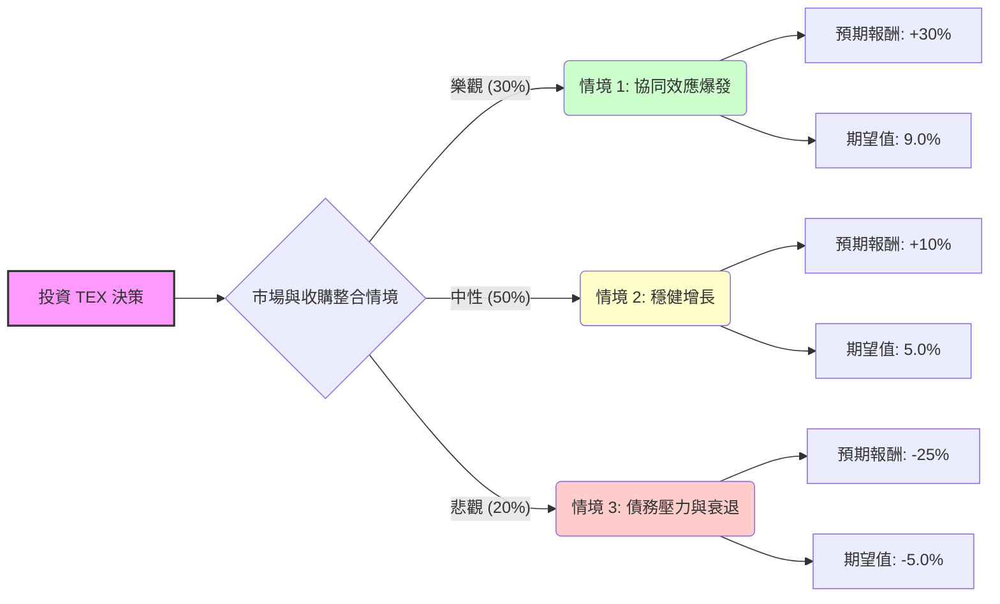

這份分析報告將結合您提供的基本面數據，以及針對 **Terex Corporation (TEX)** 最新動態（特別是 2024 年 6 月宣布的重大收購案）的網路搜尋資訊，利用「決策樹」與「期望值分析」進行評估。

---

### 1. 最新市場動態與背景分析 (Context)

在進入決策樹之前，必須納入以下關鍵即時資訊：
*   **重大收購案**：Terex 於 2024 年 6 月宣布以 **20 億美元** 現金收購 Dover 的 **Environmental Solutions Group (ESG)**（垃圾車與回收設備領導者）。這將顯著改變 TEX 的營收結構，增加非週期性的穩定收入。
*   **財務影響**：收購將使債務增加，但預計在第一年就能增加 EPS。
*   **產業趨勢**：受惠於美國基礎建設法案（IIJA）及電氣化趨勢，高空作業平台（Genie 品牌）需求依然強勁。
*   **當前股價**：目前約 $61.58，極度接近 52 週高點（$62.23）與分析師平均目標價（$62.72）。

---

### 2. 決策樹分析 (Decision Tree)

我們將未來一年的投資回報分為三種情境：**樂觀（Bull）**、**中性（Base）**、**悲觀（Bear）**。

#### **決策樹圖 (Markdown)**

---

### 3. 核心假設與計算過程

#### **核心假設：**
1.  **樂觀情境 (30%)**：ESG 收購整合極其順利，利潤率因規模經濟提升；聯準會降息刺激建築需求；Forward P/E 從 11x 修復至歷史高位 15x。
2.  **中性情境 (50%)**：收購表現符合預期，債務利息支出被新增營收抵銷；基礎建設需求維持現狀；股價隨盈利增長緩步上升至 $68 左右。
3.  **悲觀情境 (20%)**：高利率環境持久導致建築業萎縮；20 億美元債務利息負擔過重；收購整合出現文化或營運衝突；股價回測 SMA200 以下支撐位（約 $45-$48）。

#### **期望值 (Expected Value, EV) 計算：**

*   **樂觀情境 EV** = $30\% \times 30\% = 0.09$ (9.0%)
*   **中性情境 EV** = $50\% \times 10\% = 0.05$ (5.0%)
*   **悲觀情境 EV** = $20\% \times (-25\%) = -0.05$ (-5.0%)

**總期望報酬率 = 9.0% + 5.0% - 5.0% = 9.0%**

---

### 4. 綜合基本面評估

*   **估值面**：Forward P/E 僅 11.03，遠低於目前的 26.11，顯示市場預期明年盈利將大幅跳升（與收購案預期吻合）。P/S 0.76 顯示營收含金量仍有提升空間。
*   **技術面**：股價位於 SMA20, 50, 200 之上，呈現強烈多頭排列，但 52W High 壓力就在眼前，短期可能震盪。
*   **風險面**：Debt/Eq 1.29 在收購後會進一步攀升，需關注其現金流（P/FCF 14.48 尚屬健康）是否足以支撐利息支出。

---

### 5. 最終結論

**判斷：適合投資 (建議分批佈局 / Buy on Dips)**

#### **理由：**
1.  **正向期望值**：經過風險加權後的預期報酬率為 **9.0%**，優於無風險利率及多數工業股平均。
2.  **轉型契機**：收購 ESG 是 TEX 的重大轉折點，將使其從純週期的建築機械商，轉型為擁有穩定「廢棄物處理設備」現金流的複合企業，這通常會帶來估值倍數（P/E Ratio）的提升。
3.  **盈利增長明確**：EPS Next Y 預期增長 13.31%，配合低 Forward P/E，安全邊際尚可。
4.  **技術面強勢**：目前處於上升趨勢，雖接近目標價，但若收購案產生的協同效應在財報中體現，分析師將會上調目標價。

**投資建議：**
由於目前股價處於 52 週高點附近且 Short Float (11.56%) 偏高，顯示市場仍有空頭勢力。建議不要在 $62 附近一次性追高，可等股價回測 **SMA20 (約 $58-$59)** 附近時分批進場，以獲取更佳的風險報酬比。