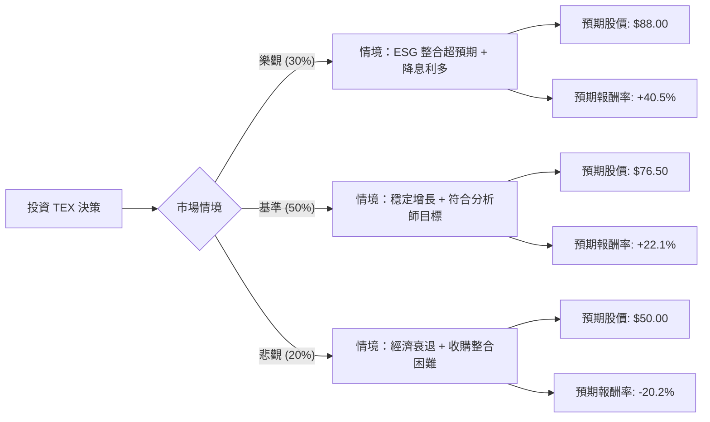

這份分析報告將結合您提供的基本面數據，以及最新的市場動態（特別是 Terex 最近的收購案與產業趨勢），利用**決策樹（Decision Tree）**與**期望值分析（Expected Value Analysis）**來評估 **TEX (Terex Corporation)** 的投資價值。

---

### 1. 核心背景與市場動態分析

在進入計算前，我們必須考慮以下關鍵因素：
*   **ESG 收購案（重大轉型）：** Terex 於 2024 年 7 月宣佈以 20 億美元收購 Dover 的 Environmental Solutions Group (ESG)。這讓 TEX 從純粹的建築/吊車設備商，轉型進入利潤更高、更具防禦性的**廢棄物處理與回收設備**市場。
*   **估值矛盾：** 目前 P/E 為 31.08，但 **Forward P/E 僅為 11.03**。這顯示市場預期未來一年盈餘將大幅增長（與數據中 EPS next Y +18.38% 一致）。
*   **宏觀環境：** 美國基礎建設法案持續發酵，且市場預期聯準會降息將有利於資本密集型的建築設備產業。

---

### 2. 決策樹分析 (Decision Tree)

我們將未來一年的投資表現分為三種情境：**樂觀（Bull）**、**基準（Base）**、**悲觀（Bear）**。

#### 節點詳細數據標示：

| 節點 (情境) | 機率 (P) | 預期目標價 | 預期報酬率 (R) | 期望值貢獻 (P * R) |
| :--- | :--- | :--- | :--- | :--- |
| **樂觀情境** | 30% | $88.00 | +40.5% | +12.15% |
| **基準情境** | 50% | $76.50 | +22.1% | +11.05% |
| **悲觀情境** | 20% | $50.00 | -20.2% | -4.04% |
| **總計** | **100%** | - | - | **+19.16%** |

---

### 3. 計算過程與核心假設

#### A. 核心假設：
1.  **基準情境 (Base Case)：** 參考數據中的 **Target Price ($76.59)**。假設公司能順利整合 ESG 業務，且 EPS 增長符合預期的 18%。
2.  **樂觀情境 (Bull Case)：** 假設降息循環啟動，建築設備需求激增，且 ESG 業務帶來的利潤率改善優於預期，給予 Forward P/E 13-14 倍的估值（目前僅 11 倍）。
3.  **悲觀情境 (Bear Case)：** 假設美國經濟陷入硬著陸，建築需求萎縮，且 20 億美元的收購債務造成財務壓力，股價回測 52 週低點附近（約 $50）。
4.  **當前價格：** 以 $62.64 作為計算基準。

#### B. 期望值 (Expected Value, EV) 計算：
*   **預期報酬率計算：**
    *   樂觀：$(88 - 62.64) / 62.64 = 40.5\%$
    *   基準：$(76.5 - 62.64) / 62.64 = 22.1\%$
    *   悲觀：$(50 - 62.64) / 62.64 = -20.2\%$
*   **總期望報酬率：**
    *   $EV = (0.30 \times 40.5\%) + (0.50 \times 22.1\%) + (0.20 \times -20.2\%)$
    *   $EV = 12.15\% + 11.05\% - 4.04\% = \mathbf{19.16\%}$

---

### 4. 綜合基本面評估

*   **成長性：** Sales Q/Q 成長 41%，EPS 下年度預期成長 18.38%，動能強勁。
*   **估值：** Forward P/E 11.03 遠低於行業平均與自身歷史高位，具備安全邊際。
*   **財務健康：** Current Ratio 1.84 顯示短期流動性無虞，Debt/Eq 0.57 尚屬穩健，但需關注收購 ESG 後的債務變化。
*   **技術面：** 股價位於 SMA20, 50, 200 之上，呈現多頭排列。

---

### 5. 最終結論

**判斷：適合投資 (Buy / Overweight)**

#### 理由：
1.  **正向期望值：** 經過風險加權後的預期報酬率高達 **19.16%**，遠高於市場平均預期。
2.  **轉型催化劑：** 收購 ESG 是戰略性的一步，將減少 TEX 對週期性建築業的依賴，提升整體利潤率（目前 Profit Margin 僅 1.81%，有極大提升空間）。
3.  **估值吸引力：** 雖然帳面 P/E 較高，但 Forward P/E 僅 11 倍，顯示市場尚未完全反映其未來的盈利增長。
4.  **風險可控：** 即使在悲觀情境下（-20%），其發生的機率較低，且公司擁有穩健的資產負債表來抵禦短期波動。

**建議操作：**
可在 $60 - $63 區間分批佈局，首波目標價看 $76 (基準情境)，若 ESG 整合數據亮眼，可長期持有至 $85 以上。需留意每季財報中關於 ESG 業務的利潤率貢獻。